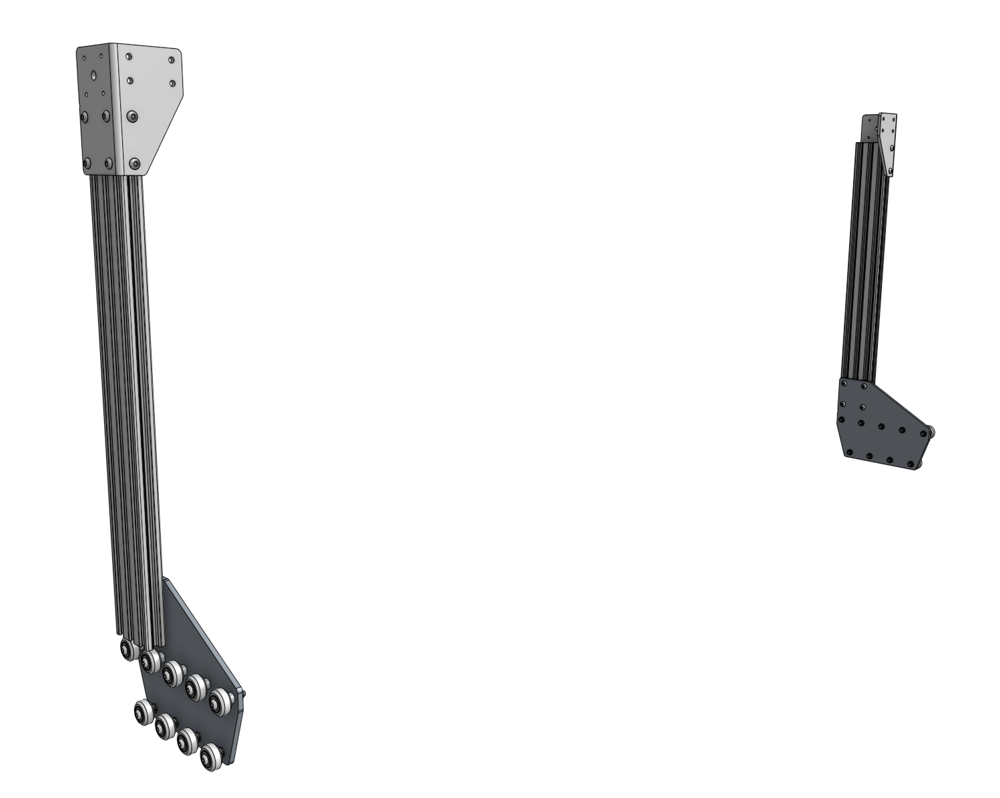
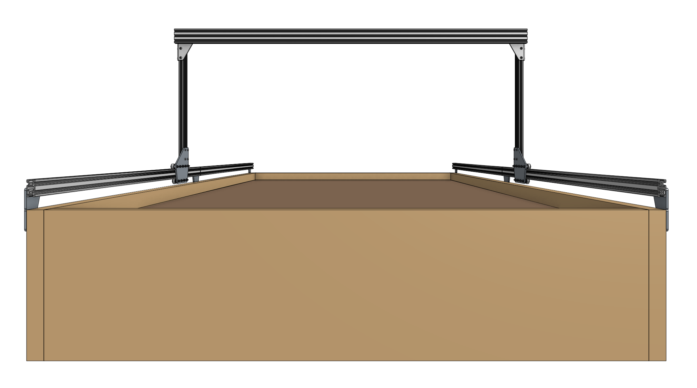
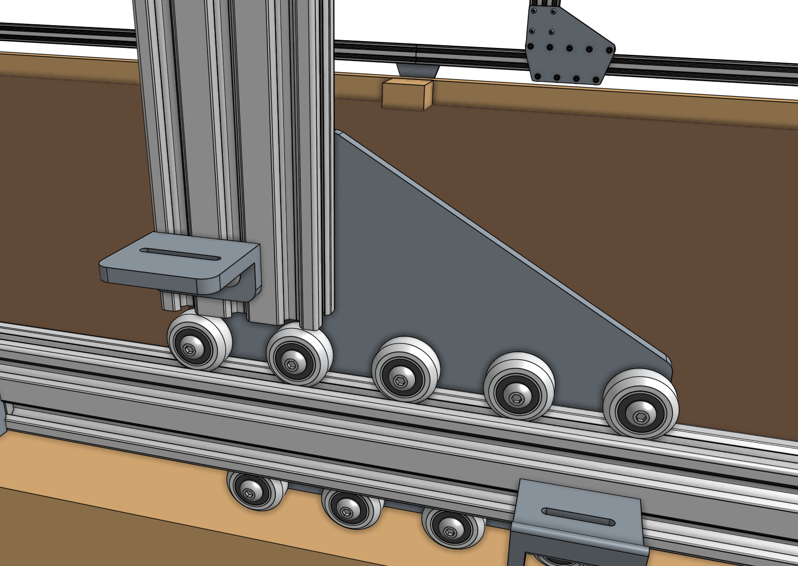

# Step 1: Attach the plates to the columns

Slide a [[gantry column]] (20mm x 60mm x 500mm extrusion) onto the **gantry wheel plate assembly**. The extrusion should reside on the same side of the plate as the V-wheels and the end of the extrusion should be aligned with the **notch** in the plate. Tighten the [[M5 x 10mm screws]] using the [[3mm hex driver]].

Repeat for the second gantry wheel plate and aluminum extrusion.



# Step 2: Attach the gantry corner brackets

Lightly attach three [[60mm nut bars]] to the [[left gantry corner bracket]] and [[right gantry corner bracket]] using [[M5 x 10mm screws]]. Then slide the corner brackets onto the gantry column/plate assemblies. The top of the extrusions should line up with the notches in the corner brackets.





# Step 3: Slide onto the tracks



Slide the [[gantry columns]] onto the **tracks**. The direction that the wheel plates extend from the column is towards the front of FarmBot. Ensure that the cable carrier supports (mounted to the tracks) are on the left side of the FarmBot.

# Step 4: Assemble the main beam



Place both [[gantry main beams]] on a flat surface such as a table or patio. Using two [[140mm nut bars]] and eight [[M5 x 10mm screws]], attach the [[gantry joining bracket]] to the *lower two slots* of both extrusions. The notch in the middle of the bracket should be aligned with the joint between the two extrusions.

# Step 5: Attach the cable carrier supports

Using [[M5 x 10mm screws]] and [[40mm nut bars]], attach six [[60mm horizontal cable carrier supports]] to the *middle slot* of the [[gantry main beam]] extrusion. For Genesis kits, there is only one main beam extrusion, so only six supports will be used.

For Genesis (XL) kits, there are two main beam extrusions, so 12 supports will be used, and they should be positioned on the same side of the extrusions as the gantry joining bracket.

# Step 6: Attach the main beam



Lift up the [[gantry main beam]] and position it onto the front of the **gantry corner brackets**. The cable carrier supports should be on the same side of the main beam as the gantry corner brackets. Secure the main beam in place using four [[60mm nut bars]] and [[M5 x 10mm screws]]. The nut bars should be positioned in the *lower two extrusion slots* of the main beam such that the top face of the main beam is 20mm *above* the top edges of the gantry corner brackets.



Ensure that the gantry columns are vertical and form a 90 degree angle with the main beam. Then tighten the [[M5 x 10mm screws]]. Depending on the spacing of your tracks, the gantry main beam may extend beyond the corner brackets. This is ok.

_This image is from the front of FarmBot_

# Step 7:  Attach the x-axis cable carrier mount

Use two [[M5 x 10mm screws]] and [[tee nuts]] to attach the aluminum [[35mm cable carrier mount]] to the bottom of the **left gantry column**.

# What's next?

 * [Attach the Drivetrain](attach-the-drivetrain.md)
