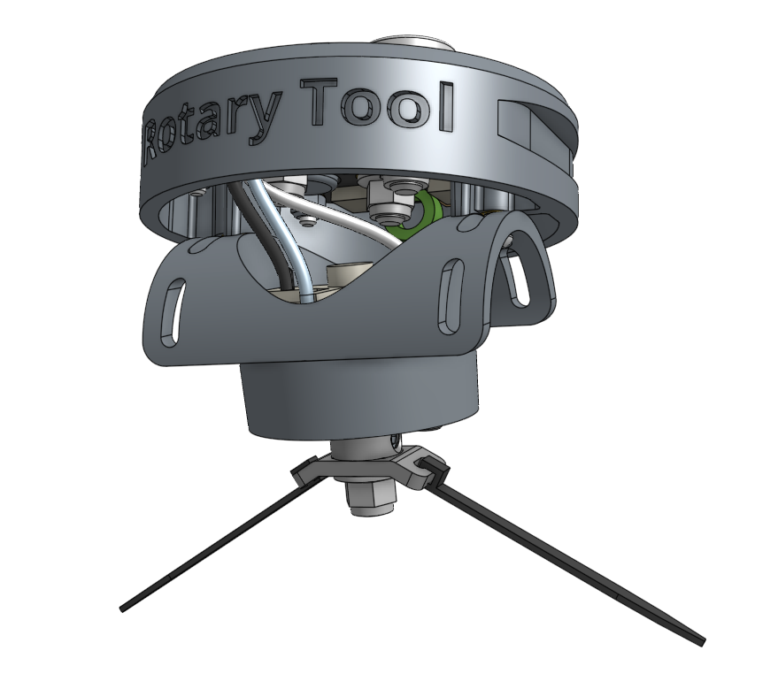

# Rotary Tool

New in this version of FarmBot Genesis is the inclusion of the **Rotary Tool** - a weed whacker style tool powered by a 24V DC motor that is designed to help abate weeds, drill holes for seeding, or even perform light milling of the soil surface. The tool is powered by a stall detecting motor driver and is compatible with the Genesis UTM like all other tools. Users can change out the Rotary Tool's implement to weed trimmer line or a drill chuck compatible with standard dremel tool bits. The axis of the motor can be adjusted +/- 70 degrees, allowing for a wide range of use cases.



# v1.6 Farmduino

The latest revision of our custom [[Farmduino]] electronics board includes a new 24V motor driver to power the new Rotary Tool. This new output includes load detection circuitry allowing FarmBot to detect when the Rotary Tool has stalled due to overload.

We have also increased the `USB OUT` voltage that supplies the Raspberry Pi to mitigate low voltage issues that have affected CPU, WiFi, and camera performance in past versions.

This revision also features a 3-pin power input with `PE` (protected earth) grounding. `PE` grounding provides additional EMI protection for the system when combined with the new shielded UTM and vacuum pump cables, as well as the new vacuum pump and rotary tool EMI filters.

Last, the board now includes a more appropriately specced `7.5A` fuse instead of a `15A` fuse.

# Vacuum pump with EMI filter

The [[vacuum pump]] now features a circuit board directly soldered onto the back of the motor which performs EMI filtering and reduces the startup current draw of the motor. This circuitry will help reduce WiFi interference caused by the vacuum pump, as well the potential for the pump to drop the system voltage below acceptable levels when starting up.

Additionally, the vacuum pump cable is now a shielded cable, with the shielding connected via a third quick-connect terminal to the vacuum pump motor's housing. The shielding is then connected to `PE` (protected earth) grounding at the Farmduino.



# Modularized UTM cable

Building on the progress made in v1.5, the v1.6 kit includes a two-piece modularized **UTM cable**, with one section running through the y-axis cable carrier and the other section running through the z-axis cable carrier. The two sections are joined by a 12-pin 90-degree waterproof screw-together connector. This makes assembly and disassembly of the FarmBot much easier because now all cables and tubing can be disconnected at the Y/Z cable carrier junction.

Additionally, the new cables are shielded, with the shielding shunted to UTM pin and UTM cable wire `L`. The shielding is then connected to `PE` (protected earth) grounding at the Farmduino.

# Smaller x-axis cable carrier

The **x-axis cable carrier** has been reduced in size to `15mm x 20mm` internal dimensions. This saves significant weight and reduces friction when moving along the X axis. With this change comes new [[30mm horizontal cable carrier supports]] and a new **35mm horizontal cable carrier mount**, adding to overall material, weight, and cost reductions in the kit.

# Pre-assembled tools

All tools (the **Watering Nozzle**, **Seeder**, **Weeder**, **Soil Sensor**, and new **Rotary Tool**) now come pre-assembled and packed individually in small boxes. This reduces the burden of FarmBot assembly required by the end user.

# Updated power supply and power supply cable

The power supply is now slightly smaller in size. Additionally, the power supply cable is now a 3-core cable to provide `PE` (protected earth) grounding for the Farmduino.

# Deprecated FarmBot Genesis MAX

Due to low demand, **FarmBot Genesis MAX** (introduced in v1.5) was [cancelled](https://farm.bot/blogs/news/putting-farmbot-genesis-max-and-express-max-on-hold) and is no longer supported in the v1.6 documentation.

# Miscellaneous

* The [[camera cable]] is now manufactured with shielded USB 2.0 cable (`28AWG/1p + 24AWG/2c`) to reduce interference problems that affected some v1.5 installations.
* Shortened the **X1 motor cable** and **X1 encoder cable** to reduce the amount of extra cabling underneath the electronics box.
* Removed unnecessary features from the [[leadscrew block]] design.
* Removed the **5.5mm wrench**, **2.5mm hex key**, **bladed screwdriver** and **phillips screwdriver** from the kit.
* Updated some part quantities to reduce the number of extra pieces at the end of assembly.
* Added numerous documented QA checks to our manufacturing processes.
* Made improvements to the sustainability of packaging materials.

# Production run 2

* Due to supply chain shortages, upgraded from the [[Raspberry Pi]] model 3B+ to model 4B (1GB version). This change also required a new [[Raspberry Pi power cable]] featuring a USB Type-C plug.
* Due to supply chain shortages, changed the [[Farmduino]]'s peripheral receptacles for the solenoid valve, LED strip, and peripherals 4 and 5 to 2-pin 2.54mm pitch locking Molex connectors via an adapter board. Changed the corresponding plugs on the mating parts as well.
* Due to shortages, did not include any [[peripheral leads]] in the kits.
* The cable used for the [[camera]] is now shielded USB 2.0 cable (`28AWG/1p + 24AWG/2c`) to reduce interference problems that affected some v1.5 installations.
* Increased the number of [[wood screws]] included.
* Decreased the quantity of [[jumper wires]] included.
* Removed the wide [[weeder blades]] from the kit.
* Replaced the three [[1-slot toolbays]] with an additional [[3-slot toolbay]] in (XL) kits.
* Replaced the 22 gauge [[luer lock needles]] with additional 16 and 19 gauge needles.

# Production run 3

* Due to supply chain shortages, upgraded from the [[Raspberry Pi]] model 4B (1GB version) to the 2GB version.
* Changed the [[Farmduino]]'s vacuum pump peripheral receptacle to a 3-pin 2.54mm pitch locking Molex connector and permanently changed the other peripheral receptacles to the 2.54mm pitch variety by removing the need for an adapter board.
* Changed the [[vacuum pump]]'s three quick-connect terminals to a single 3-pin receptacle to match the Farmduino.
* Changed the [[Y vacuum pump cable]] and [[Z vacuum pump cable]] plugs to 3-pin 2.54mm pitch plugs.
* Included a new revision of [[peripheral leads]] with 2.54mm pitch plugs.
