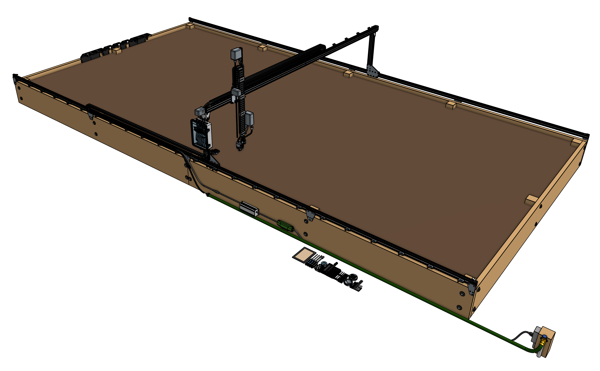
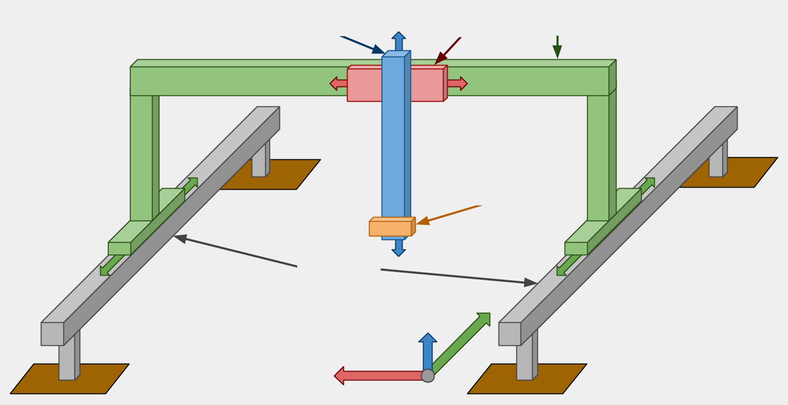

**FarmBot Genesis** and **Genesis** (XL) are primarily constructed from V-slot aluminum extrusions and aluminum plates and brackets. They are driven by four NEMA 17 stepper motors with rotary encoders, the Farmduino electronics board, and a Raspberry Pi 3 computer.  Current models cover growing areas as small 1m2 up to a maximum of 18m2, and plants as tall as 1m.



{%
include callout.html
type="success"
title="Not your typical product"
content="We've gone through great lengths to design FarmBot Genesis to be durable, easily assembled and modified with common tools, and upgradeable. Nothing about FarmBot speaks obsolescence or proprietary.

We've done this because at our core, we're makers and hackers just like you. We enjoy tearing apart our gadgets and gizmos to fix them, improve them, and make them different and unique. So that's what FarmBot Genesis is all about - empowering you to truly own FarmBot technology inside and out.

Go ahead and make your tracks longer, design a tool that electrocutes weeds, program FarmBot to spray water at the local cats, grow mushrooms, flowers, hydroponically, or on your living room wall! We can't wait to see what you do with FarmBot.

We hope you'll find our documentation useful and a great starting point for working with FarmBot and making it your own. If you ever have any questions, please head on over to the [forum](http://forum.farmbot.org). Cheers! 🍻"
%}

# Architecture

  
  
Z-Axis

  
Cross-Slide

  
Gantry

  
Universal Tool Mount

  
Tracks

  
X-Direction

  
Z-Direction

  
Y-Direction

## Tracks

**Tracks** are one of the components that really differentiate FarmBot Genesis from traditional free-driving wheeled tractors. The tracks are what allow the system to have great precision in an efficient and simple manner. There are many reasons of why tracks are superior, a few of which are listed below.
1. Tracks provide great precision and allow the FarmBot to return to the same position repeatedly
2. Any type of packing structure of plants can be created and managed
3. Tracks take up less area than paths for tractor wheels and do not compact the soil

{%
include callout.html
type="info"
title="Raised tracks vs low tracks"
content="For FarmBots to properly grow taller plants, the gantry, cross-slide, z-axis, and tools must have adequate vertical clearance from the plants. This can generally be accomplished in two ways:

1. Using raised tracks and a low-profile gantry
2. Using low tracks with a tall gantry

In general, using low tracks with a tall gantry is the better design, especially for larger applications because it saves on material cost, is less of an eyesore, blocks less sunlight, and would be easier to maintain. However, in the case of a FarmBot being installed in a greenhouse or other structure, utilizing the existing walls to support the tracks higher may be a better solution.

"
%}

## Gantry

The **gantry** is the the structural component that bridges the two tracks and moves along the x-axis via a belt and pulley drive system. It also serves as a linear guide for the cross-slide to move across the gantry along the y-axis. The gantry can also serve as a base for mounting other tools, electronics, supplies, and/or sensors.

## Cross-slide

The **cross-slide** moves across the gantry along the y-axis. This motion provides the second major degree of freedom for FarmBots and allows operations such as planting to be done anywhere in the X/Y plane. The cross-slide is moved using a belt and pulley drive system and serves as the base for the z-axis to attach to.

## Z-axis

The **z-axis** attaches to the cross-slide and provides the FarmBot with movement along the z-axis. It serves as the base for attaching the universal tool mount and other tools.

# Economies of scale

The table below shows the cost/m2 of growing area based on the size of your FarmBot. Predictably, the larger your FarmBot is, the lower the cost will be per square meter of growing area. Thus, we recommend installing the largest possible FarmBot in your space in order to get the most value out of the device.

*Note that the costs below do not account for [supporting infrastructure](../supporting-infrastructure.md), which will also increase in cost as the device size increases.*

|Model                                        |Track Length|Gantry Width|Growing Area     |Cost    |Cost/m^2|
|---------------------------------------------|------------|------------|-----------------|--------|--------|
|Genesis                                      |3m          |1.5m        |4.5m2 |~$3,000 |$667
|Genesis (XL)|6m          |3m          |18m2  |~$5,000 |$278

# What's next?

 * [Product Safety](product-safety.md)
