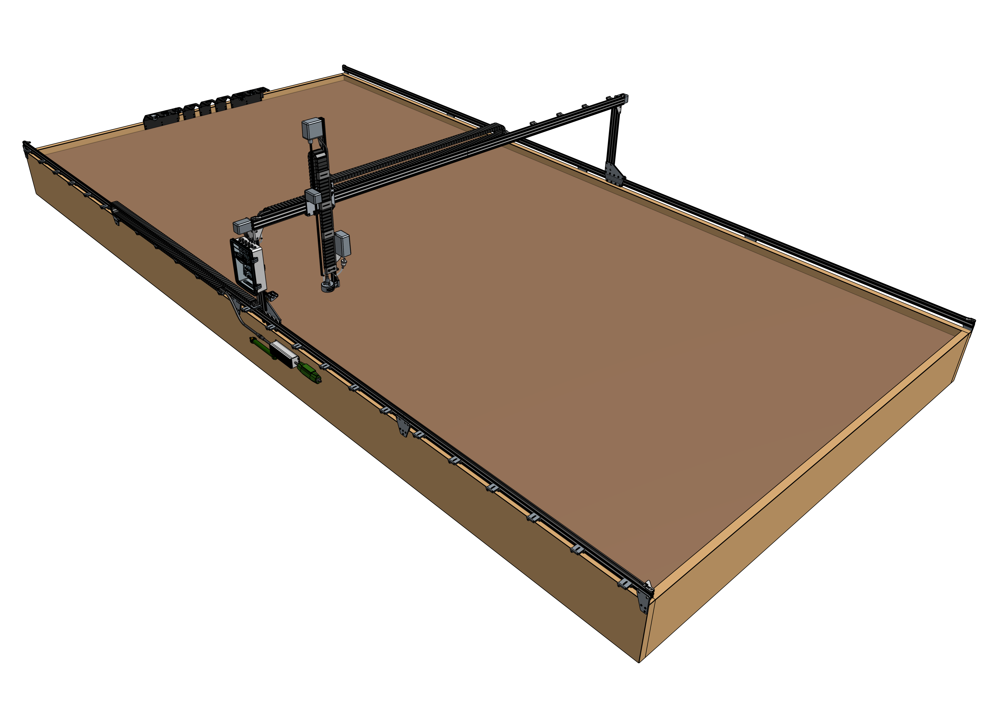
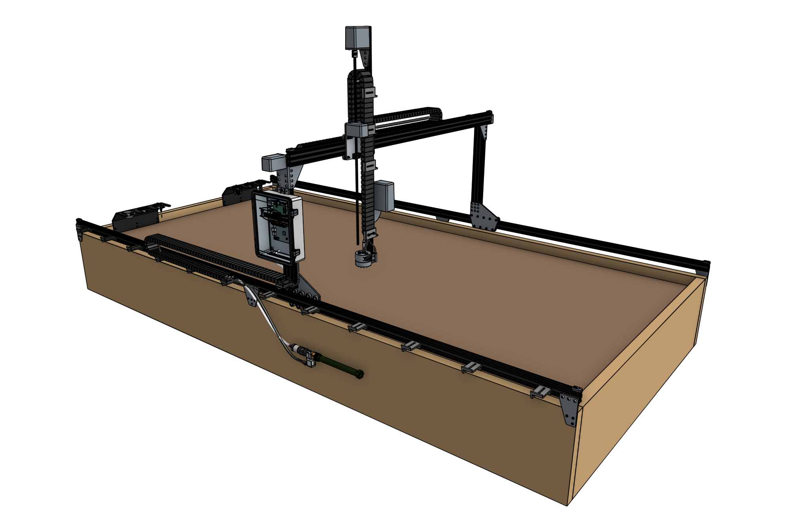
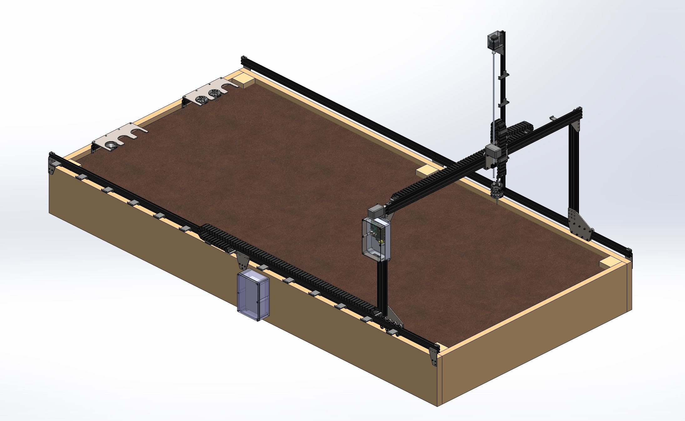
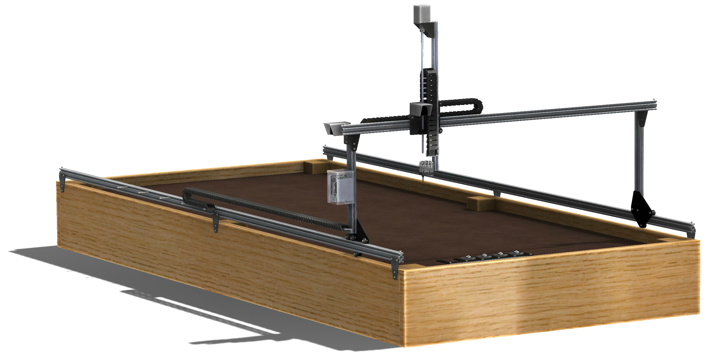

* toc
{:toc}



# Genesis v1.5





**Major changes**
* Introduced FarmBot Genesis MAX v1.5, covering an area 3m wide and 18m in length (3x larger than XL and 12x larger than the smallest size). Due to low demand, this model was later cancelled.
* Introduced a new version of the Farmduino, featuring integrated Trinamic TMC2130 stepper drivers that are controlled with a SPI interface. The new drivers deliver more current to the motors, offer significantly quieter operation, and can be tuned via software. The new board also adds load detection circuitry to all of the peripherals.
* Introduced modularized cables and tubing with 90-degree connectors at the junction between the Y and Z axis cable carriers. This makes assembly and disassembly of the FarmBot much easier.
* Switched to using nut bars and flange locknuts throughout the majority of the FarmBot allowing for faster and more robust assembly and a significantly reduced part count. Many of the plate hole layouts were simplified to accommodate nut bars.
* Improved the vacuum pump and solenoid valve mounts to be plastic injection molded parts to reduce weight, vibration, and aid with cable management.
* Decreased the size of the x-axis cable carrier to 15mm x 30mm internal size to save weight and reduce friction when moving in the X direction.
* Added a real-time clock to the Pi Adapter Board, improving FarmBot's ability to operate in offline/off-grid environments.
* Added a temperature sensor to the soil sensor PCB.
* Added a seed trough holder and seed troughs to the kit to improve seeding times.

**Minor changes**
* Extrusions are now sandblasted before being clear anodized.
* Added an inline air filter to the vacuum system.
* Switched to a stainless steel, M5 threaded luer lock adapter.
* Improved the solenoid valve wire routing.
* Switched from including camera calibration objects to a camera calibration card.
* Added a recessed lip to the z-axis motor mount.
* Combined the garden hose adapter and barbed adapter into one component.
* Began packing motors independently of the cables.
* Switched to shielded USB 2.0 cable for the camera cables to reduce interference.
* Upgraded the Raspberry Pi Model 3B to the 3B+.
* Sourced an improved Pi power cable to reduce voltage drop.
* Removed the standoffs beneath the electronics boards.
* Replaced the dowel pins with long nut bars.
* Added laser engraved labels to the barbed adapters.
* Frosted the FarmBot logo on the electronics box lid.

# Genesis v1.4





**Major changes**
  * Introduced Genesis XL covering an area 3m wide and 6m in length (400% larger than the smaller FarmBot Genesis)
  * Introduced a new version of the Farmduino featuring an STM32 co-processor dedicated to monitoring the rotary encoders, 24V operation, a new 2-pin polarized red power connector, vertically oriented USB ports, pre-installed pin jumpers to connect the UTM, improved board layout for accessing the stepper drivers and dip switches, additional circuitry to better handle motor back-current, matte-black finish, and a single blade fuse
  * Introduced a new preassembled electronics box featuring five push-buttons and four LED indicator lights, the Pi Adapter Board, board mounting bosses, and modified latches to prevent catching rain
  * Introduced a new preassembled injection molded UTM featuring a PCB with gold-plated pogo pins and pin headers for attaching to the cable with shroud (eliminating the need for a separate cover and grommets)
  * Switched to 24V peripherals and a power supply delivering 24V over a single modular screw-together cable
  * Relocated the solenoid valve to the gantry column allowing for a shorter cable and modularization of the tubing

**Kit additions**
  * Gantry joining bracket to create a 3m wide gantry (XL kits only)
  * 1-slot toolbays (XL kits only)
  * Dowel pins to improve track alignment

**Minor changes**
  * Clear anodized (instead of black anodized) extrusions to minimize temperature in the sun
  * The V-wheels now come pre-assembled
  * Switched to metric silicon tubing
  * Improvements to internal and external packaging

**Manufacturing**

|Model                         |# of Kits Manufactured        |Selling Period                |First Shipped                 |
|------------------------------|------------------------------|------------------------------|------------------------------|
|Genesis v1.4                  |300                           |Dec '17 to Nov '19            |Oct '18
|Genesis XL v1.4               |200                           |Dec '17 to Mar '19            |Oct '18

# Genesis v1.3



**Major changes**
  * Introduced the Farmduino electronics board to replace the Arduino MEGA and RAMPS shield with a board optimized for FarmBot and its motor and peripheral needs
  * Injection molded a custom-designed electronics box featuring two latches for easy access; improved the cables and connectors for the motors, encoders, UTM cable, peripherals, and power
  * Widened the cable carriers by 10mm and optimized their lengths. Made dimensional changes to the cross-slide, z-axis motor mount, cable carriers supports, and other components to accommodate the widened cable carriers
  * Relocated the vacuum pump to the z-axis extrusion to improve suction at the needle
  * Sourced an IP67 rated universal input waterproof power supply, eliminating the need for the sockit box;
  * Injection molded many new components including the cable carrier supports, tools, seed trays, camera mounts, and cable carrier spacer block, and and vacuum pump cover

**Kit additions**
  * Z-axis hardstops
  * White LED strip

**Minor changes**
  * Replaced the weeder spikes with new sizes of the weeder blades
  * Reduced the main carton volume by 40%

**Manufacturing**

|Model                         |# of Kits Manufactured        |Selling Period                |First Shipped                 |
|------------------------------|------------------------------|------------------------------|------------------------------|
|Genesis v1.3                  |300                           |Jan '17 to May '18            |Oct '17

# Genesis v1.2



**Major changes**
  * New surface treatments on all metal plates
  * Tighter M5 hole tolerances all-around
  * Improved UTM
  * Machined aluminum/plastic components (instead of 3D printing or bent metal)
  * Improved cable carrier supports
  * Machined z-axis motor mount (instead of bent/welded metal)
  * Black anodized toolbays with laser engraved FarmBot logo
  * Switched back to using a borescope camera with custom 1m focal distance
  * Developed a 2-piece watering nozzle
  * Developed the luer-lock needle style seed injector
  * Made the weeder customizable with various implements
  * Switched to jumper "links" instead of wires on all tools
  * CC spacer block
  * Developed packaging for complete kits

**Manufacturing**

|Model                         |# of Kits Manufactured        |Selling Period                |First Shipped                 |
|------------------------------|------------------------------|------------------------------|------------------------------|
|Genesis v1.2                  |350                           |Jun '16 to Jan '17            |March '17

# Genesis v1.1



**Major changes**
  * Removed the driveshaft in favor of dual x-axis motors
  * Redesigned cable carrier supports
  * Experimentation with the Raspberry Pi camera
  * New tool bay is a single bent component
  * New gantry corner brackets are single bent pieces
  * Metal belt clips and cable clips
  * Updated cross-slide
  * All metal z-axis motor mount
  * New z-axis drag chain guides
  * Encoders and motors now have removable cables
  * Added standoffs between the electronics and the mounting plate
  * Switched back to using the A4988 stepper drivers
  * Improved watering nozzle design for SLA printing
  * Switched the entire CAD workflow from Solidworks to Onshape

# Genesis v1.0



**Major changes**
  * Track plate improvements
  * New seed injector design
  * Larger z cable carrier
  * New motor housings and z motor mount
  * Larger cross-slide and gantry plates with more v-wheels
  * New tool bay
  * New seed bin
  * Stronger cable carrier supports
  * Introduced cable management clips
  * Introduced belt clip plates
  * Significant modifications to the UTM and UTM cover
  * Switched to button head M5 screws

# Genesis v0.9



**Major changes**
  * Larger plates
  * More v-wheels
  * Larger gantry extrusions for added rigidity
  * Introduced the weed suppressor tool

# Genesis v0.8



**Major changes**
  * All corrosion resistant design
  * Upgraded to 5mm thick plates
  * Improvements to the UTM, cable carrier brackets, and electronics enclosure

# Genesis v0.7



**Major changes**
  * Removal of endstops
  * Stronger z-axis motor mount
  * Added z-axis cable carrier
  * Redesigned the track plates and gantry corner plates
  * Upgraded the universal tool mount to support 6 liquid lines and 12 electrical connections
  * Designed a quick access electronics enclosure
  * Now using larger cable carriers

# Genesis v0.6



**Major changes**
  * Reliability improvements to the universal tool mount

# Genesis v0.5



**Major changes**
  * Rotary encoders on motors
  * Integrated water, vacuum, and liquid amendments into universal tool mount
  * Part simplification

# Genesis v0.4



**Major changes**
  * Electronics enclosures/housings
  * Cable carrier cable management
  * Magnetic universal tool mount design

# Genesis v0.3



**Major changes**
  * Wire and trolley cable management
  * Part simplification

# Genesis v0.2



**Major changes**
  * Endstop integration
  * Custom brackets and plates
  * Universal tool mount

# Genesis v0.1

Focused on being a quick and easy first prototype, v0.1 was constructed from all off-the-shelf components.





# Genesis v0.0

The very first physical FarmBot prototype was made from welded steel square stock, C-channel, angle iron, garage door wheels, and a trowel. It served primarily as a visual aid.

# What's next?

 * [Supporting Infrastructure](../supporting-infrastructure.md)
