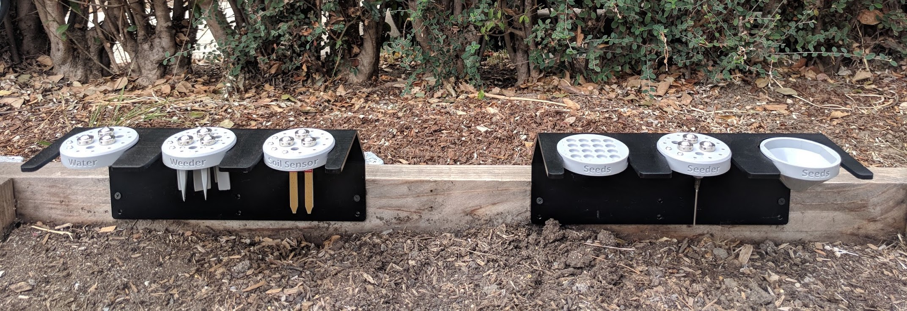

* toc
{:toc}

FarmBot Genesis kits come with five tools to cover the basics of food production, as well as multiple toolbays and various seed containers. The following documentation pages explain how to assemble and install all of these tools and more.



# What's next?

 * [Universal Tool Mount](tools/utm.md)
 * [Camera](tools/camera.md)
 * [Seeder](tools/seeder.md)
 * [Watering Nozzle](tools/watering-nozzle.md)
 * [Rotary Tool](tools/rotary-tool.md)
 * [Weeder](tools/weeder.md)
 * [Soil Sensor](tools/soil-sensor.md)
 * [Toolbays](tools/toolbays.md)
