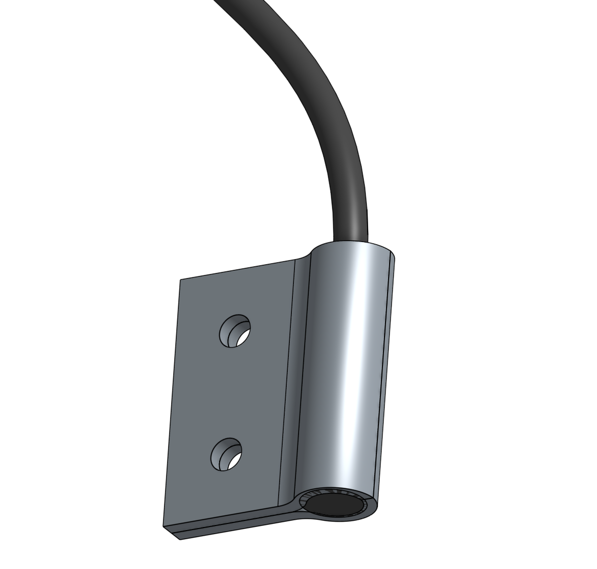
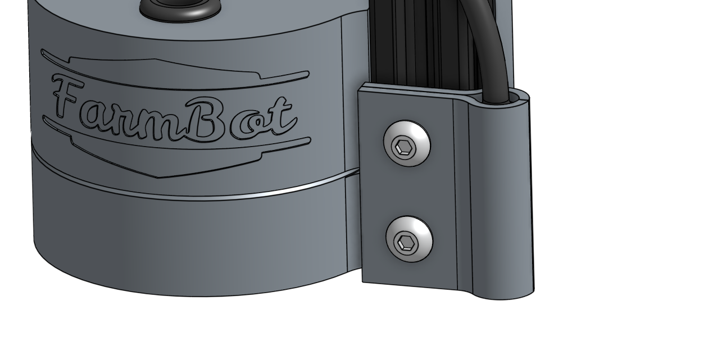

* toc
{:toc}

The camera is not a typical FarmBot tool in the sense that it does not mount onto the universal tool mount and it is not stored in a toolbay. Instead, it remains fixed in place on the z-axis next to the UTM and can be used at any time, even when other tools are mounted.

The camera itself is a borescope style camera that is fully waterproof. It can be used to take photos for weed detection, [time lapse photography](../../extras/mods/take-time-lapse-plant-photography.md) of your plants growing, and video for live streaming what is happening at the UTM. Note: video streaming support is coming soon.

The camera has a light that is controlled by a dial on the USB connector that you can rotate to turn off the lights. Unfortunately the lights are not controllable via software.

<iframe class="embedly-embed" src="//cdn.embedly.com/widgets/media.html?src=https%3A%2F%2Fwww.youtube.com%2Fembed%2F-6rKclV82EQ%3Ffeature%3Doembed&url=http%3A%2F%2Fwww.youtube.com%2Fwatch%3Fv%3D-6rKclV82EQ&image=https%3A%2F%2Fi.ytimg.com%2Fvi%2F-6rKclV82EQ%2Fhqdefault.jpg&key=02466f963b9b4bb8845a05b53d3235d7&type=text%2Fhtml&schema=youtube" width="854" height="480" scrolling="no" frameborder="0" allowfullscreen></iframe>

# Step 1: Attach the camera to the z-axis

Sandwich the **camera** between the two **camera mounts**.

Attach the **camera and mounts** to the **z-axis** using the two **M5 x 10mm screws** and **M5 tee nuts**.

# What's next?

 * [Seed Injector](seed-injector.md)
