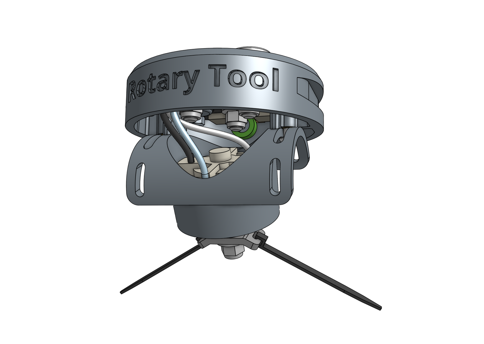
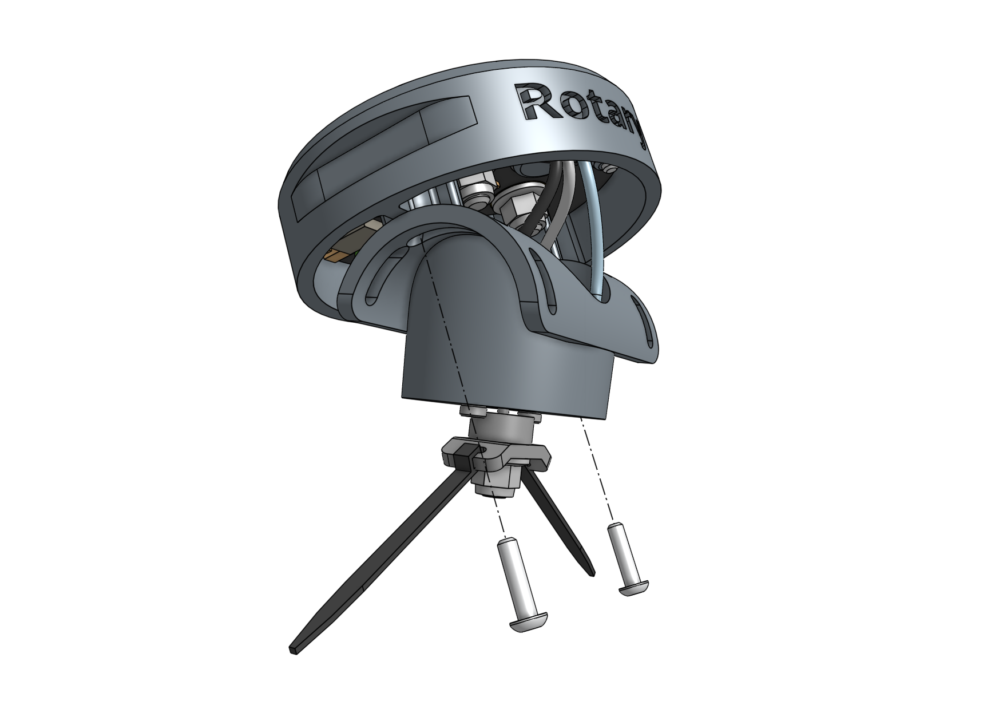
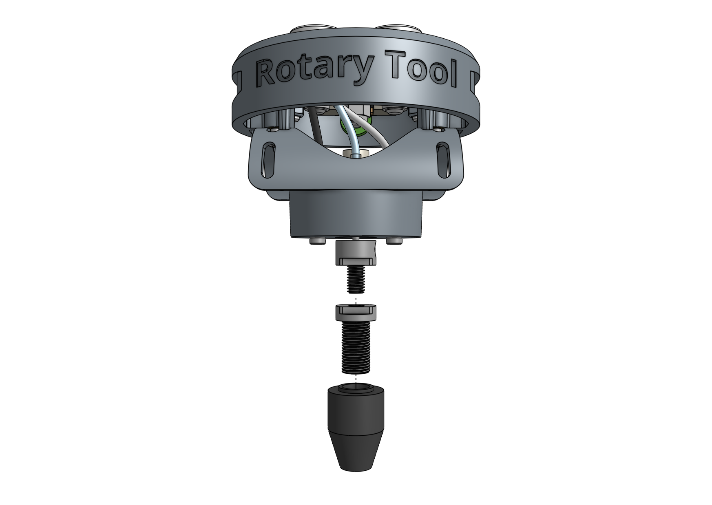

* toc
{:toc}

The **rotary tool** features a 24 volt DC motor, interchangeable implements, and an adjustable motor angle allowing FarmBot to perform light duty weed whacking, soil surface milling, and drilling operations.



This tool, and FarmBot in general, is designed for removing weeds early and often such that the weeds are always **small, young, and fragile**, and therefore easily removed.

What makes this possible is FarmBot's diligence. FarmBot has 24 hours a day to maintain your garden meticulously. It can be configured to remove weeds every single day that a human would never waste their time with. This prevents weeds from even having a chance at becoming a real problem.

If you configure FarmBot well, you will never even notice weeds in your garden because they will never have a chance to survive beyond germination. Over time, the number of weed seeds in your growing area will approach zero.





# Changing the motor angle

The angle of the rotary tool's motor can be adjusted +/- 70 degrees to allow for more aggressive weed whacking. To adjust the angle, loosen or remove the two **M3 screws** holding the motor to the upper half of the tool. Position the motor at the desired angle and retighten the screws.

# Using the shaft extension

In certain configurations of the rotary tool, you may need to use the **rotary tool shaft extension** to provide extra distance between the tool itself and the implement being used. To use the shaft extension, remove any implement currently being used. Screw the shaft extension onto the motor and then re-attach the implement.

# Using the drill chuck

The rotary tool can be configured with the included **drill chuck** to perform light duty drilling operations with most standard drill bits smaller than 5mm. To use the drill chuck, set the motor angle to vertical and remove any implement currently being used. Then screw the **drill chuck adapter** onto the motor, followed by the **drill chuck**.

# What's next?

 * [Soil Sensor](soil-sensor.md)
