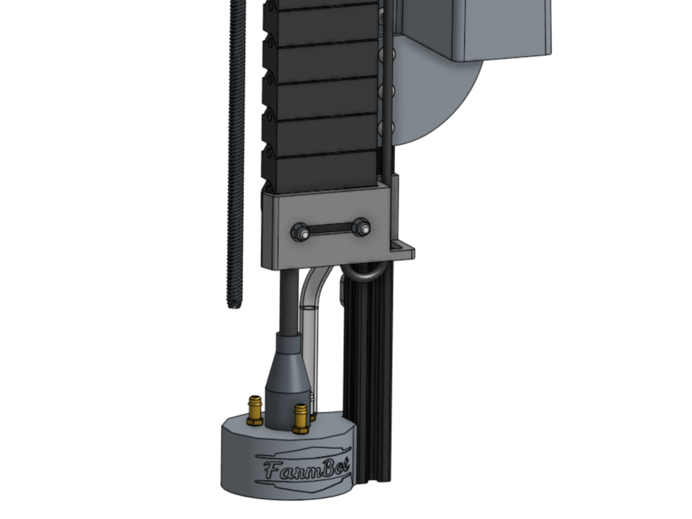

* toc
{:toc}

The Universal Tool Mount (UTM) allows FarmBot Genesis to automatically switch tools in order to perform different operations. It is a plastic component that mounts to the z-axis aluminum extrusion using two M5 screws and tee nuts. It features:

* 3 strong neodymium ring magnets to magnetically hold tools in place via other magnets placed in the same configuration on the tool.

* Passageways for water, liquid amendments (eg: fertilizer), and vacuum or compressed air to pass through from the UTM (and the rest of FarmBot) to the tool.

* 12 pogo pins that make electrical connections with tools. (See: [Pin Mapping](#pin-mapping))





# Pin mapping

|UTM Pin/UTM Wire                                     |is connected to          |and used for|
|-----------------------------------------------------|-------------------------|------------|
|**A** /red      |+5V                      |Soil sensor
|**B** /yellow|Ground (0V)              |Ground
|**C** /green  |Pin D63 - Digital-In     |Tool verification
|**D** /black  |Pin D59 (A5) - Analog-In |Soil sensor and other analog signal tools
|**E** /white  |DC 1                     |Rotary tool
|**F** /brown  |Your choice              |Anything you want
|**G** /blue    |Your choice              |Anything you want
|**H** /grey    |DC 2                     |Rotary tool
|**I** /orange|Your choice              |Anything you want
|**J** /purple|Your choice              |Anything you want
|**K** /pink    |Your choice              |Anything you want
|**L** /cyan (shunted to the cable shielding with dark dray heatshrink)|Earth Ground|Earth Ground





# Step 1: Install the UTM onto the Z-axis

Insert two **M5 x 16mm screws** and **tee nuts** into the **UTM**, and then position the UTM onto the [[z-axis extrusion]]. The mounting flanges should be positioned on the backside of the extrusion. The bottom of the UTM should be flush with the bottom of the extrusion. Tighten the two screws with the **3mm hex driver**.

# Step 2: Connect the UTM Cable

Insert the two UTM Cable Connectors into the top of the UTM. Note: The black and yellow connectors of the cable correspond to the black and yellow pin headers inside the UTM. Then slide the **UTM cable's shroud** down such that it fully covers the opening in the top of the **UTM**.

{%
include callout.html
type="success"
title="Ensure correct connection orientation"
content="Each connector and pin header have one missing pin in the corner to indicate the correct connection orientation.

Look into the UTM to see where the missing pin is located on each pin header. Then look where the individual UTM cable wires enter the connectors to see where the corresponding missing pin is located in the connectors.

Use this information to ensure you insert both connectors in the correct orientation."
%}





# Step 3: Connect the Water Tube

Push the **water tube** onto the **barb** on top of the **UTM** that is closest to the [[z-axis extrusion]].



# What's next?

 * [Camera](camera.md)
