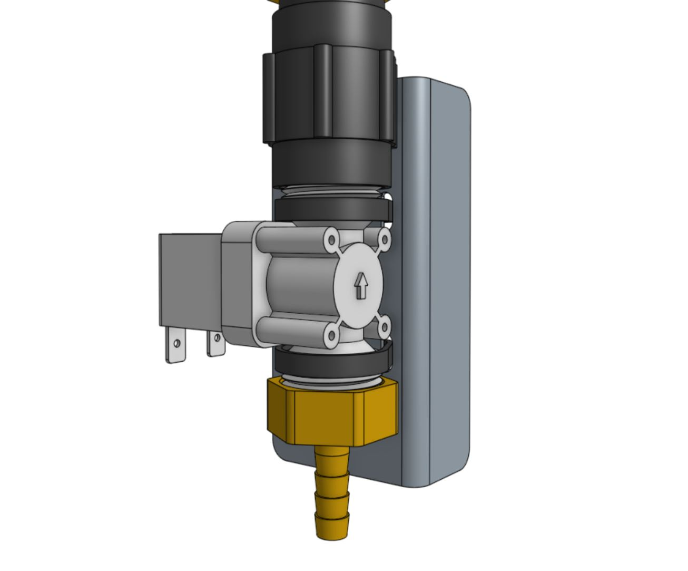
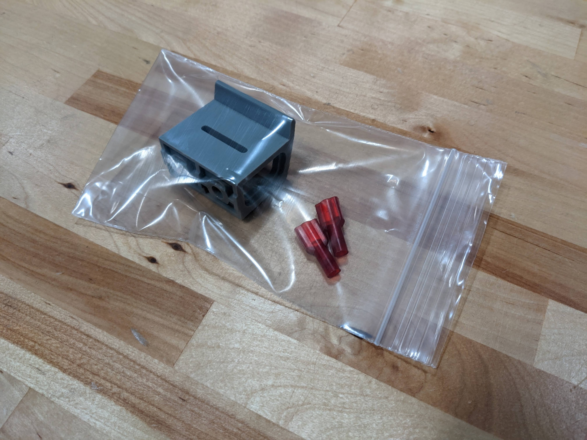

The **watering nozzle** accepts a concentrated stream of water coming from the [[UTM]] and turns it into a gentle shower for your plants.





# Step 1: Assemble the solenoid valve and pressure regulator

Insert [[rubber gaskets]] into the female ends of the [[pressure regulator]], the [[garden hose to barb adapter]], and both [[NPT to barb adapters]]. Then screw one of the [[NPT to barb adapters]] onto the [[solenoid valve]] inlet, the [[pressure regulator]] onto the [[solenoid valve]] outlet, and the second [[NPT to barb adapter]] onto the [[pressure regulator]].





# Step 2: Attach the solenoid valve
Attach the [[solenoid valve]] to the [[solenoid valve mount]] using two [[200mm zip ties]]. Then attach the [[solenoid valve mount]] to the **left gantry column** using two [[M5 x 10mm screws]] and [[tee nuts]]. Cables should be routed between the mount and the box.



# Step 3: Wire up the solenoid valve

Connect the [[solenoid valve cable]] to the [[solenoid valve]] terminals. Note: in a few steps from now, you will connect the other end of the cable to the Farmduino.

{%
include callout.html
type="info"
title="Do the quick-connect terminals not fit?"
content="Regretfully, some kits that shipped in August of 2022 included a solenoid valve cable with quick-connect terminals that are too small to fit onto the electrical tabs of the solenoid valve. If your cable does not fit, there should be two **quick connect terminals** of the correct size in a small plastic bag (shown below) that you can easily attach onto the cable with just a pair of scissors and needle nose pliers. Please refer to this troubleshooting document for [how to fix the solenoid valve cable](../../extras/troubleshooting/solenoid-valve-cable-fix.md) in about 5 minutes.

If you are not comfortable modifying the cable yourself or do not have correct tools to do so, please email us at [support@farm.bot](mailto:support@farm.bot) with your original order number to request a free replacement. We apologize for this inconvenience."
%}

# Step 4: Connect the tubing

Push the **water tube** coming from the **y-axis cable carrier** onto the upper [[NPT to barb adapter]]. Then push the **water tube** coming from the **x-axis cable carrier** (where it is mounted to the gantry) onto the lower [[NPT to barb adapter]].



# Step 5: Connect FarmBot to the water source

Screw the [[garden hose to barb adapter]] onto the **garden hose**. *Note that you will need to provide a garden hose of the appropriate length to connect FarmBot to your municipal water source - one is not provided with the FarmBot kits.* Then push the **water tube** coming from the bottom of the **x-axis cable carrier** onto the barb.

# What's next?

 * [Weeder](weeder.md)
