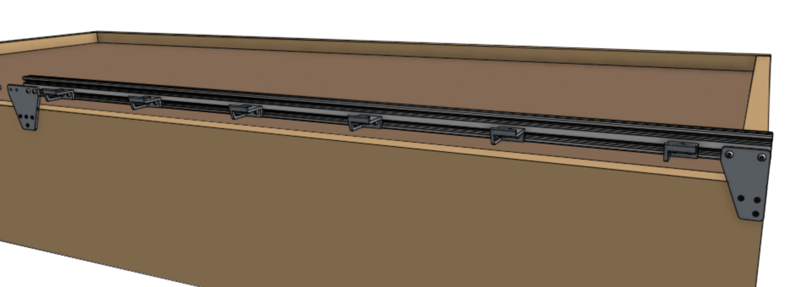

* toc
{:toc}

FarmBot's **tracks** allow the gantry to move precisely along the x-axis. They are designed to attach to a raised bed or similar [supporting infrastructure](supporting-infrastructure.md). Each track is composed of 1.5m long aluminum extrusions positioned end-to-end to form a total track length of 3m for Genesis models and 6m for Genesis XL.



The two tracks must be a parallel distance apart between 0.5m and 1.5m for Genesis, and 1.5m and 3m for Genesis XL so that the gantry may span the distance between them. Tracks may be spaced closer together than the maximum, in which case you may consider cutting the gantry main beam so that it does not inconveniently extend beyond the tracks.

## Shortening the tracks

The easiest way to shorten the tracks is to remove extrusions. Should you want an overall track length different than the 1.5m increments the extrusions afford, then you will need to use a hacksaw or bandsaw to cut the extrusions to your desired length. You can shorten your tracks to a minimum length of around 0.5m.

## Lengthening the tracks

If you would like to extend your tracks, you will need additional extrusions, track joining plates, cable carrier supports, and hardware, as well as longer x-axis cable carrier, belt, wiring, and tubing.

{%
include callout.html
type="warning"
title="For serious hackers and DIYers only"
content="We do not currently sell extension hardware, offer kits with tracks longer than 18m, or provide support for kits that are modified in this way.

Lengthening the tracks beyond what is included with your kit may introduce significant unforeseen problems to your FarmBot. If you decide to extend your tracks you will need to purchase and/or make the additional components on your own and troubleshoot any problems you run into. You may seek support in the [community forum](http://forum.farmbot.org)."
%}

# Step 1: Lay out the track extrusions



Lay out all of the [[track extrusions]] in the location that you want to attach them to your **supporting infrastructure**. Make sure that extrusions are fully butted against each other. This will help you attach the plates in the correct location.



# Step 2: Attach the horizontal cable carrier supports

Attach six [[30mm horizontal cable carrier supports]] to the *lower slot* of a [[track extrusion]] using [[40mm nut bars]] and **M5 x 10mm screws**. The supports should be spaced evenly along the length of the extrusion, and they should be attached to the track extrusions on the side of the bed that you intend to be the left side of the FarmBot (when looking from the front).

Repeat for all of the track extrusions on the side of the bed that will eventually have the electronics box (two extrusions total for Genesis, four for Genesis XL).



# Step 3: Attach a track end plate

Position a [[track end plate]] as shown below and screw it into the **supporting infrastructure** with three [[wood screws]].

{%
include callout.html
type="success"
title="Vertically aligned"
content="Use the small **notches** in the [[track end plates]] and [[track joining plates]] to help position the plates with perfect *vertical alignment* with respect to your supporting infrastructure and each other. *You should only use these notches if the top edge of your supporting infrastructure is level and straight.*

If the top edge of your supporting infrastructure is *not* level or straight, then you will need to manually ensure that your track plates are vertically aligned with other means. Because the gantry has wheels that ride on the bottom face of the track extrusions, you need to ensure that the bottom of the track extrusion will be at least 25mm away from the top of the supporting infrastructure so that the wheels have adequate clearance."
%}

# Step 4: Attach a track joining plate

Position a [[track joining plate]] such that one half of it will be able to attach to each [[track extrusion]] and so that it is vertically aligned with the first [[track end plate]]. Screw the plate into the **supporting infrastructure** with four [[wood screws]].

# Step 5: Attach the first track extrusion

Attach one end of the first [[track extrusion]] to the [[track end plate]] using a [[60mm nut bar]] and two **M5 x 10mm screws**.

Attach the other end of the extrusion to the [[track joining plate]] using a [[100mm nut bar]] and two **M5 x 10mm screws**. Do not fully tighten the screws on the track joining plate yet.



# Step 6: Attach the next extrusion

Slide the *lower* V-slot of the **second track extrusion** onto the [[100mm nut bar]]. If it does not slide on easily, you may need to loosen the screws holding the first extrusion in place.



Push the second extrusion into place so there is no gap between the extrusions, then add two **M5 x 10mm screws**.





# Step 7: Attach the next track joining plate



Position another [[track joining plate]] such that one half of it will be able to attach to the free end of the [[track extrusion]] that was just put in place, and so that it is vertically aligned with the other track mounting plates. Screw the plate into the **supporting infrastructure** with four [[wood screws]], and then secure the **extrusion** with another [[100mm nut bar]] and tighten all screws.

Repeat to install subsequent [[track joining plates]] and [[track extrusions]].

# Step 8: Attach the second track end plate

Position the second [[track end plate]] and secure it to the **supporting infrastructure** with three [[wood screws]]. Then fasten the final [[track extrusion]] to the plate using a [[60mm nut bar]] and **M5 x 10mm screws**.

# Step 9: Install the other track

Repeat steps 3 through 8 for the track on the other side of the bed. Note that the second track will not have any horizontal cable carrier supports.



# Step 10: Sand away bumps

If needed, use **150 grit sand paper** to sand away any bumps on the diagonal surfaces of the **extrusions** that the FarmBot wheels ride upon. This will ease the movements of the FarmBot and improve longevity. Make sure that both the upper surfaces and lower surfaces are smooth to the touch and that there is no bump or uneven edges in the transition from one extrusion to another.

_This photo shows that the aluminum tracks can be sanded down so that there is no bump on the transition between one section of track to another._



# What's next?

 * [Gantry](gantry.md)
