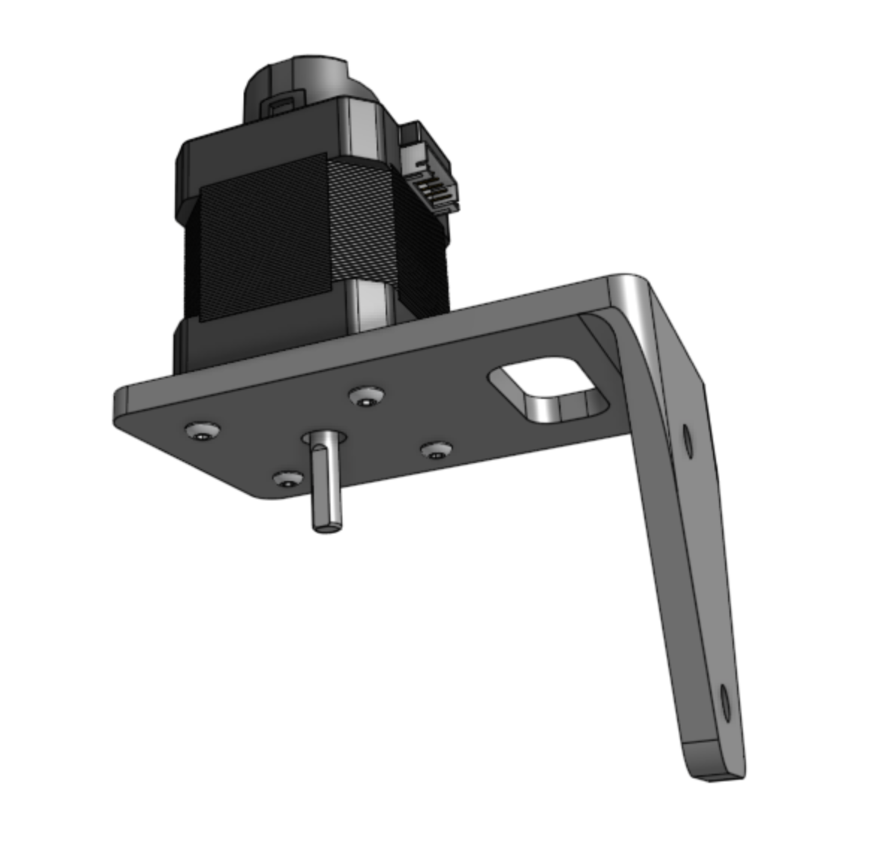
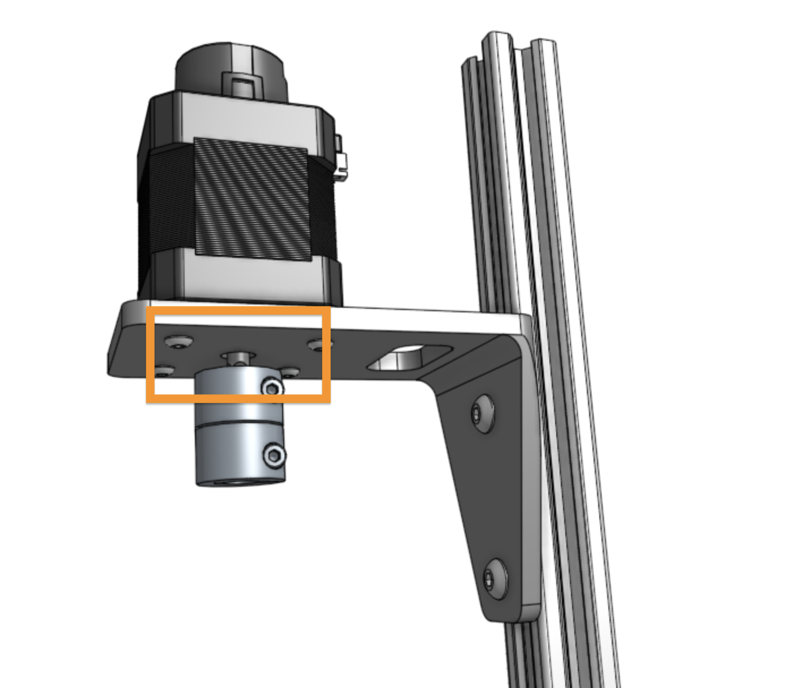
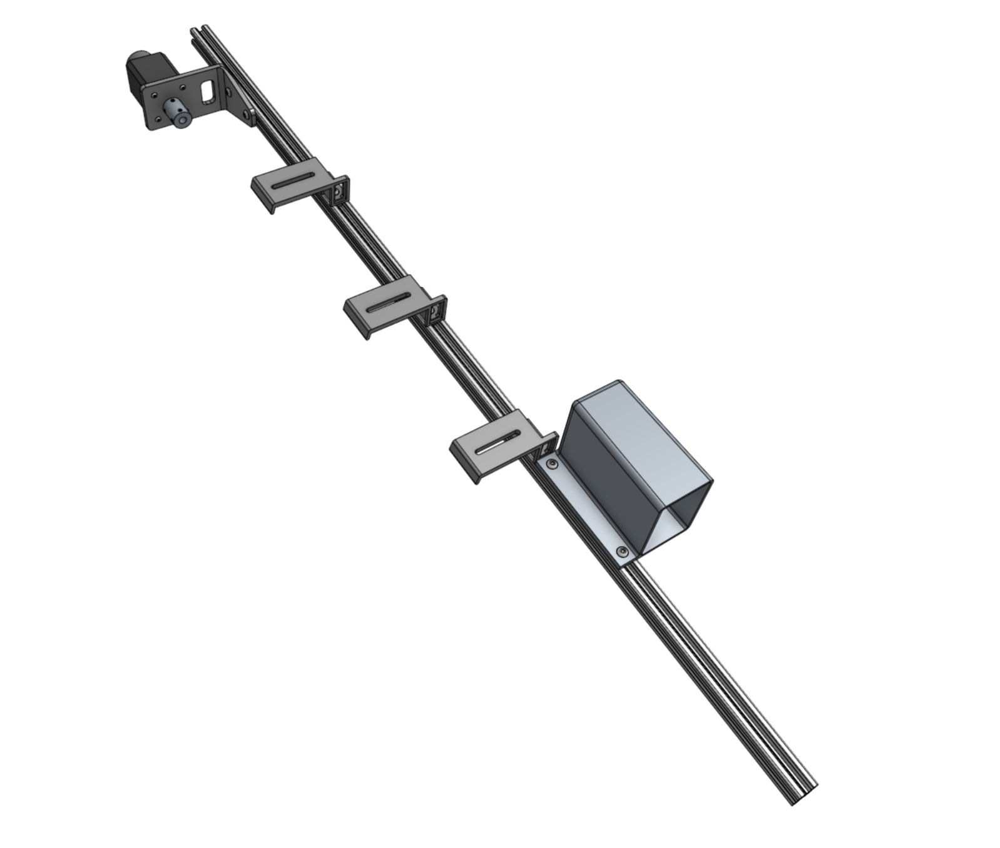
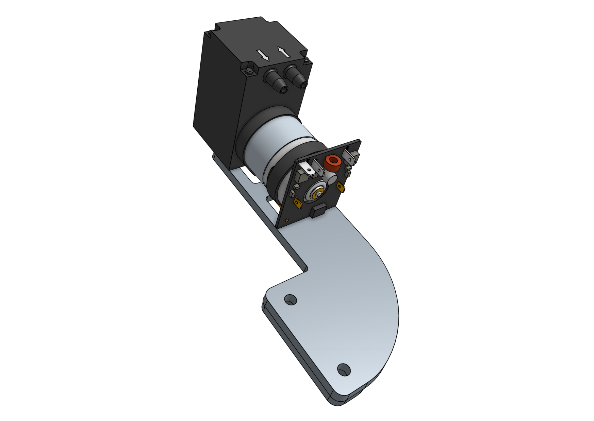
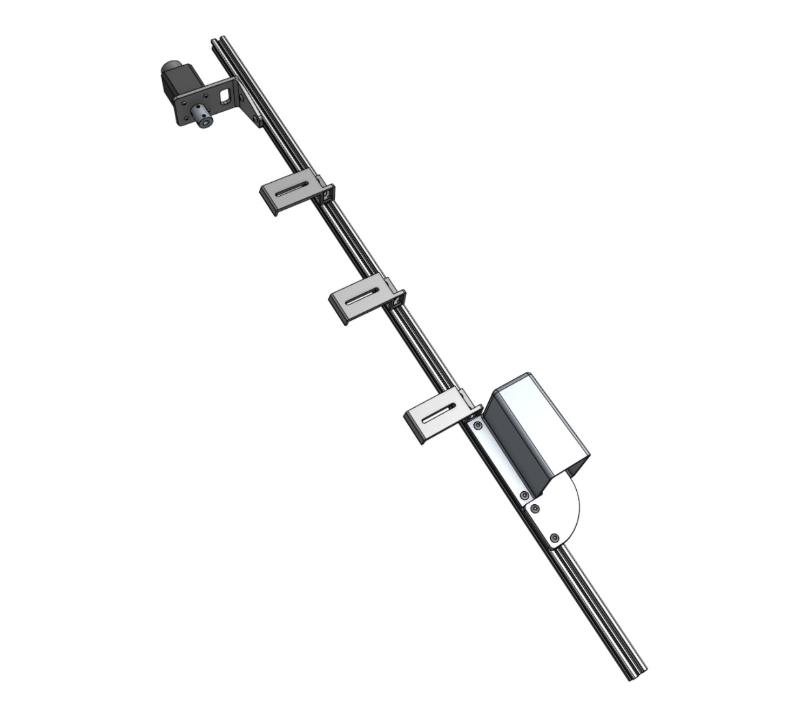
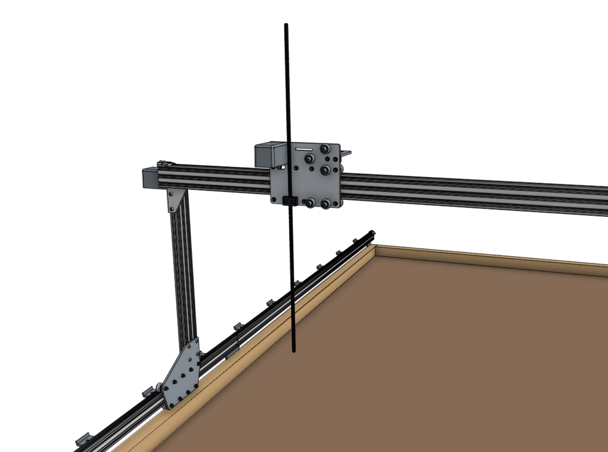

* toc
{:toc}



# Step 1: Attach the stepper motor to the Z-axis motor mount

Attach a **stepper motor** to the **z-axis motor mount** using four **M3 x 12mm screws**. The motor and encoder connectors should be facing the back flange of the mount.

# Step 2: Attach the motor mount to the Z-axis extrusion



Attach the **z-axis motor mount** to the **z-axis extrusion** using a **60mm nut bar** and **M5 x 10mm screws**. The top face of the motor mount should be 80mm from the end of the extrusion.

# Step 3: Attach the shaft coupling

Slide the **5mm to 8mm shaft coupling** onto the **motor shaft** and tighten the top screw with the **2.5mm hex key**.



# Step 4: Attach three cable carrier supports

Attach three **60mm vertical cable carrier supports** to the **z-axis extrusion** using **40mm nut bars** and **M5 x 10mm screws**. Space the supports along the extrusion as shown.

# Step 5: Attach the vacuum pump cover

Attach the **vacuum pump cover** to the **z-axis extrusion** using two **M5 drop-in tee nuts** and **M5 x 10mm screws**. The cover should be butted up against the lowest **cable carrier support**.

# Step 6: Attach the vacuum pump

Fasten the **vacuum pump** to the **vacuum pump mount** using two **200mm zip ties**. Then attach the vacuum pump mount to the **z-axis extrusion** using a **60mm nut bar** and two **M5 x 16mm screws**. The mount should be butted up against the **vacuum pump cover**.



# Step 7: Attach one more cable carrier support

Attach one more **60mm vertical cable carrier support** using a **40mm nut bar** and two **M5 x 10mm screws**. The support should be butted up against the **vacuum pump mount**.

# Step 8: Attach the z-axis to the cross-slide

Screw the **leadscrew** halfway into the **leadscrew block**.

Slide the **z-axis extrusion** through the v-wheels on the **cross-slide** until the **leadscrew** inserts into the **5mm to 8mm shaft coupling**. Then tighten the coupling's lower **screw** with the **2.5mm hex key**.





# Step 9: Install the hardstops

Attach the **z-axis hardstops** onto the back side of the **z-axis extrusion** approximately 200mm from the top of the extrusion and 100mm from the bottom of the extrusion using **M5 x 10mm screws** and **tee nuts**. Later, you can quickly adjust these to physically prevent FarmBot from moving too low or too high within its working space.



# Step 10: Add the vertical motor housing (optional)

If you plan on stopping assembly after this page, it is recommended to attach the **80mm vertical motor housing** to the **z-axis extrusion** using **M5 x 10mm screws** and **tee nuts** now. This will protect the motor from rain and other hazards until you resume assembly at a later point. Once you resume assembly, you will need to remove the housing.

If you do not plan on stopping the assembly process now, you can skip this step and install the housing after the z motor and encoder cables have been connected in the next step.

# What's next?

 * [Cables and Tubing](cables-and-tubing.md)
