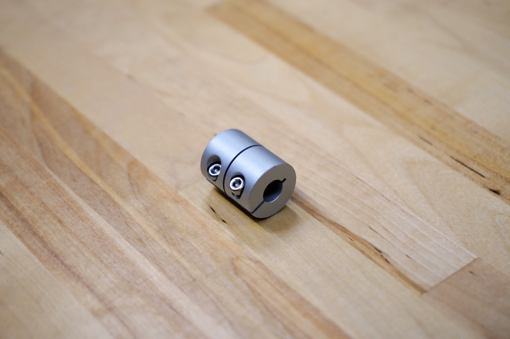

* toc
{:toc}



# 5mm to 8mm Shaft Coupling

This aluminum coupling connects the Z-axis stepper motor to the leadscrew to allow FarmBot to move in the Z direction.



specs:
  Material: Aluminum
  Length: 25mm
  Outer Diameter: 20mm
  Inner Diameters: 5mm and 8mm
  Screws: Stainless steel with 2mm hex drive
price: $6.00
quantity: 1
internal-specs:
  Internal Part Name: 5mm to 8mm Shaft Coupler w/ SS screws w/ 2mm drive
  Vendor: 
  $/pc: $1.60
  Notes: `v1.5 Production Run 2` and `v1.6 Production Run 1`: screws had 2.5mm drive instead of 2mm. Need to fix next time so we can avoide adding extra hex key.

**Component tests**{:.internal}

|Test         |Description  |Target       |Tolerance    |
|-------------|-------------|-------------|-------------|
|Inner diameters|Measure using digital calipers.|5mm and 8mm|+/- 0.05mm
|Motor shaft fit|Connect the coupling to a motor shaft.|The coupling should be easy to connect and resist pulling off by hand once tightened.|N/A
|Leadscrew fit|Connect the coupling to a leadscrew.|The coupling should be easy to connect and resist pulling off by hand once tightened.|N/A
|Outer diameter|Measure using digital calipers.|18mm|+/- 0.5mm
|Length       |Measure using digital calipers.|25mm|+/- 0.5mm
|Screw drive size|Use a hex driver to validate the drive size of the screws.|2mm|N/A
|Material     |Ensure the material is aluminum or stainless steel and will not rust by holding a magnet to the part.|Aluminum and stainless steel (no magnetic attraction)|Weak attraction to stainless steel is permissible.

# Belt Sleeve

These sleeves secure the loose end of a belt to itself.

specs:
  Material: Aluminum
  Surface Finish: Sand blasted and clear anodized
price: $0.50
quantity: 6
internal-specs:
  Internal Part Name: Belt Sleeve
  Vendor: LDO
  $/pc: $0.20

**Component tests**{:.internal}

|Test         |Description  |Target       |Tolerance    |
|-------------|-------------|-------------|-------------|
|Inner width  |Measure using digital calipers.|7.5mm|+/- 0.1mm
|Inner height |Measure using digital calipers.|2.15mm|+/- 0.05mm
|Belt fit     |Assemble the belt sleeve with a belt and belt clip.|The belt sleeve should fit snugly over the two belt sections and provide adequate holding force.|N/A
|Outer width  |Measure using digital calipers.|10mm|+/- 0.2mm
|Outer height |Measure using digital calipers.|5mm|+/- 0.2mm
|Length       |Measure using digital calipers.|10mm|+/- 0.5mm
|Material     |Ensure the material is aluminum and will not rust by holding a magnet to the part.|Aluminum (no magnetic attraction)|N/A
|Sandblasting |Inspect for thorough sandblasting coverage.|100%|-1%
|Anodization  |Inspect for thorough annodization coverage.|100%|-1%
|Deburred     |Inspect for burrs.|No burrs|0

# Leadscrew

This stainless steel leadscrew allows FarmBot to move in the Z direction.

<iframe class="embedly-embed" src="//cdn.embedly.com/widgets/media.html?src=https%3A%2F%2Fwww.youtube.com%2Fembed%2F2GPDnuH1k9o%3Ffeature%3Doembed&url=http%3A%2F%2Fwww.youtube.com%2Fwatch%3Fv%3D2GPDnuH1k9o&image=https%3A%2F%2Fi.ytimg.com%2Fvi%2F2GPDnuH1k9o%2Fhqdefault.jpg&key=02466f963b9b4bb8845a05b53d3235d7&type=text%2Fhtml&schema=youtube" width="854" height="480" scrolling="no" frameborder="0" allowfullscreen></iframe>



specs:
  Material: Stainless Steel
  Length: 800mm
  Diameter: 8mm
  Threads: Tr8*8-2p (4 starts)
  Pitch: 2mm
  Lead: 8mm
price: $35.00
quantity: 1
internal-specs:
  Internal Part Name: 8mm x 800mm SS ACME Leadscrew
  Vendor: 
  $/pc: $5.00

**Component tests**{:.internal}

|Test         |Description  |Target       |Tolerance    |
|-------------|-------------|-------------|-------------|
|Length       |Measure the length using a measuring tape.|800mm|+/- 3mm
|Threads      |Thread the leadscrew into the delrin leadscrew block.|The leadscrew should thread as expected without significant resistance.|N/A
|Straightness |Place the leadscrew on a reference table with a flatness tolerance of 0.5mm per 1m or better.|0mm deviation|+ 2mm
|Deburred     |Inspect for burrs, especially on the cut ends.|No burrs|0
|Material     |Ensure the material is stainless steel and will not rust by holding a magnet to the part.|Stainless steel (no magnetic attraction)|Weak attraction to stainless steel is permissible.

# Leadscrew Block

This delrin block attaches to the cross-slide plate so that the leadscrew can move through it, allowing FarmBot to move in the Z direction.



specs:
  Material: Black delrin
  Threads: Tr8*8-2p (4 starts)
  Pitch: 2mm
  Lead: 8mm
  Mounting Holes: M5, 20mm apart
  Length: 34mm
  Width: 20mm
  Thickness: 12mm
price: $7.00
quantity: 1
internal-specs:
  Internal Part Name: Leadscrew Block
  Vendor: 
  $/pc: $1.60

**Component tests**{:.internal}

|Test         |Description  |Target       |Tolerance    |
|-------------|-------------|-------------|-------------|
|Size         |Measure the outer dimensions of the block with digital calipers.|34mm x 20mm x 12mm|+/- 0.5mm
|Threads      |Thread a leadscrew into the block.|The leadscrew should thread as expected without significant resistance.|N/A
|Hole diameter|Measure the hole diameter using digital calipers|5.25mm|+/- 0.1mm
|Hole spacing |Attach the block to a cross-slide plate according to the FarmBot system design.|The block should attach without screw/hole interference.|N/A

# V-Wheel

These polycarbonate V-wheels are precision machined to allow FarmBot to move in the X, Y, and Z directions smoothly and precisely. Each wheel comes pre-assembled with two stainless steel rubber-sealed ball bearings and one M5 precision shim.

<iframe class="embedly-embed" src="//cdn.embedly.com/widgets/media.html?src=https%3A%2F%2Fwww.youtube.com%2Fembed%2FR4hbZb2wRmY%3Ffeature%3Doembed&url=http%3A%2F%2Fwww.youtube.com%2Fwatch%3Fv%3DR4hbZb2wRmY&image=https%3A%2F%2Fi.ytimg.com%2Fvi%2FR4hbZb2wRmY%2Fhqdefault.jpg&key=02466f963b9b4bb8845a05b53d3235d7&type=text%2Fhtml&schema=youtube" width="854" height="480" scrolling="no" frameborder="0" allowfullscreen></iframe>

specs:
  Wheel Material: Clear polycarbonate
  Wheel Dimensions: 23.9mm OD, 16mm ID, 10.23mm thickness
  Bearing Trade Name: SS-625-2RS (SS = stainless steel, 625 = bearing size, 2RS = two rubber seals)
  Bearing Material: Stainless steel
  Bearing Dimensions: 16mm OD, 5mm ID, 5mm thickness
  Bearing Seal: Rubber sealed
  Precision Shim Material: Stainless steel
  Precision Shim Dimensions: 10mm OD, 5mm ID, 1mm thickness
price: $6.00
quantity: 30
internal-specs:
  Internal Part Name: V-Wheels (pre-assembled w/ SS M5 precision shim and SS bearings)
  Vendor: 
  $/pc: $1.10

**Component tests**{:.internal}

|Test          |Description  |Target       |Tolerance    |
|--------------|-------------|-------------|-------------|
|Outer diameter|Measure the outer diameter of the v-wheel with digital calipers.|23.89mm|+/- 0.1mm
|Inner diameter|Measure the inner diameter of the v-wheel (where the bearings will sit) with digital calipers.|15.974mm|+/- 0.05mm
|Bearing material|Ensure the material is stainless steel and will not rust by holding a magnet to the bearing.|Stainless steel (no magnetic attraction)|Weak attraction to stainless steel is permissible.
|Bearing trade size|Inspect the bearing's trade size|`S625RS` or `SS-625-2RS`|N/A
|Bearing fit   |Assemble a V-wheel, two bearings, and an M5 precision shim.|Assembly should fit together snug without play.|N/A
|Width         |Measure the width of the v-wheel with digital calipers.|10.23mm|+/- 0.1mm
|V-angle       |Using a digital protractor, measure the angle that the two V-sides of the wheel create.|90 degrees|+/- 2 degrees
|Extrusion fit |Roll a V-wheel along an extrusion.|The wheel should fit properly in the V-slot of the extrusion.|N/A
|Smoothness    |Inspect the wheel to ensure there are no eroneous grooves, cuts, or knicks|No blemishes|N/A

# GT2 Timing Belt

<iframe class="embedly-embed" src="//cdn.embedly.com/widgets/media.html?src=https%3A%2F%2Fwww.youtube.com%2Fembed%2FDu2sdMXKPEw%3Ffeature%3Doembed&url=http%3A%2F%2Fwww.youtube.com%2Fwatch%3Fv%3DDu2sdMXKPEw&image=https%3A%2F%2Fi.ytimg.com%2Fvi%2FDu2sdMXKPEw%2Fhqdefault.jpg&key=02466f963b9b4bb8845a05b53d3235d7&type=text%2Fhtml&schema=youtube" width="854" height="480" scrolling="no" frameborder="0" allowfullscreen></iframe>

specs:
  Material: Neoprene with fiberglass cords
  Lengths: enesis**: 1.7m, 4.5m **Genesis XL**: 3.2m, 7.5m
  Width: 5mm
  Thickness: 0.75mm
  Pitch: GT2 (2mm)
  Color: Black (no markings)
price: 1.7m - $20.00 3.2m - $30.00 4.5m - $40.00 7.5m - $70.00 19.5m - $180.00
quantity: enesis** 1.7m - 1 4.5m - 2  **Genesis XL** 3.2m - 1 7.5m - 2
internal-specs:
  Internal Part Name: GT2 Timing Belt - [length]
  Vendor: 
  $/pc: 1.7m - $1.00 3.2m - $1.80 4.5m - $2.50 7.5m - $4.20

**Component tests**{:.internal}

|Test         |Description  |Target       |Tolerance    |
|-------------|-------------|-------------|-------------|
|Length       |Measure the length of the belt using a measuring tape.|See BOM spec.|+/- 1cm
|Width        |Measure the width of the belt using digital calipers.|5mm|+/- 0.25mm
|Extrusion fit|Lay the belt into the V-slot of an extrusion.|The belt should pass through the narrowest section and lay flat in the bottom of the slot.|N/A
|Pitch        |Measure the distance between one tooth and another one 50 teeth away using digital calipers, then divide by 50.|2mm|+/- 0.02mm (1%)
|Pulley fit   |Engage the belt to a GT2 pulley.|The belt should fully engage with the pulley's teeth.|N/A
|Thickness    |Measure the thickness of the belt using digital calipers.|0.75mm|+/- 0.05mm
|Belt sleeve fit|Assemble the belt to a belt clip and secure with a belt sleeve.|The belt sleeve should fit snugly over the two belt sections and provide adequate holding force.|N/A
|Stretch      |Tie a belt to a fixture 1.5m or more off the ground. Mark the belt just below the knot and then add a second mark exactly 1000mm below the first. Hang a 10kg weight from the belt (below the 1000mm mark) and measure the distance between the two marks.|1000m|+ 10mm (1%)
|Strength     |Use a tensile testing machine to measure the equivalent hung weight at which the belt will break.|100kg|- 20kg
|Color        |Inspect the belt for any discoloration or markings|Black, no markings.|N/A

# GT2 Pulley

These pulleys are attached directly to NEMA 17 stepper motor shafts or onto the driveshaft. They transfer power from the motor to the belt such that FarmBot can move in the X and Y directions.

specs:
  Material: Aluminum
  Number of Teeth: 20
  Inner Diameter: 5mm
  Outer Diameter: 15mm
  Height: 14mm
  Setscrews: Two, stainless steel, with 2mm hex drive
  Max Belt Width: 7mm
  Pitch: GT2 (2mm)
price: $6.00
quantity: 3
internal-specs:
  Internal Part Name: 20 Tooth GT2 Pulleys w/ SS Setscrews w/ 2mm drive
  Vendor: 
  $/pc: $0.75

**Component tests**{:.internal}

|Test         |Description  |Target       |Tolerance    |
|-------------|-------------|-------------|-------------|
|Number of teeth|Count the number of teeth on the pulley.|20|+/- 0
|Pitch        |Mate the pulley with a belt and inspect tooth engagement|The pulley should fully engage the belt's teeth at all points of contact.|N/A
|Tooth width  |Measure the width of the teeth using digital calipers.|7mm|+/- 0.5mm
|Overall length|Measure the overall length using digital calipers.|14mm|+/- 0.5mm
|Outer Diameter|Measure using digital calipers.|15mm|+/- 0.5mm
|Hole diameter|Measure the diameter of the motor shaft hole using digital calipers.|5mm|+ 0.05mm
|Motor shaft fit|Assemble the pulley to a NEMA 17 motor shaft and tighten the setscrews.|Pulley should fit snug and concentrically.|N/A
|Number of setscrews|Count the number of setscrews.|2|N/A
|Setscrew drive size|Use a hex driver to validate the drive size of the setscrews.|2mm|N/A
|Material     |Ensure the material is aluminum and stainless steel and will not rust by holding a magnet to the part.|Aluminum and stainless steel (no magnetic attraction)|Weak attraction to stainless steel is permissible.
