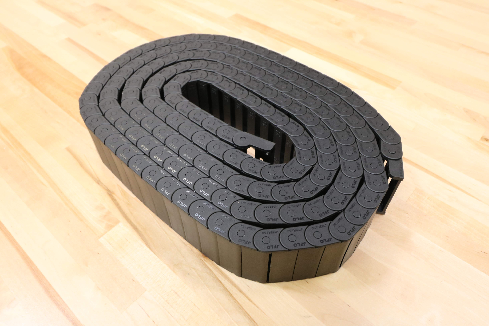

* toc
{:toc}

# Cable Carrier

These hollow plastic chains are used throughout FarmBot to manage cables and tubing along each of the three axes.

## Specs

specs:
  Material: Black Nylon PA66
  Lengths: enesis** X-Axis - 1.7m (85 links) + end pieces Y-Axis - 1.7m (85 links) + end pieces Z-Axis - 0.74m (37 links) + end pieces  **Genesis XL** X-Axis - 3.2m (160 links) + end pieces Y-Axis - 3.2m (160 links) + end pieces Z-Axis - 0.74m (37 links) + end pieces
  Inside Height: 15mm
  Inside Width: X-Axis - 20mm Y-Axis - 50mm Z-Axis - 50mm
  Outside Height: 20mm
  Outside Width: X-Axis - 30mm Y-Axis - 60mm Z-Axis - 60mm
  Pitch: 20mm
  Bending Radius: 28mm
  End Piece Configuration: X-Axis - `X configuration` (see image below) Y-Axis - `Y configuration` (see image below) Z-Axis - `Z configuration` (see image below)
price: enesis** X-Axis - $50.00 Y-Axis - $50.00 Z-Axis - $30.00  **Genesis XL** X-Axis - $80.00 Y-Axis - $80.00 Z-Axis - $30.00
quantity: 1 for each axis
internal-specs:
  Internal Part Name: enesis** X-Axis - `15 x 20 x 1700mm (85 links + end pieces in X configuration)` Y-Axis - `15 x 50 x 1700mm (85 links + end pieces in Y configuration)` Z-Axis - `15 x 50 x 740mm (37 links + end pieces in Z configuration)`  **Genesis XL** X-Axis - `15 x 20 x 3200mm (160 links + end pieces in X configuration)` Y-Axis - `15 x 50 x 3200mm (160 links + end pieces in Y configuration)` Z-Axis - `15 x 50 x 740mm (37 links + end pieces in Z configuration)`
  Vendor: JFLO
  Vendor Part Number: enesis and Genesis XL** X-Axis - `J15BF.1.20N R28` Y-Axis - `J15BF.1.50N R28` Z-Axis - `J15BF.1.50N R28`
  $/pc: enesis** X-Axis - $11.20 Y-Axis - $13.10 Z-Axis - $5.90  **Genesis XL** X-Axis - $19.90 Y-Axis - $24.50 Z-Axis - $5.90

**Component tests**{:.internal}

|Test         |Description  |Target       |Tolerance    |
|-------------|-------------|-------------|-------------|
|Size         |Inspect the size marking embossed into the plastic.|See BOM spec|N/A
|Length       |Measure the length of the cable carrier using a measuring tape.|See BOM spec|0
|End pieces   |Inspect the orientation of the end pieces.|Oriented according to FarmBot system design|N/A
|Mount fit    |Connect the end pieces to the appropriate cable carrier mounts/supports using the appropriate hardware.|Should fit as expected|N/A
|Contents fit |Inert all cables and tubing into each cable carrier according to FarmBot system design.|Should fit as expected|N/A

## End piece configuration



