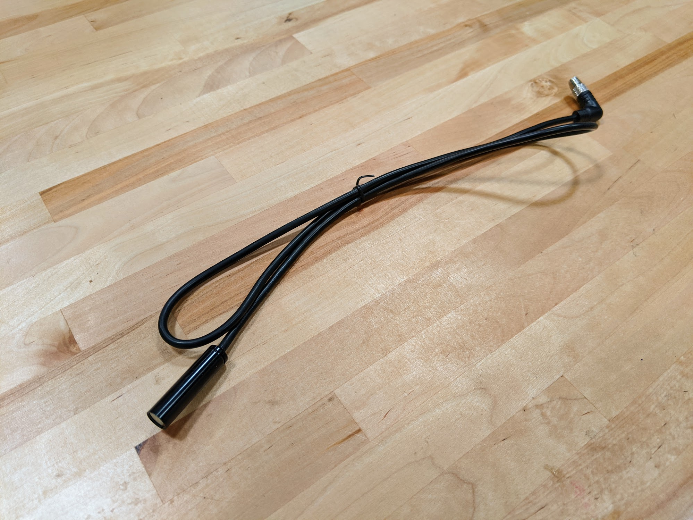
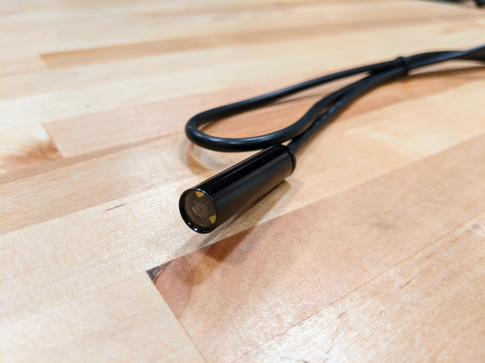
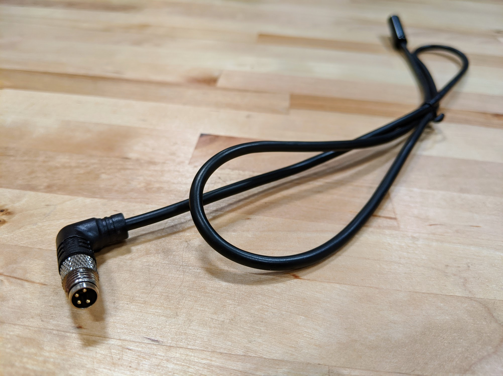
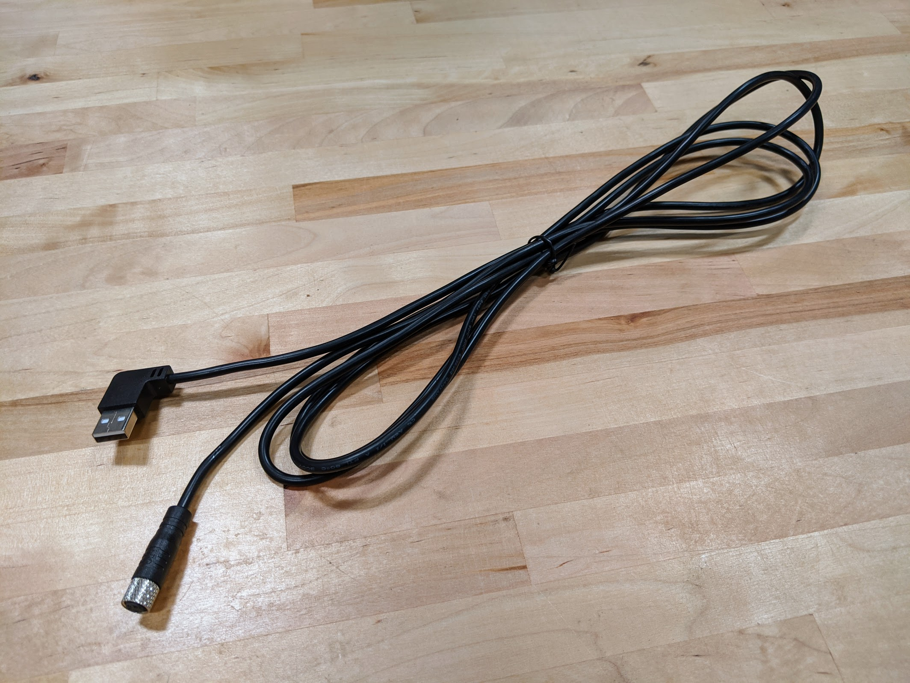

* toc
{:toc}

# Camera

The camera is mounted on the z-axis and allows FarmBot to take photos of the garden and plants for weed detection and tracking plant growth.



specs:
  Resolution: 0.3MP
  Waterproof?: Yes
  Focal Distance: 0.5m (custom set)
  Outer Diameter: 9mm
  Camera Length: 38mm
  Cable Length: 1m
  Connector: 4-pin male 90 degree waterproof connector
price: $30.00
quantity: 1
internal-specs:
  Internal Part Name: Camera
  Vendor: Shibang
  $/pc: $18.90
  Component Tests: 
  Notes: Inspect the camera module to ensure there are no obstructions in front of the lens, such as foam or glue.

**Component tests**{:.internal}

|Test         |Description  |Target       |Tolerance    |
|-------------|-------------|-------------|-------------|
|Resolution   |Take a photo and inspect the resolution.|1.3MP|N/A
|Focus        |Take a photo of an object 50cm away.|The object should appear sharp|N/A
|Diameter     |Measure the diameter of the camera module using digital calipers.|11mm|+/- 0.5mm
|Mount compatibility|Mount the camera to an extrusion using two camera mount halves.|The camera should be able to be firmly mounted in place|N/A
|Function     |Connect the camera to a Raspberry Pi using a Genesis XL camera cable and take a photo from the FarmBot web app.|Photo taking should work as expected (no black images, no failures)|N/A
|Camera module length|Measure the length of the camera module using digital calipers.|38mm|+/- 2mm
|Cable        |Inspect the spec of the cable.|`Shielded 28AWG/1p+24AWG/2c`  `1p` = 1 twisted pair (for data) `2c` = 2 core (for power)|N/A
|Cable length |Measure the length of the cable using a tape measure.|1m|+/- 2cm
|Sealing      |Inspect the sealing where the cable enters the camera module housing.|The cable should be well sealed|N/A
|Lens         |Inspect the camera lens for obstructions and straightness.|The camera lens should be free of obstructions and point straight out of the camera module.|N/A
|Color        |Inspect the color of the cable.|Black|N/A

# Camera Cable

This cable connects the camera to the Raspberry Pi through the y-axis cable carrier.

specs:
  Length: Genesis: 2.6m Genesis XL: 4.1m
  Cable: `Shielded 28AWG/1p+24AWG/2c`  `1p` = 1 twisted pair (for data) `2c` = 2 core (for power)
  Connector 1: 4-pin female waterproof 90 degree connector
  Connector 2: Right-angle USB Type A connector
price: Genesis: $15.00 Genesis XL: $20.00
quantity: 1
internal-specs:
  Internal Part Name: Genesis: `Camera Cable - 2.6m` Genesis XL: `Camera Cable - 4.1m`
  Vendor: 
  $/pc: Genesis (2.6m) - $3.50 Genesis XL (4.1m) - $4.30
  Component Tests: 
  Notes: Cable must be shielded USB cable or there will be EMI issues.

**Component tests**{:.internal}

|Test         |Description  |Target       |Tolerance    |
|-------------|-------------|-------------|-------------|
|Length       |Measure the length of the cable using a measuring tape.|See BOM spec|+/- 20mm
|Diameter     |Measure the diameter of the cable using digital calipers.|5mm|+/- 0.5mm
|Cable        |Inspect the spec of the cable.|`Shielded 28AWG/1p+24AWG/2c`  `1p` = 1 twisted pair (for data) `2c` = 2 core (for power)|N/A
|Color        |Inspect the color of the cable.|Black|N/A
|Function     |Use the camera cable to connect a camera to a Raspberry Pi. Take a photo using the web app.|Image should be captured as expected|N/A
|90 degree connector|Connect the 90 degree connector to a camera and submerge into a cup of water. Take a photo using the web app.|The connector should make a waterproof connection, allowing an image to be captured as expected|N/A
|Electronics box fit|Connect the camera cable to the Raspberry Pi in a fully assembled electronics box.|Cable and connector should fit|N/A

# Camera Calibration Card

Use this card to perform an automatic calibration of FarmBot's camera.

specs:
  Material: Matte cardstock
  Thickness: 16pt
  Printing: [Front.pdf](https://cdn.shopify.com/s/files/1/2040/0289/files/Camera_Calibration_Card_Rev_A_front.pdf?v=1596066432) [Back.pdf](https://cdn.shopify.com/s/files/1/2040/0289/files/Camera_Calibration_Card_Rev_A_back.pdf?v=1596066431)
price: $1.00
quantity: 1
internal-specs:
  Internal Part Name: Camera Calibration Card
  Vendor: 
  $/pc: $0.25
  Component Tests: 
  Notes: 2-sided print

**Component tests**{:.internal}

|Test         |Description  |Target       |Tolerance    |
|-------------|-------------|-------------|-------------|
|Print size   |Measure the center-to-center distance between two white dots in the same row using digital calipers or a measuring tape.|30mm|+/- 0.5mm
|Contrast     |Inspect the card for good contrast between the background and the white dots.|Black and white (no gray)|N/A
|Paper thickness|Measure the thickness of the paper using digital calipers.|0.43mm (16pt)|+/- 0.1mm
|Sheen        |Inspect the sheen of the card.|Matte|N/A
|Function     |Use the card to perform camera calibration.|Camera should calibrate in a variety of common lighting conditions.|N/A