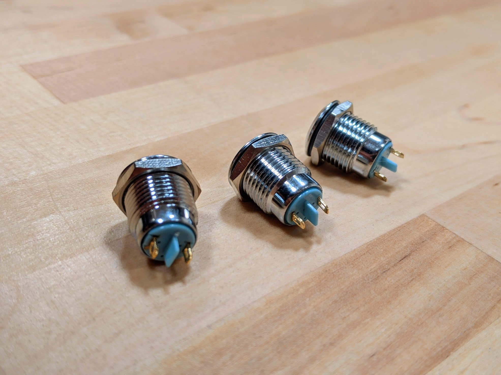
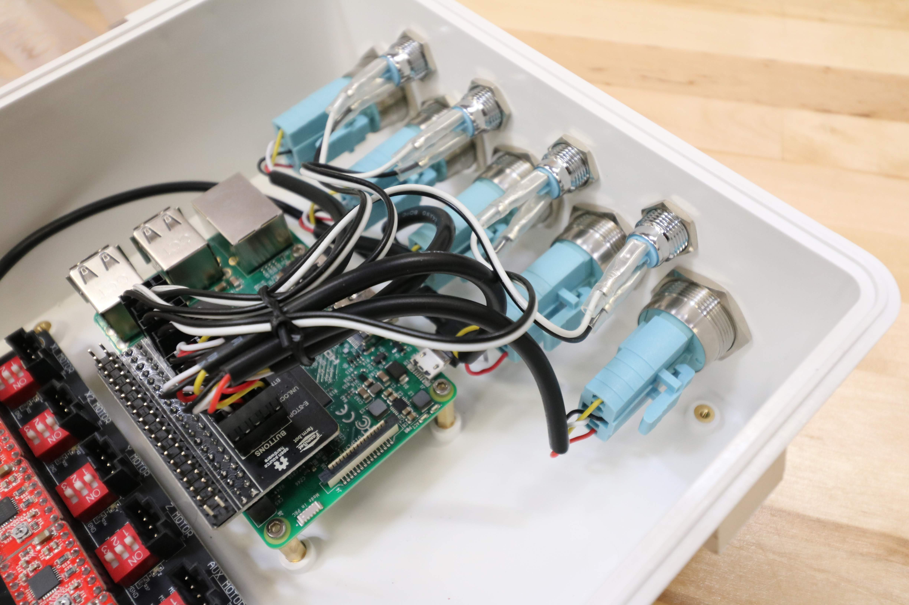

* toc
{:toc}

# Electronics Box

This rainproof box protects FarmBot's electronics from rain and debris. It features an easy-to-use tool-less double latch design for quickly opening and closing the box, a rubber gasket to keep moisture out, and a custom gland for all of FarmBot's cables to be passed through. The lid, latches, and box are made of UV stabilized materials.



specs:
  Materials: Box, Lid, and Latches - UV stabilized ABS Gasket and Supergland - Rubber Screws and Nuts - Stainless steel
  Rainproof?: Yes
  Colors: Box - White Lid - Frosted clear Latches, Gasket, and Supergland - Black
  Cover Type: Hinged with latches
  Hinge Type: M3 x 35mm screws with locknuts
  Price: $95.00
  Quantity: 1
internal-specs:
  Internal Part Name: Genesis Electronics Box (Box) Rev A` `Genesis Electronics Box (Lid) Rev A` `Genesis Electronics Box (Gasket) Rev A` `Genesis Electronics Box (Supergland) Rev A` `Electronics Box (Latches) Rev A
  Vendor: 
  $/pc: Box - $10.60 Lid - $5.40 Gasket - $1.20 Supergland - $0.70 Latches - $0.80

# LED Indicator

These waterproof LED indicator lights come pre-mounted on the top of the electronics box. The blue light is reserved for connectivity status, the green light for sync status, and the two white lights are user-customizable. Each light includes a wiring harness and comes pre-connected to the Pi adapter board.



specs:
  Color: Blue - 1 Green - 1 White - 2
  Material: Stainless steel and plastic
  Waterproof?: Yes
  O-Ring?: Included
  Wiring?: Included
  Price: $5.00
  Quantity: 4 total
internal-specs:
  Internal Part Name: Blue LED Indicator` `Green LED Indicator` `White LED Indicator
  Vendor: 
  $/pc: Indicator: $0.99 Wiring: $0.50

**Component tests**{:.internal}

|Test         |Description  |Target       |Tolerance    |
|-------------|-------------|-------------|-------------|
|Diameter     |Measure the diameter of the threaded section using digital calipers.|11.8mm|+/- 0.2mm
|Electronics box fit|Check fit in electronics box.|LED should fit with minimal play such that o-ring is guaranteed to seal.|N/A
|Length       |Measure the overall length using digital calipers.|24mm|+/- 1mm
|O-ring       |Inspect for the presence of an O-ring under the top flange.|Present|N/A
|Waterproof   |Drill a hole in a small plastic tub. Fasten the LED indicator to the hole and fill the tub with water.|The LED indicator should continue to operate when submerged, and prevent water from leaking.|N/A
|Wiring harness|Connect wiring harness between LED and Pi Adapter Board.|LED should work, harness should be of adequate length, and connectors should stay firmly attached.|N/A
|Material     |Ensure the material will not rust by holding a magnet to the part.|Stainless steel (no magnetic attraction)|Weak attraction to stainless steel is permissible.
|Illumination |Power on FarmBot.|The Sync and Connectivity indicators should be illuminated|N/A

# Push Button

These waterproof push buttons come pre-mounted on the top of the electronics box. The red button is reserved for E-STOP, the yellow for UNLOCK, and the three white ones are user-customizable. Each button includes a wiring harness and comes pre-connected to the Pi adapter board.



specs:
  Color: Yellow - 1 Red - 1 White - 3
  Material: Stainless steel and plastic
  Waterproof?: Yes
  O-Ring?: Included
  Wiring?: Included
  Price: $7.00
  Quantity: 5 total
internal-specs:
  Internal Part Name: Yellow LED Push Button` `Red LED Push Button` `White LED Push Button
  Vendor: 
  $/pc: Button: $2.49 Wiring: $1.00

**Component tests**{:.internal}

|Test         |Description  |Target       |Tolerance    |
|-------------|-------------|-------------|-------------|
|Diameter     |Measure the diameter of the threaded section using digital calipers.|21.8mm|+/- 0.2mm
|Electronics box fit|Check fit in electronics box.|Button should fit with minimal play such that o-ring is guaranteed to seal.|N/A
|Length       |Measure the overall length using digital calipers.|40mm|+/- 1mm
|O-ring       |Inspect for the presence of an O-ring under the top flange.|Present|N/A
|Waterproof   |Drill a hole in a small plastic tub. Fasten the button to the hole and fill the tub with water.|The button should continue to operate when submerged, and prevent water from leaking.|N/A
|Wiring harness|Connect wiring harness between button and Pi Adapter Board.|Button should work, harness should be of adequate length, and connectors should stay firmly attached.|N/A
|Material     |Ensure the material will not rust by holding a magnet to the part.|Stainless steel (no magnetic attraction)|Weak attraction to stainless steel is permissible.
|Function     |Bind a button to a sequence and press the button.|FarmBot should execute the sequence|N/A
|Illumination |Power on FarmBot.|The E-stop button should be illuminated|N/A
