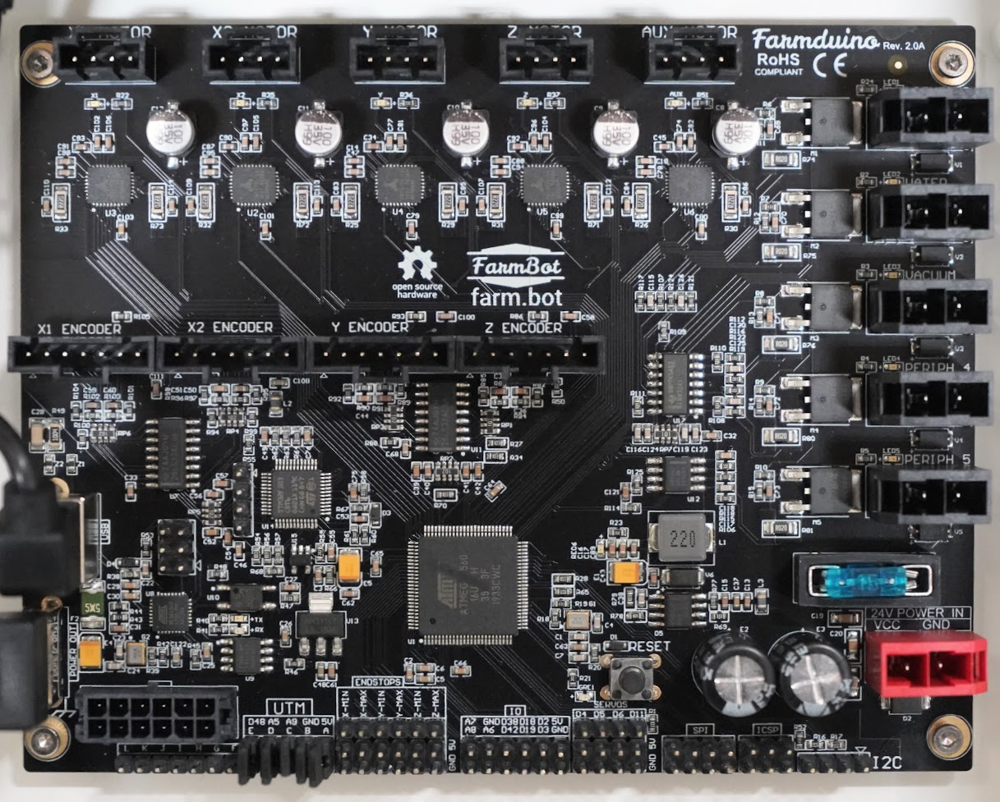

* toc
{:toc}

# Farmduino

The Farmduino microcontroller features a board layout and connectors that are optimized for FarmBot. It receives G-code commands from the Raspberry Pi and then moves the motors, reads sensors, activate peripherals, and more. It features integrated Trinamic TMC2130 stepper drivers for ultra quiet movements and an STM32 coprocessor dedicated to monitoring the rotary encoders.

## Open-source



|Resource|Link|
|--------|----|
|Schematics, board layout, and hardwrae source files|[Google Drive Folder](https://drive.google.com/drive/folders/1mUYvzC2uOgCfWoyfXvQitavsMF2ly5H-?usp=sharing)
|Arduino MCU firmware source code|[GitHub](https://github.com/FarmBot/farmbot-arduino-firmware)
|STM32 firmware for tracking encoder signals|[GitHub](https://github.com/MotorDynamicsLab/encoder-tracker/releases/tag/v1.0.2)

## Specs

specs:
  Microcontrollers: ATmega2560 STM32
  Stepper Drivers: Trinamic TMC2130
  Input Voltage: 24V
  Fuse: 7.5 amp blade fuse
  Power Receptacle: Black 3-pin receptacle ([Molex Part 2002411113](https://www.molex.com/molex/products/part-detail/pcb_headers/2002411113))
  Peripheral Receptacle** (Vaccum)|Black 3-pin receptacle ([Molex Part 2002411113](https://www.molex.com/molex/products/part-detail/pcb_headers/2002411113))
  Peripheral Receptacles** (Water, Lighting, and Peripherals 4 and 5)|Black 2-pin receptacle ([Molex Part 151048-1206](https://www.molex.com/molex/products/part-detail/pcb_headers/1510481206))
  UTM Receptacle: Black 12-pin receptacle ([Molex Part 430451212](https://www.molex.com/molex/products/part-detail/pcb_headers/0430451212))
  Motor Receptacles: Black 4-pin receptacle ([Molex Part 705430038](https://www.molex.com/molex/products/part-detail/pcb_headers/0705430038))
  Encoder Receptacles: Black 7-pin receptacle ([Molex Part 705430041](https://www.molex.com/molex/products/part-detail/pcb_headers/0705430041))
  Rotary Tool Driver: [Texas Instruments DRV8876](https://www.ti.com/lit/ds/symlink/drv8876.pdf) H-bridge motor driver with integrated current sense and regulation
  DC Current per I/O Pin: 40 mA
  DC Current for 3.3V Pin: 50 mA
  PCB Color: Black
  RoHS Compliant: Yes
  CE Certification: Yes
  Price: $150.00
  Quantity: 1
internal-specs:
  Internal Part Name: Farmduino v1.6 Rev A
  Vendor: LDO
  $/pc: $77.50
  Component Tests: 
  Notes: 

**Component tests**{:.internal}

|Test         |Description  |Target       |Tolerance    |
|-------------|-------------|-------------|-------------|
|Pins         |Inspect the pins for damage.|No pins should be bent|N/A
|Fuse         |Ensure the blade fuse is inserted and of the correct amperage.|7.5 Amps|N/A
|USB power out|Read the voltage coming from the `POWER OUT` USB connector.|5.25V|+/- 0.1V
|UTM shunts   |Inspect for the presence of the UTM pin shunts.|Present on Pins `A`-`H`|N/A
|Color        |Inspect the color of the PCB.|Matte black|N/A
|Functionality|Use the factory test firmware to test motor, encoder, and periperhal functions.|All functions work|N/A
|Encoder tracking|Move all motor axes with manual controls, by hand, and with forced stalls.|Encoder positions should be accurately tracked in all scenarios.|N/A
|Encoder tracking range|Using stock encoder scaling, move to +/- 10,000mm on the X and Y axes and +/- 2,000mm on the Z axis.|STM32 should accurately track encoder positions through the range of movement.|N/A
|STM32 reset  |Set `pin 49` low and then high.|Encoder tracking should reset.|N/A
|SPI comms    |Move motors to random positions and then modify Trinamic TMC2130 parameters (eg: motor current)|Parameters should update and encoder tracking should maintain position.|N/A

# Farmduino Data Cable

This USB cable is used as a serial connection between the Raspberry Pi and the Farmduino.

specs:
  Connector 1: Right-angle USB 2.0 Type A Male
  Connector 2: Right-angle USB 2.0 Type B Male
  Length: 150mm
  Color: Black
  Price: $5.00
  Quantity: 1
internal-specs:
  Internal Part Name: Farmduino Data Cable
  Vendor: 
  $/pc: $1.19

**Component tests**{:.internal}

|Test         |Description  |Target       |Tolerance    |
|-------------|-------------|-------------|-------------|
|Cable        |Inspect the cable spec.|`Shielded 28AWG/1p+24AWG/2c`  `1p` = 1 twisted pair (for data) `2c` = 2 core (for power)|N/A
|Connectors   |Connect the cable to a Raspberry Pi and Farmduino inside a fully assembled electronics box.|The cable should connect to both circuit boards without interference from the box or other components.|N/A
|Length       |Measure the length using a measuring tape.|150mm|+/- 10mm
|Color        |Inspect the color of the cable.|Black|N/A

# Peripheral Lead

These extra leads make it easy to connect new, additional peripherals to your Farmduino.

specs:
  Wire Type: 18 AWG stranded copper, two core
  Outer Color: Black
  Inner Colors: Red and black
  Heat Shrink Color: Black
  Connector 1: Black 2-pin connector ([Molex Part Number 151049-2206](https://www.molex.com/molex/products/datasheet.jsp?part=active/1510492206_CRIMP_HOUSINGS.xml))
  Connector 2: Pre-stripped wire (no connector)
  Length: 10cm
  Price: $3.00
  Quantity: 2
internal-specs:
  Internal Part Name: Peripheral Lead
  Vendor: 
  $/pc: $1.30

**Component tests**{:.internal}

|Test         |Description  |Target       |Tolerance    |
|-------------|-------------|-------------|-------------|
|Connector and continuity|Connect the lead to a Farmduino and power the peripheral. Use a voltmeter to measure the voltage at the exposed leads.|The cable's connectors should connect as expected and the voltage should be 24V.|N/A
|Length       |Measure the length using a tape measure.|10cm|+/- 1cm
|Cable        |Inspect the cable's spec.|18AWG-2C stranded copper cable|N/A
|Shrinkwrap   |Inspect the color of the shrinkwrap.|Black|N/A
|Color        |Inspect the color of the cable.|Black outer, black and red inner|N/A
