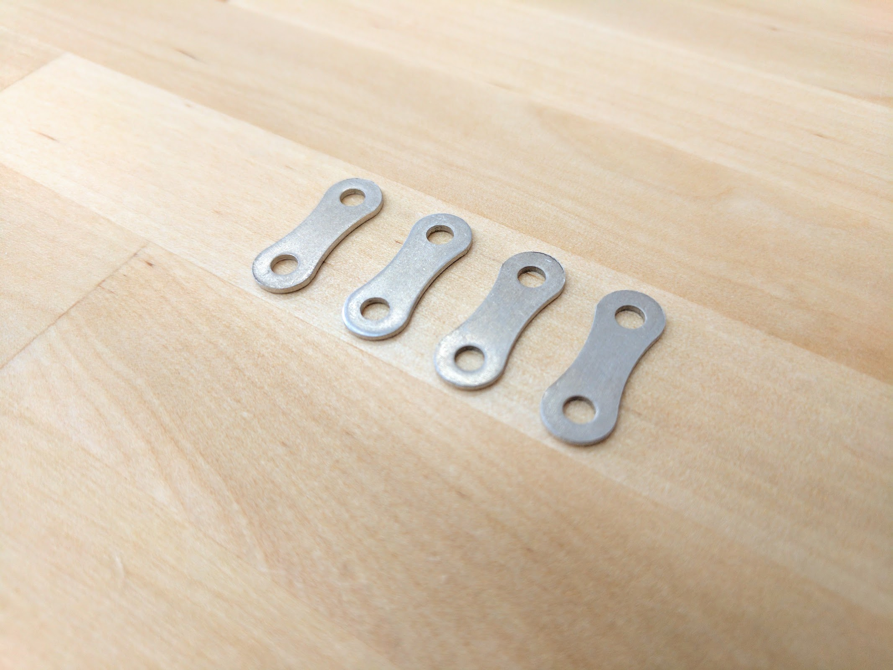

* toc
{:toc}

# Jumper Link

These connect the Grounded electronic pin to the Digital In pin, allowing FarmBot to detect when a tool has been mounted or dismounted correctly.

specs:
  Material: Aluminum
  Thickness: 1mm
  Hole Sizes: M3
  Price: $0.25
  Quantity: 5
internal-specs:
  Internal Part Name: Jumper Link
  Vendor: LDO
  $/pc: $0.22

**Component tests**{:.internal}

|Test         |Description  |Target       |Tolerance    |
|-------------|-------------|-------------|-------------|
|Hole size    |Measure the size of the holes using digtial calipers.|3.25mm|+/- 0.1mm
|Fit          |Assemble a jumper link into a tool using M3 screws and locknuts according to the FarmBot system design.|Part should fit without interference|N/A
|Thickness    |Measure the thickness using digital calipers.|1mm|+/- 0.2mm
|Material     |Ensure the material will not rust by holding a magnet to the part.|Aluminum (no magnetic attraction)|N/A
|ELectrical conductivity|Connect an ohm meter to both ends of a jumper link.|Less than 1 ohm|N/A

# Jumper Wire

Use these jumper wires to connect the UTM headers on Farmduino to other pins such as I2C, PWM, or more digital or analog I/O.

specs:
  Length: 180mm
  Connectors: 2.54mm pitch female dupont contact with heatshrink
  Color: Black
  Price: $0.25
  Quantity: 12
internal-specs:
  Internal Part Name: Jumper Wire
  Vendor: 
  $/pc: $0.14

**Component tests**{:.internal}

|Test         |Description  |Target       |Tolerance    |
|-------------|-------------|-------------|-------------|
|Connectors   |Connect a jumper wire to two GPIO pins.|It should connect as expected.|N/A
|Wire         |Inspect the wire spec.|20AWG|N/A
|Length       |Measure the length using a measuring tape.|180mm|+/- 10mm
|Color        |Inspect the color of the cable and shrinkwrap.|Black|N/A
