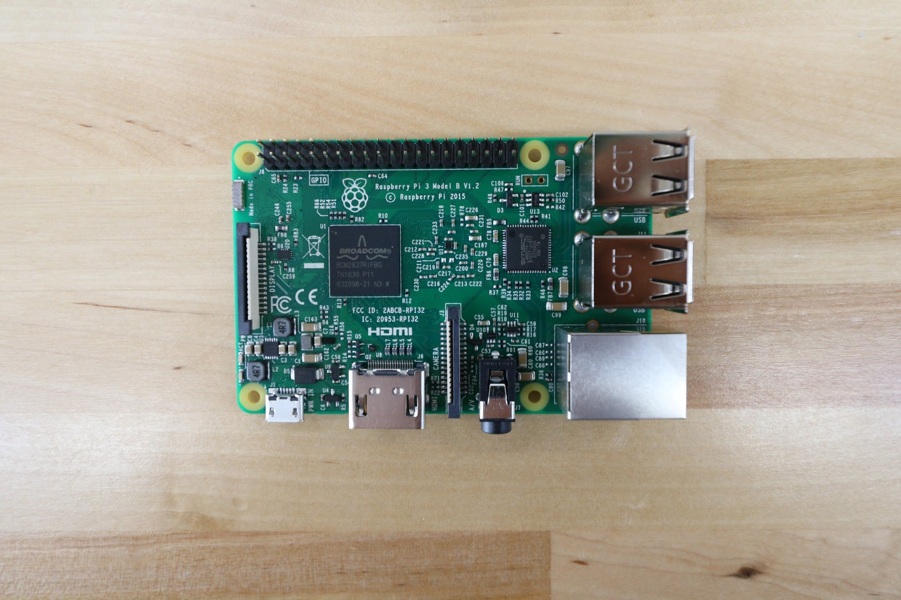
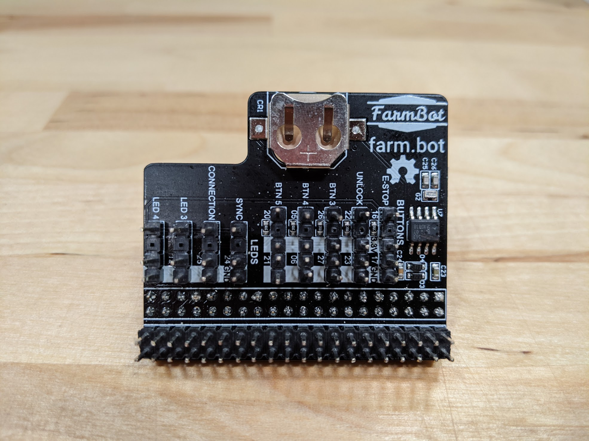
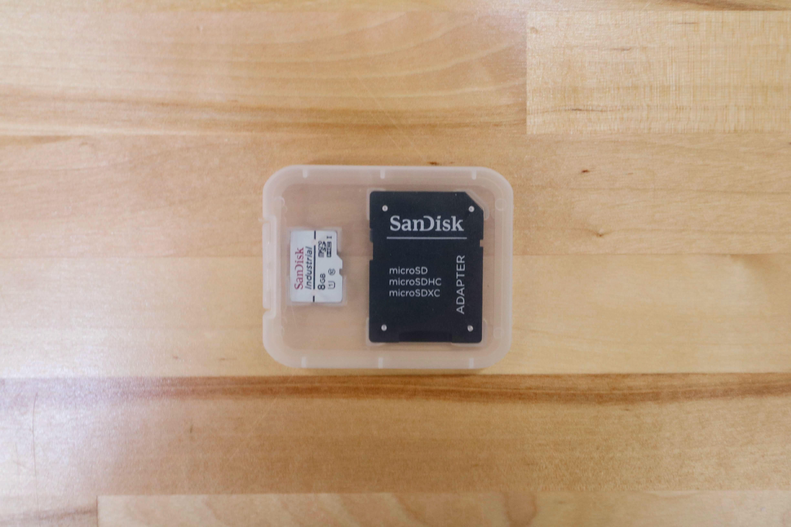

* toc
{:toc}

# Raspberry Pi 3

This is the "host computer" of FarmBot. You might also call it FarmBot's brain. The Raspberry Pi runs FarmBot OS, communicates with the web application over ethernet or WiFi, and talks to the Farmduino over a USB serial connection.



specs:
  CPU: 1.2Ghz Quad Core (3B) 1.4Ghz Quad Core (3B+)
  RAM: 1GB
  WiFi: 2.4GHz 802.11n (3B) Dual-Band 802.11ac (3B+)
  Ethernet: 10/100 (3B) 1000 (3B+)
  USB: 4x USB 2.0 ports
  Storage: MicroSD
  GPIO: 40-pin header
price: $40.00
quantity: 1
internal-specs:
  Internal Part Name: Raspberry Pi 3B+
  Vendor: 
  $/pc: $39.70
  Notes: Ensure the model is `3B+` (not `3B`)

**Component tests**{:.internal}

|Test         |Description  |Target       |Tolerance    |
|-------------|-------------|-------------|-------------|
|Model        |Inspect the board for model number.|`Model 3B+`|N/A
|Brand        |Inspect the board for the brand name.|`Raspberry Pi`|N/A
|Condition    |Inspect to ensure the product is not used or refurbished.|Product should be brand new|N/A
|GPIO pins    |Inspect the GPIO pins for damage.|No pins should be bent|N/A

# Raspberry Pi Power Cable

This USB cable provides power to the Raspberry Pi from the Farmduino's built-in 12v to 5v to USB circuitry.

specs:
  Connector 1: Right-angle USB 2.0 Type A Male
  Connector 2: Right-angle microUSB 2.0 Male
  Length: 300mm
  Color: Black
price: $5.00
quantity: 1
internal-specs:
  Internal Part Name: Raspberry Pi Power Cable
  Vendor: 
  $/pc: $1.19
  Notes: Samples received in July 2020

**Component tests**{:.internal}

|Test         |Description  |Target       |Tolerance    |
|-------------|-------------|-------------|-------------|
|Cable        |Inspect the cable spec.|`Shielded 28AWG/1p+24AWG/2c`  `1p` = 1 twisted pair (for data) `2c` = 2 core (for power)|N/A
|Connectors   |Connect the cable to a Raspberry Pi and Farmduino inside a fully assembled electronics box.|The cable should connect to both circuit boards without interference from the box or other components.|N/A
|Length       |Measure the length using a measuring tape.|300mm|+/- 10mm
|Voltage drop |Use USB voltage monitors to check the voltage before and after the cable.|Less than 5% voltage drop|4.9V output minimum
|Color        |Inspect the color of the cable.|Black|N/A

# Pi Adapter Board

This PCB mounts directly onto the Raspberry Pi's GPIO pin header and provides connectors for the push buttons and LED indicators, as well as a real-time clock for timekeeping in offline situations. [Click here to download the source files](https://drive.google.com/drive/folders/1P8Pdpv2Jrlygh-WBlnO5RMSocQVUQCna?usp=sharing).



specs:
price: $10.00
  PCB Color: Black
  Realtime Clock: Integrated
  Battery: CR1220
quantity: 1
internal-specs:
  Internal Part Name: Pi Adapter Board w/ RTC
  Vendor: LDO
  $/pc: $2.60

**Component tests**{:.internal}

|Test         |Description  |Target       |Tolerance    |
|-------------|-------------|-------------|-------------|
|Pins         |Inspect the pins for damage.|No pins should be bent|N/A
|RTC battery  |Ensure the RTC battery is inserted.|Included|N/A
|Color        |Inspect the color of the PCB.|Matte black|N/A

# MicroSD Card

The microSD card holds FarmBot OS and is inserted into the Raspberry Pi.

specs:
  Form Factor: MicroSD
  Capacity: 8GB
  Brand: SanDisk
price: $15.00
quantity: 1
internal-specs:
  Internal Part Name: 8GB Sandisk Industrial Micro SD card
  Vendor: 
  $/pc: $6.00
  Notes: Must be genuine SanDisk brand, new (not refurbished)

**Component tests**{:.internal}

|Test         |Description  |Target       |Tolerance    |
|-------------|-------------|-------------|-------------|
|Brand        |Inspect the card for the brand name.|`SanDisk`|N/A
|Capacity     |Inspect the card for capacity rating.|8GB|N/A
|Condition    |Inspect to ensure the product is not used or refurbished.|Product should be brand new|N/A
|Software     |Power on the FarmBot.|FarmBot OS should boot into configurator.|N/A