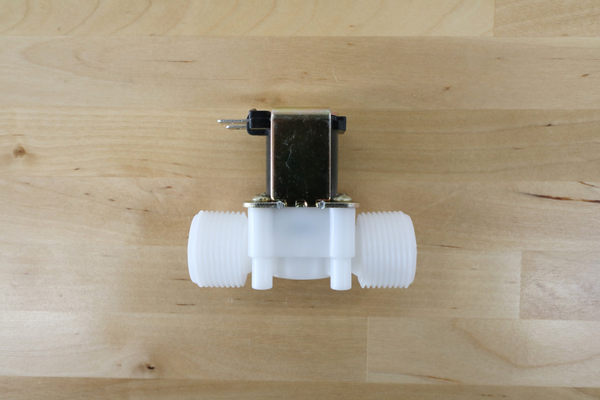
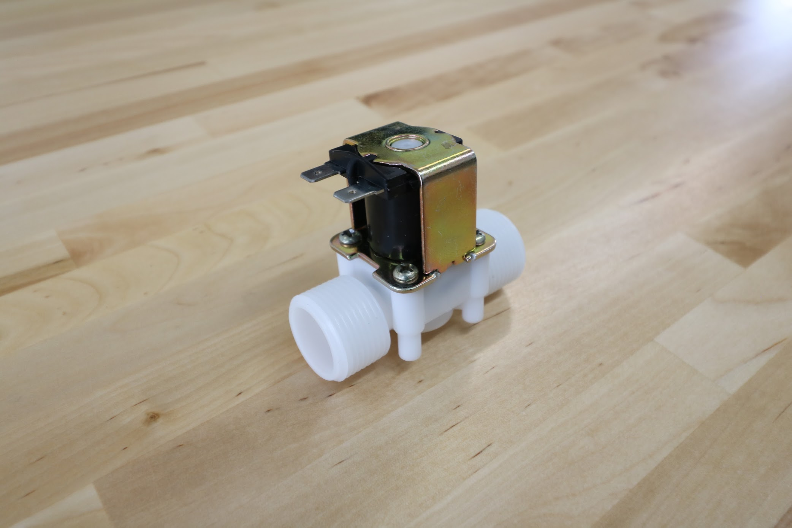
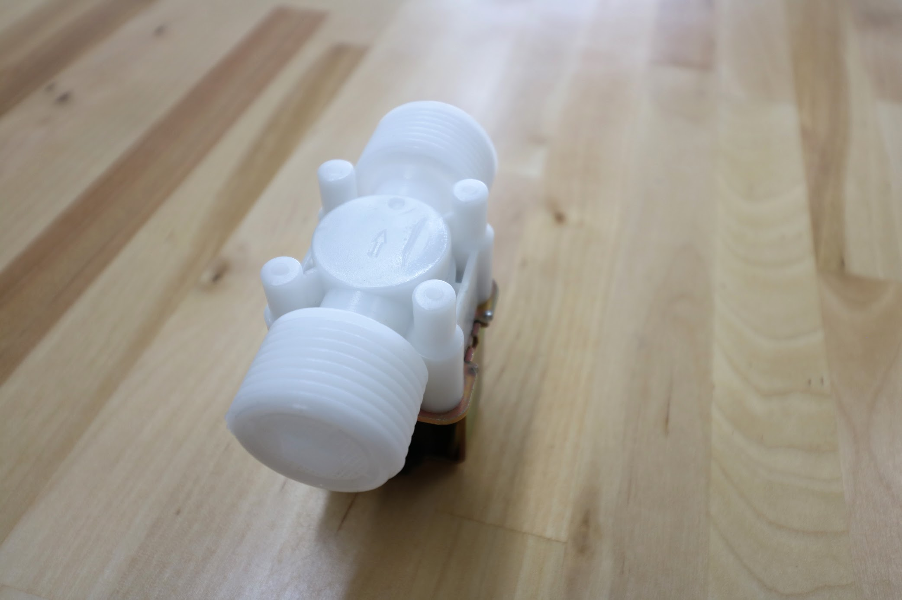
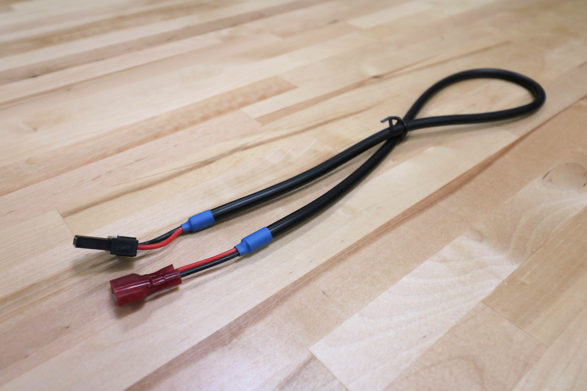

* toc
{:toc}

# Solenoid Valve

This 24V valve controls the flow of water from your garden hose to FarmBot's tubing.



specs:
  Inlet: 3/4" NPT (National Pipe Thread)
  Outlet: 3/4" NPT (National Pipe Thread)
  Operation: Normally closed
  Working Pressure Range: 0.02 to 0.8 Mpa (3 to 116 PSI)
  Flow Direction: One-way, indicated by an arrow molded into the plastic
  Input Voltage: 24V
  Current Draw: 160mA
  Power Consumption: 3.84 watts
  Electrical Tabs Direction: Facing towards the inlet
price: $8.00
quantity: 1
internal-specs:
  Internal Part Name: 24V Solenoid Valve
  $/pc: $2.30

**Component tests**{:.internal}

|Test         |Description  |Target       |Tolerance    |
|-------------|-------------|-------------|-------------|
|Threads      |Screw an NPT to barb adapter (with rubber gasket) onto the inlet. Connect a tube to the barb and pressurize the system with municipal water.|Adapter should thread on as expected and the system should hold water without leaking.|N/A
|Voltage      |Connect the solenoid valve to a Farmduino and test operation.|Opens and does not get hot with 24V input|+/- 3V
|Terminal size|Connnect a solenoid valve cable.|The cable's connectors should connect to the terminals as expected|N/A
|Terminal direction|Inspect the direction the terminals face.|Terminals should face the inlet|N/A
|Normal state |Try to blow air through the solenoid valve when it is unplugged/inactive.|Air should not pass through (the valve should be closed)|N/A
|Pressure Range|Inspect the label on the solenoid valve for the working pressure range.|0.02 to 0.8 Mpa (3 to 116 PSI)|N/A

# Solenoid Valve Cable

This cable connects the solenoid valve to the Farmduino.

specs:
  Wire Type: 18 AWG stranded copper, 2 core
  Length: 0.5m
  Rated Voltage: 300V DC
  Inner Colors: Red and black
  Outer Color: Black
  Heat Shrink Color: Blue
  Connector 1: Black 2-pin connector ([Molex Part Number 151049-2206](https://www.molex.com/molex/products/datasheet.jsp?part=active/1510492206_CRIMP_HOUSINGS.xml))
  Connector 2: Two 1/4" female shielded quick-connect terminals
price: $10.00
quantity: 1
internal-specs:
  Internal Part Name: Solenoid Valve Cable - 0.5m
  $/pc: $1.70

**Component tests**{:.internal}

|Test         |Description  |Target       |Tolerance    |
|-------------|-------------|-------------|-------------|
|Connectors and continuity|Use the cable to connect a solenoid valve to a Farmduino.|The cable's connectors should connect as expected and the valve should be operable.|N/A
|Length       |Measure the length using a tape measure.|0.5m|+/- 20mm
|Cable        |Inspect the cable's spec.|18AWG-2C stranded copper cable|N/A
|Shrinkwrap   |Inspect the color of the shrinkwrap.|Blue|N/A
|Color        |Inspect the color of the cable.|Black outer, black and red inner|N/A
