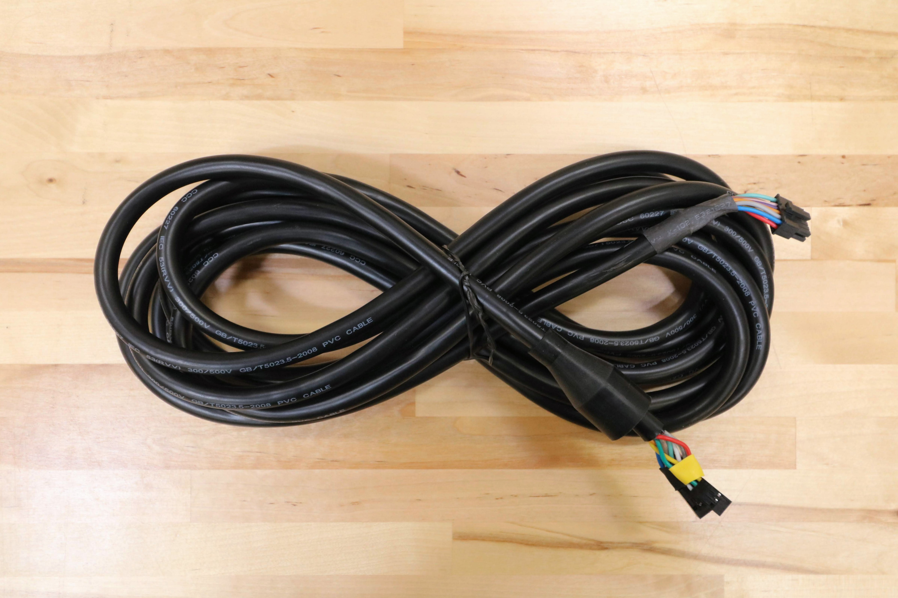
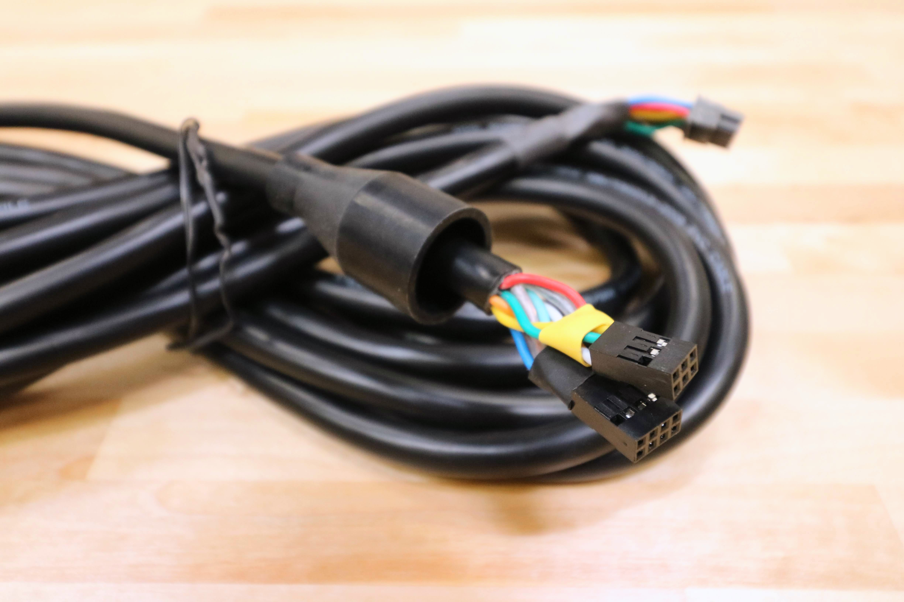
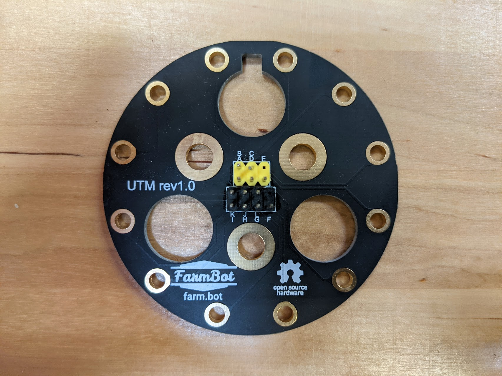
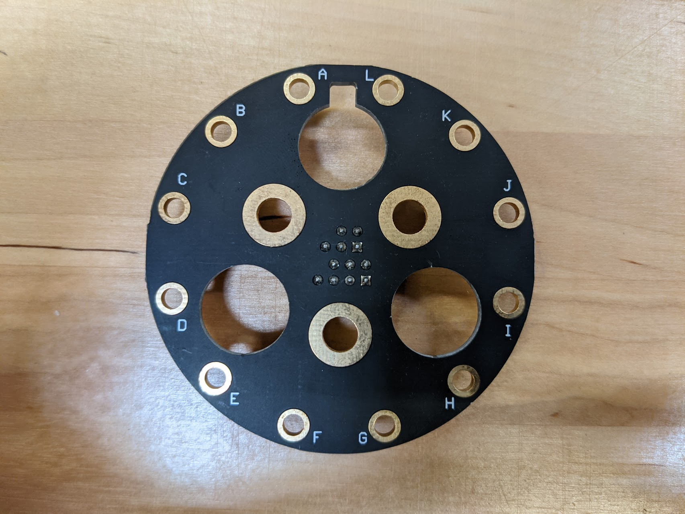

* toc
{:toc}

# UTM Cable

This 12-wire shielded cable connects the Farmduino to the UTM. It comes in two pieces, a Y-axis section and a Z-axis section that connect with a 90-degree screw-together waterproof connection at the cross-slide. It provides Ground, 5V, 24V, digital and analog I/O, with a pin mapping that can be configured at the Farmduino to support custom tools. It features connectors on both ends for easy connection to both the UTM and Farmduino, as well as a rubber shroud to protect the inside of the UTM from the elements.



specs:
  Number of Wires: 12
  Wire Colors: All different
  Shielded?: Yes
  Wire Gauge: 24
  Lengths: enesis** Y-axis section: 2.6m Z-axis section: 1.0m  **Genesis XL** Y-axis section: 4.1m Z-axis section: 1.0m
  Outer Diameter: 8mm
  Outer Color: Black
  Shroud: Included black silicone rubber
  Farmduino connector: Black 12-pin connector ([Molex Part 430251200](https://www.molex.com/molex/products/part-detail/crimp_housings/0430251200))
  Intermediate connectors: 12-pin waterproof screw together 90 degree connectors. (female connector on the Y-Axis sections, male connector on the Z-Axis section)
  UTM connectors: 2x3 2.54mm pitch plug (yellow shrinkwrap) 2x4 2.54mm pitch plug (black shrinkwrap)
  price: Genesis - $50.00 Genesis XL - $60.00
  quantity: 1
internal-specs:
  Internal Part Name: enesis** `UTM Cable Y-Axis Section - 2.6m (Genesis) Rev A` `UTM Cable Z-Axis Section with Shroud - 1.0m Rev A`  **Genesis XL** `UTM Cable Y-Axis Section - 4.1m (Genesis XL) Rev A` `UTM Cable Z-Axis Section with Shroug - 1.0m Rev A`
  Vendor: 
  $/pc: Y-Axis Section - 2.6m (Genesis) - $6.00 Y-Axis Section - 4.1m (Genesis XL) - $8.00 Z-Axis Section - 1.0m (Genesis and Genesis XL) - $5.00

**Component tests**{:.internal}

|Test         |Description  |Target       |Tolerance    |
|-------------|-------------|-------------|-------------|
|Length       |Measure the length using a measuring tape.|See BOM spec|+/- 20mm
|Diameter     |Measure the diameter of the cable using digital calipers.|7mm|+/- 0.5mm
|Connectors   |Connect a UTM to the Farmduino using the cable.|Connectors should fit as expected.|N/A
|Continuity   |Use a multimeter to check pinout and continuinty for each core through complete cable (Y and Z sections).|All cores are connected correctly|N/A
|Cable        |Inspect the cable's spec.|24AWG-12C shielded stranded copper cable|N/A
|Shroud       |Inspect the shroud and test fit on UTM.|Shroud should snugly fit on top of UTM|N/A
|Color        |Inspect the color of the cable.|Black|N/A
|Function     |Mount and dismount the Rotary Tool and Soil Sensor. Use a tools to verify cable function.|Tools work as expected|N/A

# UTM PCB

This PCB features 12 pre-mounted pogo pins to enable electrical connection with FarmBot's tools. [Click here to download the source files](https://drive.google.com/drive/folders/1BTdp27t__LOzHmLJjJt_slEUzAGGNGCx).



specs:
  Pre-assembled?: Yes
  Number of pogo pins: 12 (includes 1 extra, and 2 extra jam nuts)
  Color: Matte black
  price: $35.00
  quantity: 1
internal-specs:
  Internal Part Name: UTM PCB (assembled with pogo pins)` `Pogo Pins` `Jam Nuts
  Vendor: LDO
  $/pc: $6.90
  Notes: 12 pogo pins and 24 jam nuts pre-assembled to PCB, 1 extra pogo pin and 2 extra jam nuts included in separate bag.

**Component tests**{:.internal}

|Test         |Description  |Target       |Tolerance    |
|-------------|-------------|-------------|-------------|
|Pins         |Inspect the pins for damage.|No pins should be bent|N/A
|Fit          |Mount the PCB into a UTM.|The PCB should fit as expected|N/A
|Color        |Inspect the color of the PCB.|Matte black|N/A