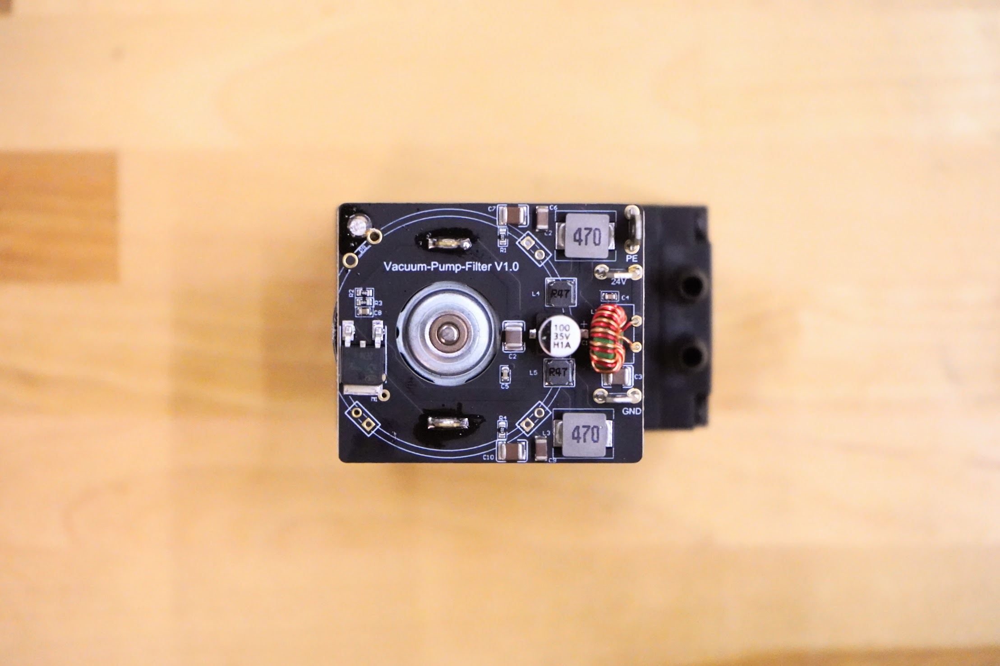
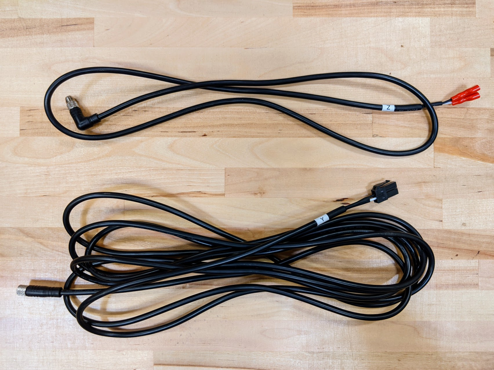

* toc
{:toc}

# Vacuum Pump

This 24V vacuum pump sucks air through the seeder's luer lock needle in order to suction-hold a seed on the needle tip during planting. It features a PCB direct-soldered onto the back of the motor to provide EMI filtering and smooth startup current draw.



specs:
  Input Voltage: 24V DC
  Current Draw: 0.5A
  Connectors: Three 3/16" male quick-connect terminals for `24V`, `GND`, and `PE` (protected earth)
  Barb Size: For 6mm ID tubing
price: $30.00
quantity: 1
internal-specs:
  Internal Part Name: 24V Vacuum Pump with EMI Filter
  Vendor: LDO
  $/pc: $10.20

**Component tests**{:.internal}

|Test         |Description  |Target       |Tolerance    |
|-------------|-------------|-------------|-------------|
|Performance  |Connect the vacuum pump to a 24V power source, vacuum air tube, UTM, and seeder tool.|The vacuum should exert enough suction to pick up a seed|N/A
|Terminal size|Connnect a vacuum pump cable.|The cable's connectors should connect to the terminals as expected|N/A
|PCB color    |Inspect the PCB's color.|Matte black|N/A
|Size         |Assembly a vacuum pump, vacuum pump mount plate, vacuum pump cover, and z-axis extrusion according to the FarmBot system design.|Vacuum pump should fit inside the housing without interference,|N/A
|Inlet size   |Connect a vacuum air tube to the vacuum pump's inlet.|Tube should connect as expected, requiring a small amount of force to remove.|N/A

# Vacuum Pump Cable

This cable connects the vacuum pump to the Farmduino. It comes in two pieces, a Y-axis section labelled `Y` and a Z-axis section labelled `Z` that connect with a 90-degree screw-together waterproof connection at the cross-slide.



specs:
  Wire Type: 18 AWG stranded copper, 3 core
  Shielded?: Yes
  Lengths: enesis** Y-axis section: 2.6m Z-axis section: 1.0m  **Genesis XL** Y-axis section: 4.1m Z-axis section: 1.0m
  Rated Voltage: 300V
  Inner Colors: Red and black
  Outer Color: Black
  Heat Shrink Color: Gray
  Farmduino connector: Black 3-pin connector ([Molex Part 2004561213](https://www.molex.com/molex/products/part-detail/crimp_housings/2004561213))
  Intermediate connectors: 3-pin waterproof screw together 90 degree connectors. (female connector on the Y-Axis sections, male connector on the Z-Axis section)
  Vacuum pump connectors: Three 3/16" female insulated quick-connect terminals
price: Genesis - $20.00 Genesis XL - $25.00
quantity: 1
internal-specs:
  Internal Part Name: enesis** `Vacuum Pump Cable Y-Axis Section - 2.6m (Genesis)` `Vacuum Pump Cable Z-Axis Section - 1.0m`  **Genesis XL** `Vacuum Pump Cable Y-Axis Section - 4.1m (Genesis XL)` `Vacuum Pump Cable Z-Axis Section - 1.0m`
  Vendor: 
  $/pc: Y-Axis Section - 2.6m (Genesis) - $2.50 Y-Axis Section - 4.1m (Genesis XL) - $3.20 Z-Axis Section - 1.0m (Genesis and Genesis XL) - $1.90

**Component tests**{:.internal}

|Test         |Description  |Target       |Tolerance    |
|-------------|-------------|-------------|-------------|
|Connectors and continuity|Use the cable to connect a vacuum pump to a Farmduino.|The cable's connectors should connect as expected and the vacuum pump should be operable.|N/A
|Length       |Measure the length of the two sections of cable using a tape measure.|See BOM spec|+/- 20mm
|Cable        |Inspect the cable's spec.|18 guage, 2 core|N/A
|Shrinkwrap   |Inspect the color of the shrinkwrap.|Gray|N/A
|Color        |Inspect the color of the cable.|Black outer, black and red inner|N/A