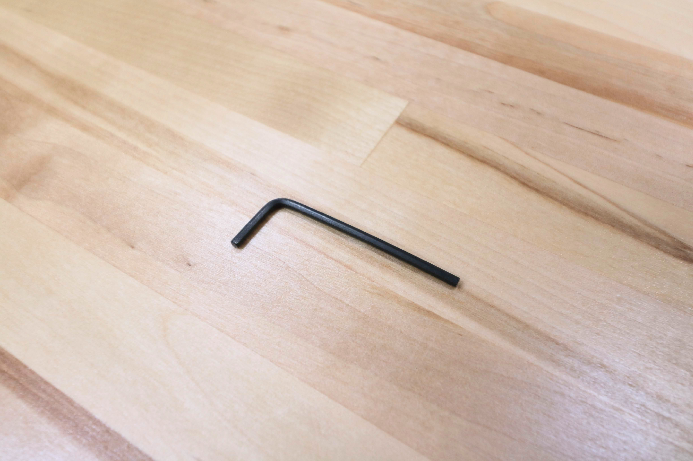
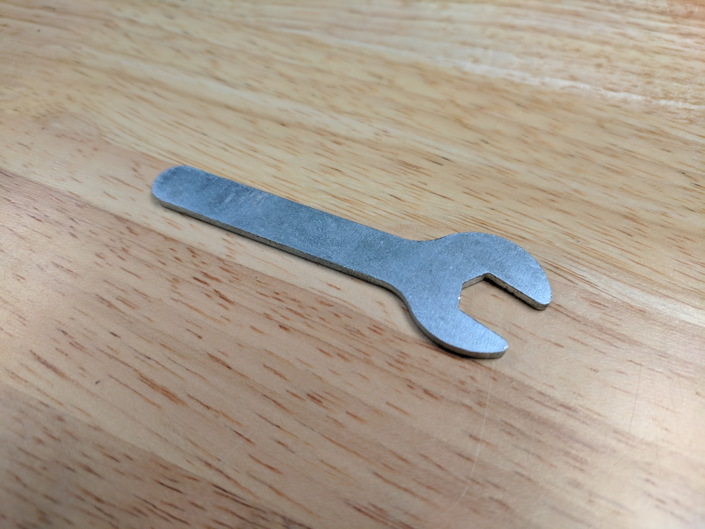

* toc
{:toc}

# Tools

FarmBot Genesis kits include all of the tools required to complete assembly.

<iframe class="embedly-embed" src="//cdn.embedly.com/widgets/media.html?src=https%3A%2F%2Fwww.youtube.com%2Fembed%2F-RoldWV-ut4%3Ffeature%3Doembed&url=http%3A%2F%2Fwww.youtube.com%2Fwatch%3Fv%3D-RoldWV-ut4&image=https%3A%2F%2Fi.ytimg.com%2Fvi%2F-RoldWV-ut4%2Fhqdefault.jpg&key=02466f963b9b4bb8845a05b53d3235d7&type=text%2Fhtml&schema=youtube" width="854" height="480" scrolling="no" frameborder="0" allowfullscreen></iframe>

## 2mm Allen Key

Use this tool to tighten the bits in the handles of the other drivers.

specs:
  Size: 2mm
price: $1.00
quantity: 1
internal-specs:
  Internal Part Name: 2mm Allen Key
  $/pc: $0.05
Component Tests: Fasteners and hardware tests

## 2mm Hex Driver

This hex (allen) driver is used to tighten all of the M3 screws and setscrews on FarmBot.

specs:
  Hex Size: 2mm
  Bit: Hardened steel with a titanium nitride coating
  Handle: Blue anodized aluminum
  Label: `2.0mm`
price: $5.00
quantity: 1
internal-specs:
  Internal Part Name: 2mm Hex Driver
  $/pc: $1.80
Component Tests: Fasteners and hardware tests

## 3mm Hex Driver

This hex (allen) driver is used to tighten all of the M5 screws on FarmBot.

specs:
  Hex Size: 3mm
  Bit: Hardened steel with a titanium nitride coating
  Handle: Blue anodized aluminum
  Label: `3.0mm`
price: $5.00
quantity: 1
internal-specs:
  Internal Part Name: 3mm Hex Driver
  $/pc: $1.80
Component Tests: Fasteners and hardware tests

## 5.5mm Nut Driver

This nut driver is used to tighten all of the M3 locknuts on FarmBot.

specs:
  Box Size: 5.5mm
  Handle: Black anodized aluminum
  Label: `5.5 BOX`
price: $5.00
quantity: 1
internal-specs:
  Internal Part Name: 5.5mm Nut Driver
  $/pc: $1.90
Component Tests: Fasteners and hardware tests

## 8mm Nut Driver

This nut driver is used to tighten all of the M5 screws on FarmBot.

specs:
  Box Size: 8mm
  Handle: Black anodized aluminum
  Label: `8.0 BOX`
price: $5.00
quantity: 1
internal-specs:
  Internal Part Name: 8mm Nut Driver
  $/pc: $1.90
Component Tests: Fasteners and hardware tests

## 8mm Wrench

The wrench is for tightening M5 locknuts and adjusting eccentric spacers throughout FarmBot.

specs:
  Size: 8mm
  Label: `8mm`
price: $3.00
quantity: 1
internal-specs:
  Internal Part Name: 8mm Thin Wrench
  $/pc: $0.10
Component Tests: Fasteners and hardware tests
