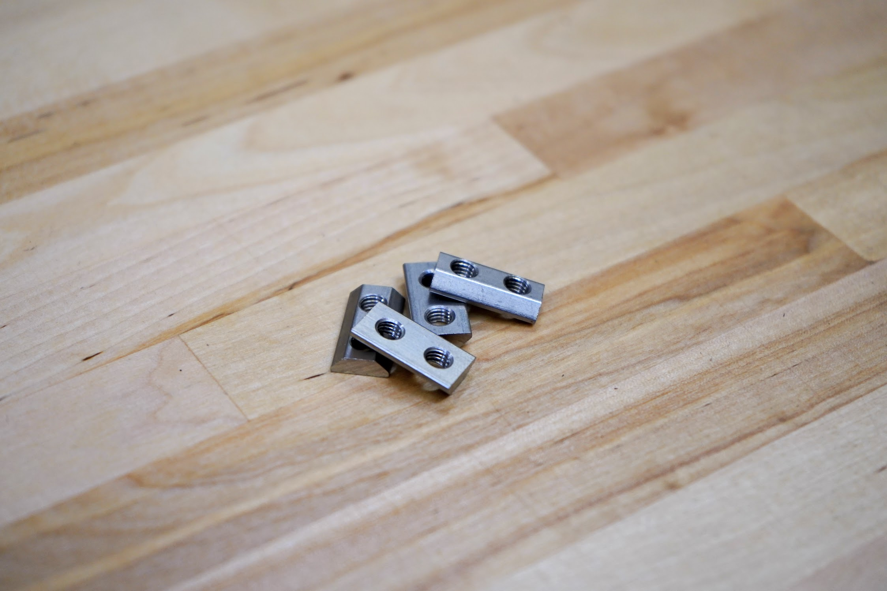
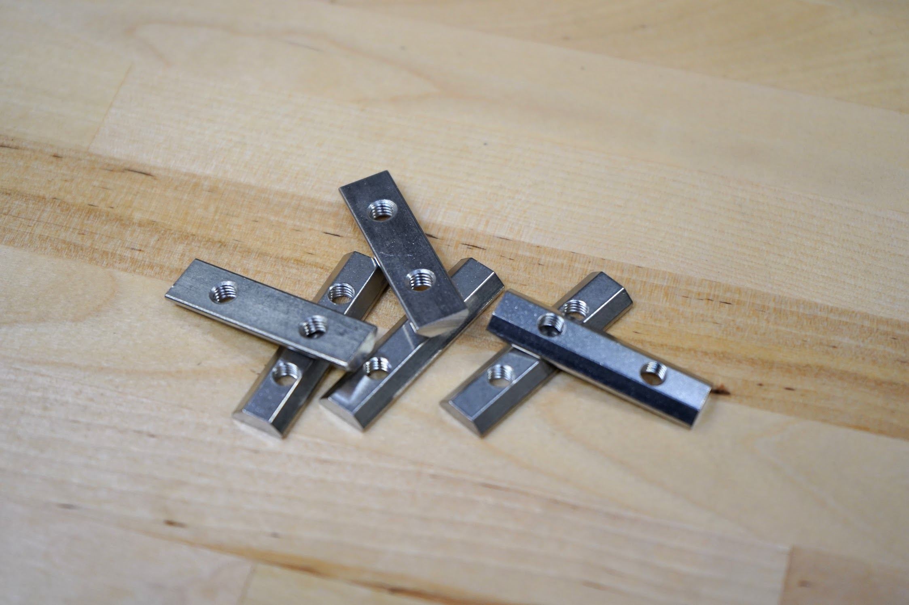
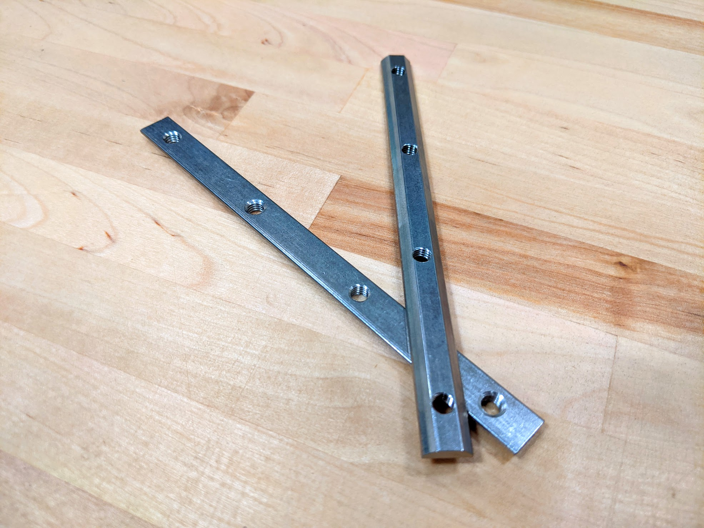

* toc
{:toc}

# Nut Bars

These stainless steel bars act as long tee nuts allowing M5 screws to securely hold plates, brackets, and other components to a v-slot extrusion.

specs:
  Material: Stainless steel
  Overall Lengths: 20mm, 40mm, 60mm, 100mm, 140mm
  Threads: M5 x 0.8mm
  Fits Slot Size: 6
  Price: 20mm - $1.50 40mm - $1.75 60mm - $2.00 100mm - $2.50 140mm - $3.00
  Quantity: enesis** 20mm - 6 40mm - 28 60mm - 20 100mm - 2 or 0 (see note above)  **Genesis XL** 20mm - 6 40mm - 54 60mm - 24 100mm - 6 or 0 (see note above) 140mm - 2 or 0 (see note above)
internal-specs:
  Internal Part Name: 20mm Nut Bar` `40mm Nut Bar` `60mm Nut Bar` `100mm Nut Bar` `140mm Nut Bar
  Vendor: 
  $/pc: 20mm - $0.39 40mm - $0.49 60mm - $0.59 100mm - $0.89 140mm - $0.95
  Component Tests: [Fasteners and hardware tests](../fasteners-and-hardware.md#component-tests)

## 20mm Nut Bar

## 40mm Nut Bar

## 60mm Nut Bar

## 100mm Nut Bar

## 140mm Nut Bar

# Tee Nuts

Combined with screws, these drop-in style tee nuts allow components such as plates and 3D printed parts to be attached quickly and securely anywhere on a V-slot aluminum extrusion.

specs:
  Trade Name: Drop-in Tee Nut
  Material: Stainless Steel
  Threads: M5 x 0.8mm
  Fits Slot Size: 6
  Price: $0.40
  Quantity: 20
internal-specs:
  Internal Part Name: M5 SS Drop-in Tee Nuts
  Vendor: 
  $/pc: $0.16
  Component Tests: [Fasteners and hardware tests](../fasteners-and-hardware.md#component-tests)