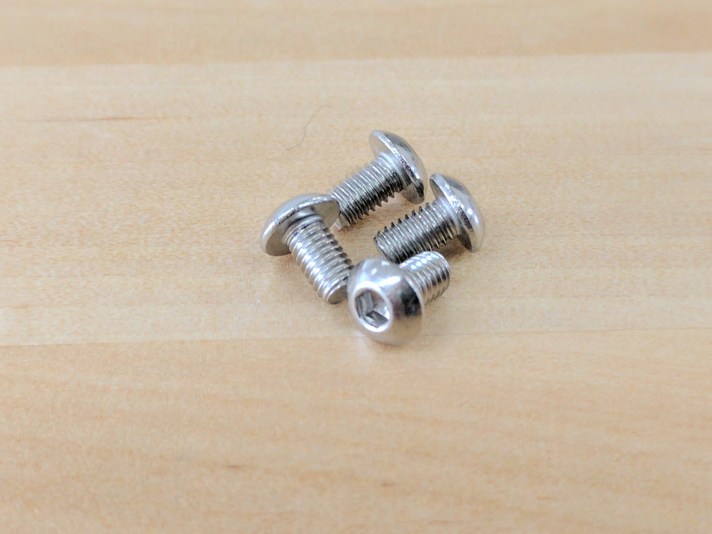
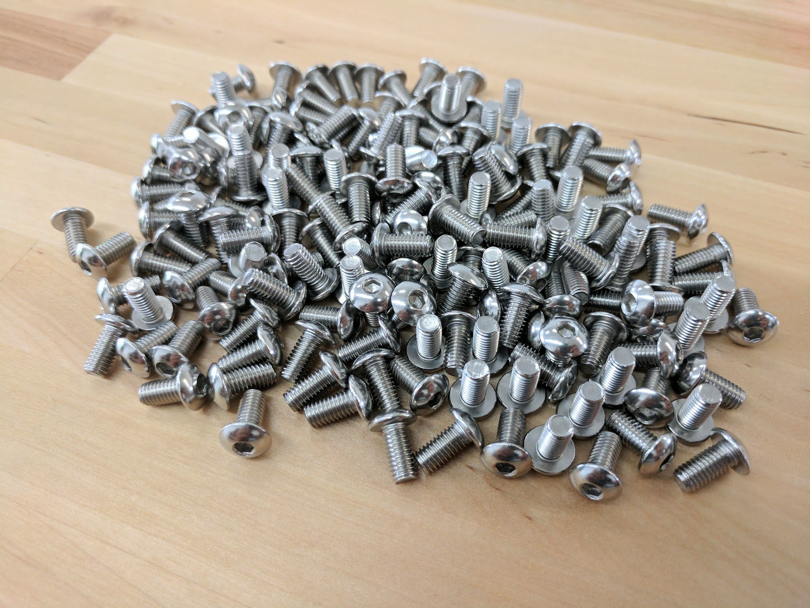

* toc
{:toc}

# M2.5 x 4mm Screws

These screws are used to mount the electronics boards into the electronics box with the M2.5 M/F standoffs as an intermediary component.

specs:
  Threads: M2.5
  Length: 4mm
  Drive Size: 2mm hex
  Material: Stainless steel
  Price: $0.15
  Quantity: 8 (pre-assembled in the electronics box)
internal-specs:
  Internal Part Name: M2.5 x 4mm Screw (2mm Hex Drive)
  Vendor: 
  $/pc: $0.009
  Component Tests: [Fasteners and hardware tests](../fasteners-and-hardware.md#component-tests)

# M3 Screws

M3 screws are used throughout FarmBot for mounting motors and other small electronic components on the tools.

specs:
  Threads: M3 x 0.5mm
  Lengths: 6mm, 12mm, 35mm
  Trade Name: M3 Low-Profile Socket Head Cap Screw
  Material: Stainless Steel
  Head Height: 2mm
  Head Diameter: 5.5mm
  Drive Size: 2mm hex
  Price: 6mm - $0.10 12mm - $0.15 35mm - $0.20
  Quantity: 6mm - 10 12mm - 40 35mm - 4 (pre-assembled in the electronics box)
internal-specs:
  Internal Part Name: M3 x 6mm Screw` `M3 x 12mm Screw` `M3 x 35mm Screw
  Vendor: 
  $/pc: 6mm - $0.008 12mm - $0.012 35mm - $0.032
  Component Tests: [Fasteners and hardware tests](../fasteners-and-hardware.md#component-tests)

## M3 x 6mm Screws

## M3 x 12mm Screws

## M3 x 35mm Screws

Image coming soon

# M5 Screws

M5 button-head screws of various lengths are used throughout FarmBot to attach plates and 3D printed parts to extrusions, V-wheels to plates, and other components together. They are usually used in combination with M5 washers, and terminated with an M5 tee nut or locknut. The button head provides a wide bearing surface, a low-profile head, and a finished appearance. Length is measured from under the head.

specs:
  Threads: M5 x 0.8mm
  Lengths: 10, 16, and 30mm
  Trade Name: Button-Head Socket Cap Screw
  Material: Stainless Steel
  Head Height: 2.75mm
  Head Diameter: 9.5mm
  Drive Size: 3mm hex
  Price: 10mm - $0.15 16mm - $0.20 30mm - $0.30
  Quantity: 10mm - Genesis: 150, Genesis XL: 225 16mm - 40 30mm - 45
internal-specs:
  Internal Part Name: M5 x 10mm Screw` `M5 x 16mm Screw` `M5 x 30mm Screw
  Vendor: 
  $/pc: 10mm - $0.023 16mm - $0.029 30mm - $0.049
  Component Tests: [Fasteners and hardware tests](../fasteners-and-hardware.md#component-tests)

## M5 x 10mm Screws

## M5 x 16mm Screws

## M5 x 30mm Screws

# Wood Screws

These are used to attach the track end plates and track joining plates to supporting infrastructure such as a raised.

specs:
  Material: Steel
  Finish: Black Oxide
  Length: 25mm
  Head Diameter: 12mm
  Price: $0.05
  Quantity: Genesis - 35 Genesis XL - 60
internal-specs:
  Internal Part Name: 25mm Wood Screw
  Vendor: 
  $/pc: $0.006
  Component Tests: [Fasteners and hardware tests](../fasteners-and-hardware.md#component-tests)
