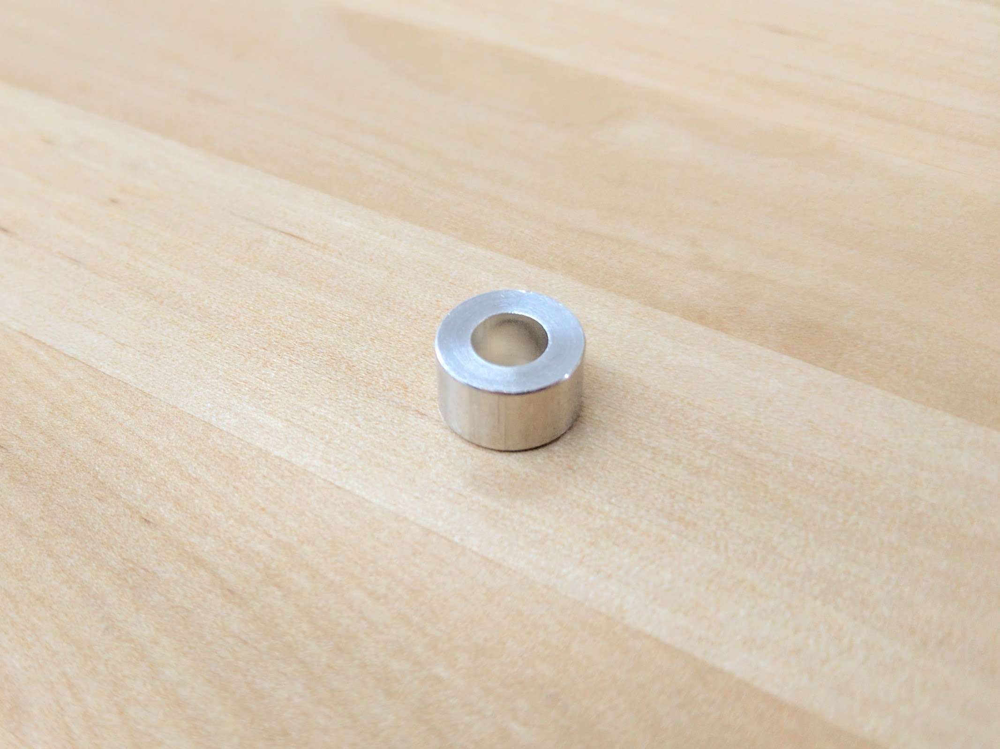

* toc
{:toc}

# M5 x 6mm Spacers

These spacers are used to offset V-wheels from plates so that they may engage extrusions.

specs:
  Material: Aluminum
  Outer Diameter: 10mm
  Inner Diameter: 5.1mm
  Length: 6mm
price: $0.20
quantity: 30 (12 extra)
internal-specs:
  Internal Part Name: M5 x 6mm Spacer
  Vendor: 
  $/pc: $0.10

**Component tests**{:.internal}

|Test         |Description  |Target       |Tolerance    |
|-------------|-------------|-------------|-------------|
|Length       |Measure the spacing that the spacer will provide using calipers.|6mm|+/- 0.2mm
|OD           |Measure the outer diameter using calipers.|10mm|+/- 0.2mm
|ID           |Measure the inner diameter using calipers.|5.1mm|+/- 0.1mm
|Material     |Ensure the material is aluminum or stainless steel and will not rust by holding a magnet to the part.|Aluminum or stainless steel (no magnetic attraction)|Weak attraction to stainless steel is permissible.

# M5 x 6mm Eccentric Spacers

When rotated, eccentric spacers accurately position V-wheels on a plate such that they can firmly engage V-slot aluminum extrusions. They are only used on wheels on one side of an extrusion. Adjustments are made by using a 8mm wrench on the spacer itself.

specs:
  Material: Stainless Steel
  Height: 6mm (not including rim)
  Bore: 5mm
  Rim Diameter: Fits into a 7.12mm hole
  Hex Size: 8mm
  Engraving: `6mm`, on the side with the shortest distance to the bore
price: $2.00
quantity: 15
internal-specs:
  Internal Part Name: M5 x 6mm Eccentric Spacer
  Vendor: 
  $/pc: $0.30

**Component tests**{:.internal}

|Test         |Description  |Target       |Tolerance    |
|-------------|-------------|-------------|-------------|
|Hex size     |Fit an 8mm wrench on the spacer.|Wrench should fit spacer|N/A
|Engraving    |Inspect the part for a `6mm` engraving on the side with the shortest distance to the bore.|Engraving is in correct location|N/A
|Length       |Measure the spacing that the spacer will provide using calipers.|6mm|+/- 0.2mm
|OD           |Measure the outer diameter using calipers.|7.1mm|+/- 0.05mm
|ID           |Measure the inner diameter using calipers.|5.1mm|+/- 0.1mm
|Material     |Ensure the material is aluminum or stainless steel and will not rust by holding a magnet to the part.|Aluminum or stainless steel (no magnetic attraction)|Weak attraction to stainless steel is permissible.
