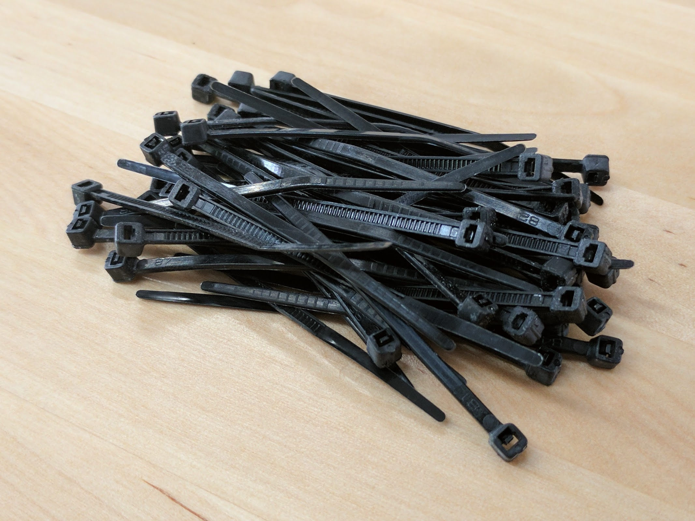
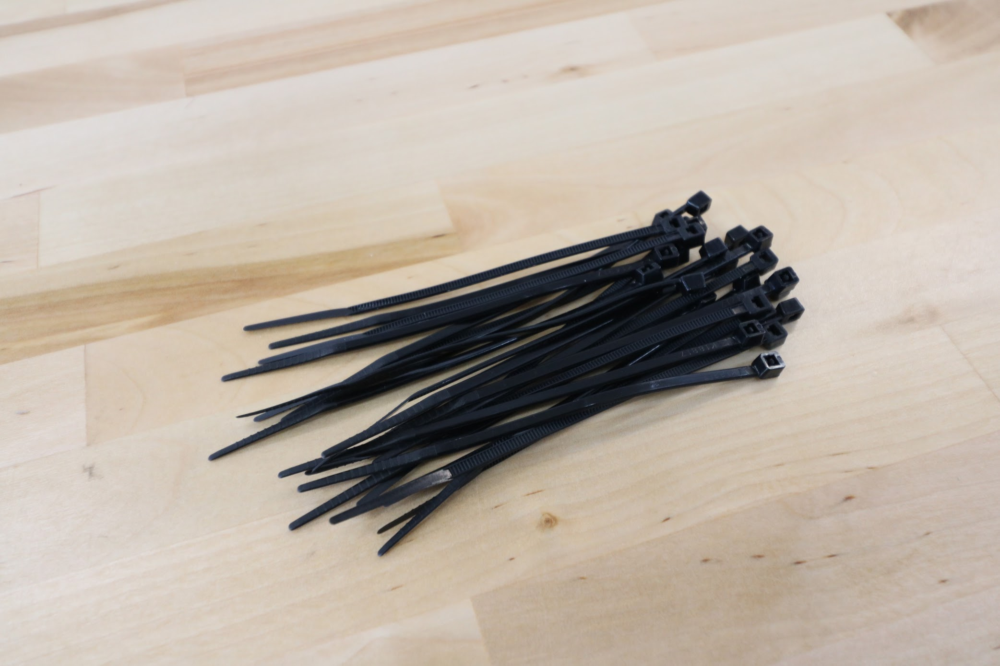
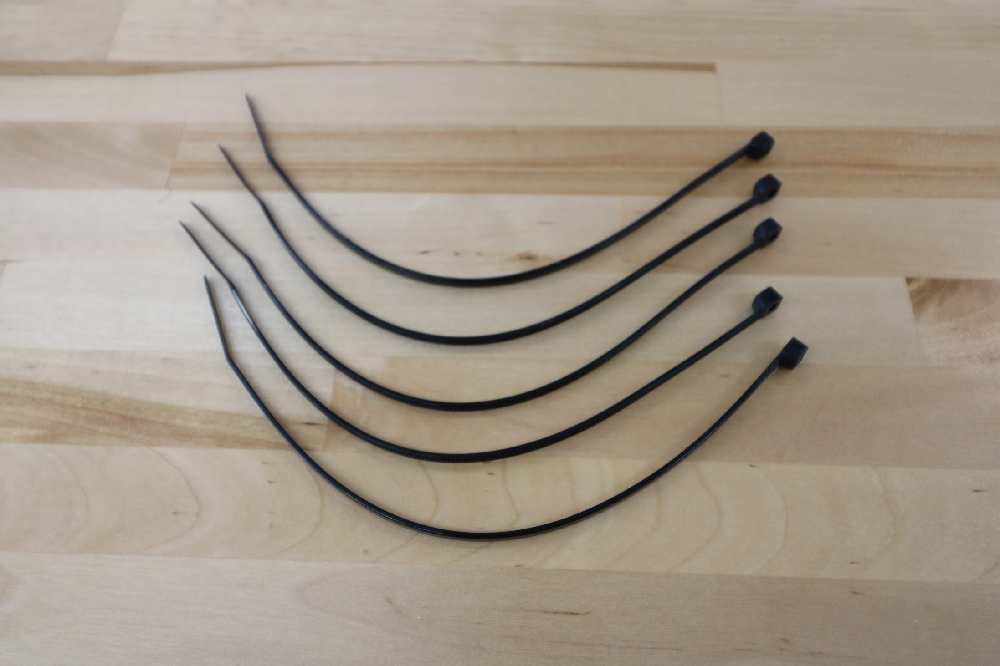

* toc
{:toc}

# Zip Ties

Zip ties are used to fasten the vacuum pump and solenoid valve to their mounts, and for cable management throughout FarmBot.

specs:
  Material: Nylon
  Color: Black
  Length: 60mm, 100mm, and 200mm
price: 60mm - $0.05 100mm - $0.07 200mm - $0.10
quantity: 60mm - 50 or 0 (see note above) 100mm - 25 200mm - 10
internal-specs:
  Internal Part Name: 100mm Zip Tie` `200mm Zip Tie
  Vendor: 
  $/pc: 100mm - $0.006 200mm - $0.015
  Component Tests: [Fasteners and hardware tests](../fasteners-and-hardware.md#component-tests)

## 60mm Zip Ties

## 100mm Zip Ties

## 200mm Zip Ties

