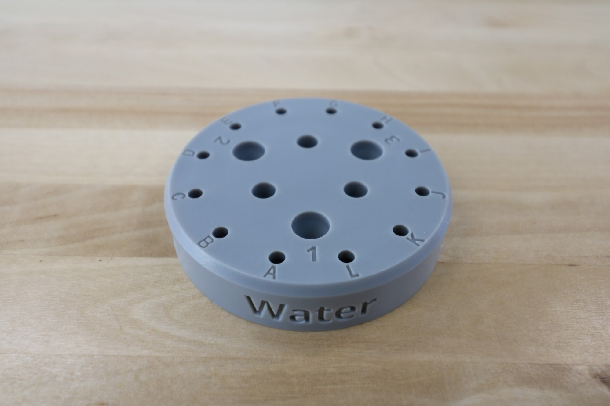
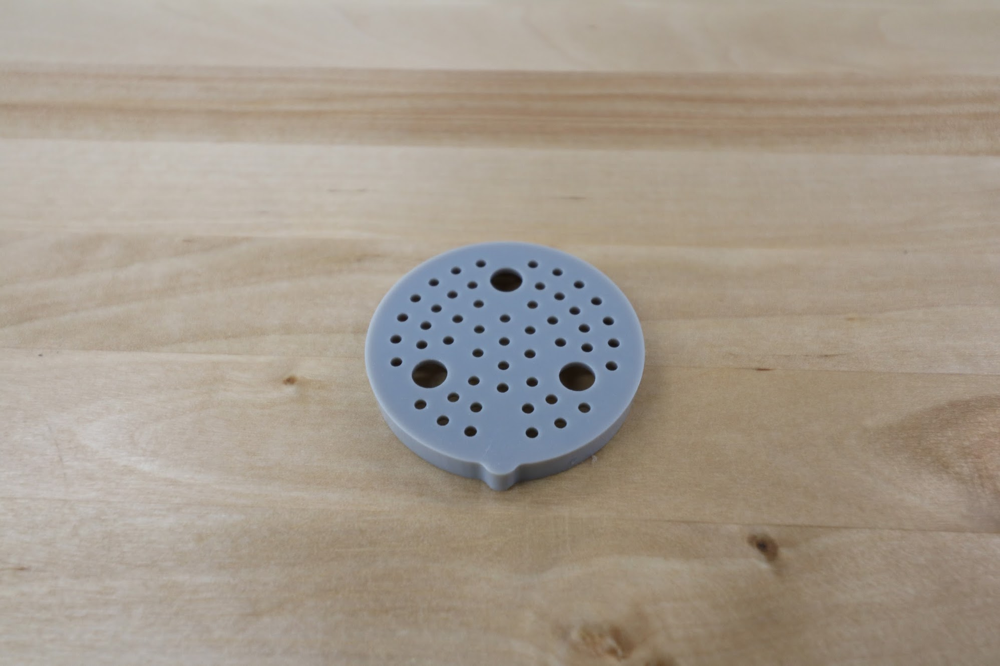

* toc
{:toc}

This two-part tool distributes the stream of water coming from the UTM into a gentle shower for your plants.



# Watering Nozzle Top



specs:
  Material: Gray UV stabilized ABS
  price: $7.00
  quantity: 1
internal-specs:
  Internal Part Name: Watering Nozzle Top Rev A
  Vendor: LDO
  $/pc: $1.00
  Component Tests: Plastic Part Tests

# Watering Nozzle Bottom



specs:
  Material: Gray UV stabilized ABS
  price: $5.00
  quantity: 1
internal-specs:
  Internal Part Name: Watering Nozzle Bottom Rev A
  Vendor: LDO
  $/pc: $1.00
  Component Tests: Plastic Part Tests