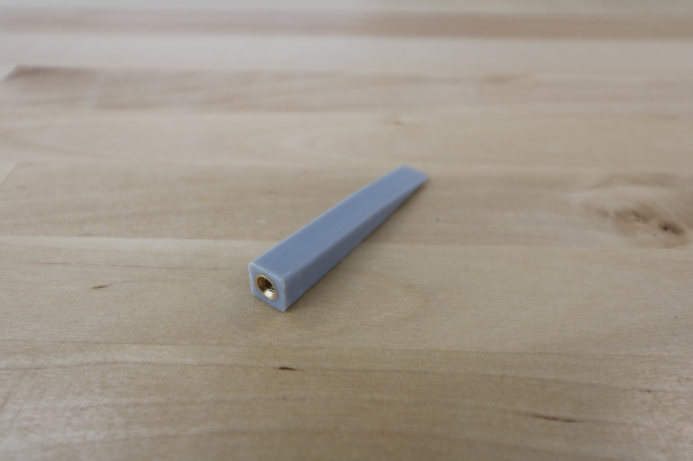

* toc
{:toc}

The weeding tool allows FarmBot to smash weeds into the ground, thereby killing them via mechanical disruption. The tool consists of a base component and interchangeable implements that allow you to customize the tool for your soil conditions and types of weeds.

<iframe width="854" height="480" src="https://www.youtube.com/embed/NsEdALh3ZYY" frameborder="0" allow="accelerometer; autoplay; clipboard-write; encrypted-media; gyroscope; picture-in-picture" allowfullscreen></iframe>

# Weeder



specs:
  Material: Gray UV stabilized ABS
  Brass Inserts: M3 inserts on all blades
  price: $7.00
  quantity: 1
internal-specs:
  Internal Part Name: Weeder Rev A
  Vendor: LDO
  $/pc: $1.45
  Component Tests: [Plastic Part Tests](../plastic-parts.md#component-tests)
  Notes: `Weeder Rev A` injection mold needs work: Remove ejector pin artifacts on bottom inside of part.

# Weeder Blades



specs:
  Material: Gray UV stabilized ABS
  Brass Inserts: M3 inserts on all blades
  price: $2.00 each
  quantity: 4 of each size
internal-specs:
  Internal Part Name: Weeder Blades (Wide) Rev A` `Weeder Blades (Medium) Rev A` `Weeder Blades (Medium) Rev A
  Vendor: LDO
  $/pc: $1.00
  Component Tests: Plastic Part Tests
