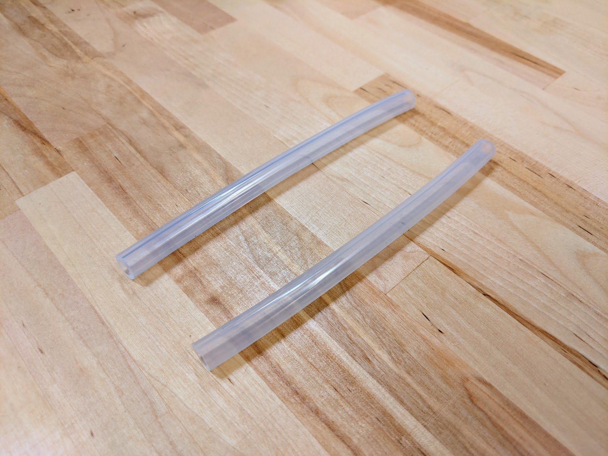

* toc
{:toc}



# NPT to Barb Adapter

These adapters are used on the inlet of the solenoid valve and the outlet of the pressure reducer.



specs:
  Material: Brass
  For Tube ID: 6mm
  Threads: 3/4" female NPT (National Pipe Thread)
  Engraving: `NPT`
  Rubber Gasket?: Included
  Price: $5.00
  Quantity: 2
internal-specs:
  Internal Part Name: NPT to Barb Adapter (3/4" female NPT to Barb for 6mm ID tubing)
  Vendor: LDO
  $/pc: $3.50
  Notes: Includes "NPT" laser engraving and pre-inserted rubber gasket.

**Component tests**{:.internal}

|Test         |Description  |Target       |Tolerance    |
|-------------|-------------|-------------|-------------|
|Threads      |Connect the adapter to a solenoid valve.|Parts should connect as expected|N/A
|Barb         |Connect a 6mm ID tube to the barbed end.|The tube should connect securely and resist being disconnected by hand.|N/A
|Engraving    |Inspect the part for an engraved label.|Should say `NPT`|N/A

# O-rings

These O-rings fit onto the UTM's liquid/gas ports and create a solid seal when tools are mounted.

specs:
  Material: Viton
  Durometer: A70 (Medium)
  Outer Diameter: 10.5mm
  Inner Diameter: 7.65mm
  Thickness: 1.78mm
  Temperature Range: -30° to 212° F
  Color: Black
  Price: $0.50
  Quantity: 3
internal-specs:
  Internal Part Name: X profile O-rings
  Vendor: LDO
  $/pc: $0.33

**Component tests**{:.internal}

|Test         |Description  |Target       |Tolerance    |
|-------------|-------------|-------------|-------------|
|Profile      |Inspect the o-ring's profile.|X-profile|N/A
|Inner diameter|Measure the inner diameter with digital calipers.|7.5mm|+/-0.2mm
|Thickness    |Measure the thickness with digital calipers.|1.5mm|+/-0.1mm
|Color        |Inspect the part's color|Black|N/A
|UTM fit      |Slide an o-ring onto a UTM liquid/gas port and then vigorously shake the UTM up and down.|The o-ring should stay in place.|N/A

# Pressure Regulator

This pressure regulator reduces the pressure from a municipal water supply down to 15 PSI (103 kpa, 1.03 bar) so that FarmBot can more easily control the amount of water it disperses.



specs:
  Material: UV resistant plastic
  Inlet: 3/4 in. female pipe thread
  Outlet: 3/4 in. male pipe thread
  Color: Black
  Outer Diameter: 1.25 inches (31.75mm)
  Outlet Pressure: 15 PSI (103 kpa, 1.02 bar)
  Max Input Pressure: 100 PSI (688 kpa, 6.88 bar)
  Rubber Gasket?: Included
  Price: $8.00
  Quantity: 1
internal-specs:
  Internal Part Name: 15 psi Pressure Reducer (3/4" female NPT to 3/4" male NPT)
  Vendor: LDO
  $/pc: $1.00
  Notes: Includes pre-inserted rubber gasket.

**Component tests**{:.internal}

|Test         |Description  |Target       |Tolerance    |
|-------------|-------------|-------------|-------------|
|Threads      |Connect a solenoid valve and NPT to barb adapter onto the pressure regulator.|Mating parts should connect as expected|N/A
|Rating       |Inspect the part's printed pressure rating|15 PSI|N/A
|Color        |Inspect the part's color|Black|N/A

# Rubber Gasket

These gaskets are used with the NPT to barb adapter, garden hose to barb adapter, and pressure reducer to seal the water system's threaded connections.

specs:
  Material: Rubber
  Size: For 3/4" NPT or GHT connections
  Price: $1.00
  Quantity: 4
internal-specs:
  Internal Part Name: 3/4" Rubber Gasket
  Vendor: LDO
  $/pc: Inlcuded in price of adapters
  Notes: Pre-inserted into `Garden Hose to Barb Adapter`, `NPT to Barb Adapter`, and `Pressure Regulator`

**Component tests**{:.internal}

|Test         |Description  |Target       |Tolerance    |
|-------------|-------------|-------------|-------------|
|Size         |Insert a rubber gasket into an NPT to barb adapter and then screw the adapter onto a solenoid valve.|Gasket should insert into the adapter and seal the assembly as expected.|N/A

# Teflon Tape

This plumber's tape is used to seal the pipe thread connections in FarmBot's watering system.

specs:
  Material: PTFE
  Length: 10m
  Width: 1.5cm
  Color: White
  Price: $5.00
  Quantity: 1
internal-specs:
  Internal Part Name: Teflon Tape (1.5cm wide, 10m long)
  Vendor: LDO
  $/pc: $0.20

**Component tests**{:.internal}

|Test         |Description  |Target       |Tolerance    |
|-------------|-------------|-------------|-------------|
|Width        |Measure the width with digital calipers|15mm|+/- 1mm
|Length       |Unravel a spool and measure the length with a tape measure.|9m|+/- 0.5m
|Color        |Inspect the color.|White|N/A
|Packing      |Inspect the packing.|Plastic bag|N/A

# Vacuum Tube

These ultra flexible silicone tubes carry vacuum suction from the vacuum pump to the UTM.

specs:
  Length: 0.15m
  Material: Semi-clear silicone
  Flexibility: Very flexible
  Compatible Tube Fittings: Barbs
  Inner Diameter: 6mm
  Outer Diameter: 10mm
  Price: $1.00
  Quantity: 2
internal-specs:
  Internal Part Name: 6 x 10mm Tube - 0.15m (Vacuum)
  Vendor: LDO
  $/pc: $0.30

**Component tests**{:.internal}

|Test         |Description  |Target       |Tolerance    |
|-------------|-------------|-------------|-------------|
|ID           |Measure the inner diameter with digital calipers.|6mm|+/- 0.1mm
|OD           |Measure the outer diameter with digital calipers.|10mm|+/- 0.25mm
|Length       |Measure the length with a tape measure.|See BOM spec.|+/- 10mm
|Flexibility  |Inspect for flexibility.|Tubing should be very flexible|N/A
|Kink resistance|Bend the tube into a 10cm diameter circle.|The tube should not kink|N/A
|Barb compatibility|Connect to a barbed adapter.|The tube should connect securely and resist being disconnected by hand.|N/A

# Water Tube

These ultra flexible silicone tubes carry water to the UTM.



specs:
  Lengths: enesis** 3m, 2.1m, and 0.95m  **Genesis XL** 4.5m, 3.6m, and 0.95m
  Material: Semi-clear silicone
  Flexibility: Very flexible
  Compatible Tube Fittings: Barbs
  Inner Diameter: 6mm
  Outer Diameter: 10mm
  Price: $5.00 - 0.95m $8.00 - 2.1m $10.00 - 3m $12.00 - 3.6m $15.00 - 4.5m $35.00 - 10.5m
  Quantity: One of each length
internal-specs:
  Internal Part Names: enesis** `6 x 10mm Tube - 0.95m (Water, Z-axis, all bots)` `6 x 10mm Tube - 2.1m (Water, Y-axis, Genesis)` `6 x 10mm Tube - 3.0m (Water, X-Axis, Genesis)`  **Genesis XL** `6 x 10mm Tube - 0.95m (Water, Z-axis, all bots)` `6 x 10mm Tube - 3.6m (Water, Y-Axis Genesis XL)` `6 x 10mm Tube - 4.5m (Water, X-Axis, Genesis XL)`
  Vendor: LDO
  $/pc: $0.80 - 0.95m $1.80 - 2.1m $2.70 - 3.0m $3.00 - 3.6m $3.80 - 4.5m

**Component tests**{:.internal}

|Test         |Description  |Target       |Tolerance    |
|-------------|-------------|-------------|-------------|
|ID           |Measure the inner diameter with digital calipers.|6mm|+/- 0.1mm
|OD           |Measure the outer diameter with digital calipers.|10mm|+/- 0.25mm
|Length       |Measure the length with a tape measure.|See BOM spec.|+/- 10mm
|Flexibility  |Inspect for flexibility.|Tubing should be very flexible|N/A
|Kink resistance|Bend the tube into a 10cm diameter circle.|The tube should not kink|N/A
|Barb compatibility|Connect to a barbed adapter.|The tube should connect securely and resist being disconnected by hand.|N/A
