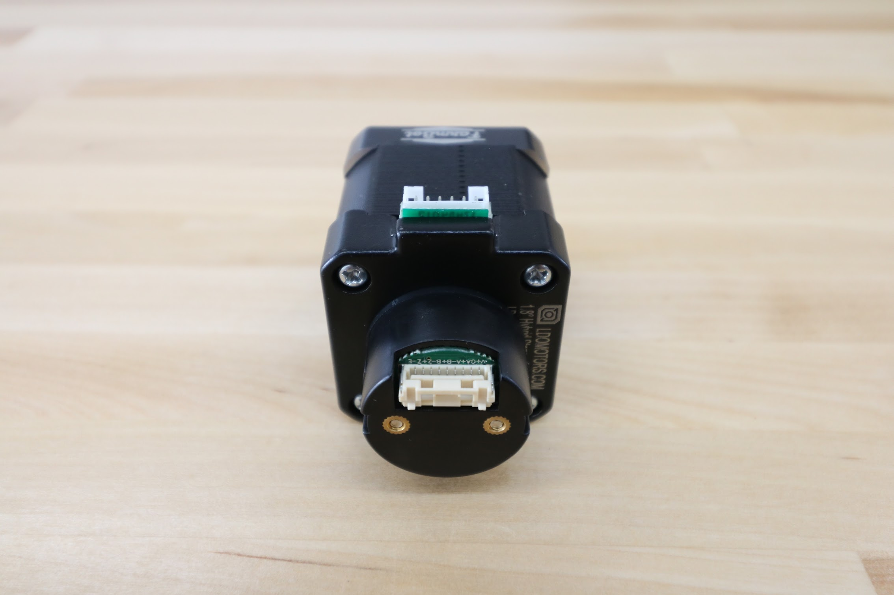
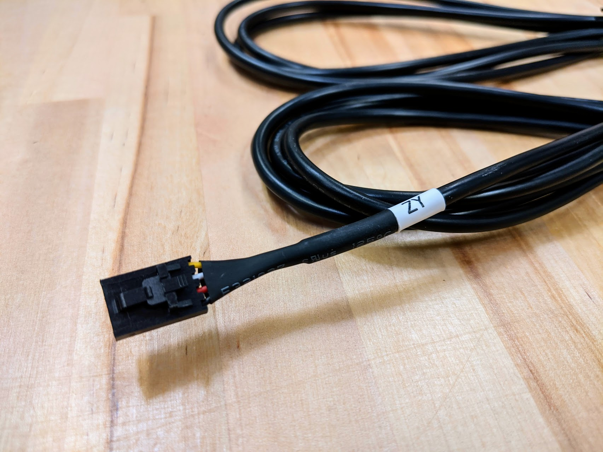
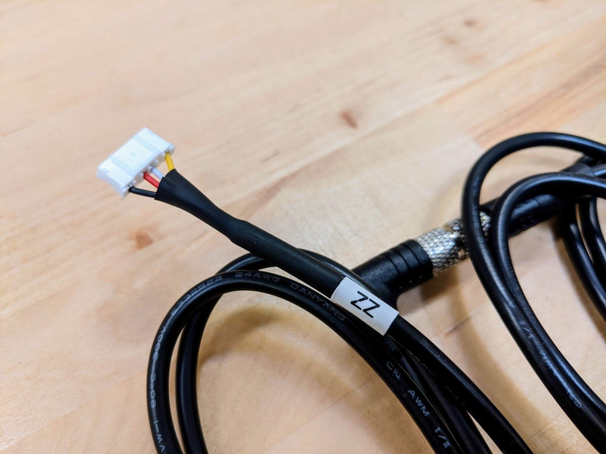
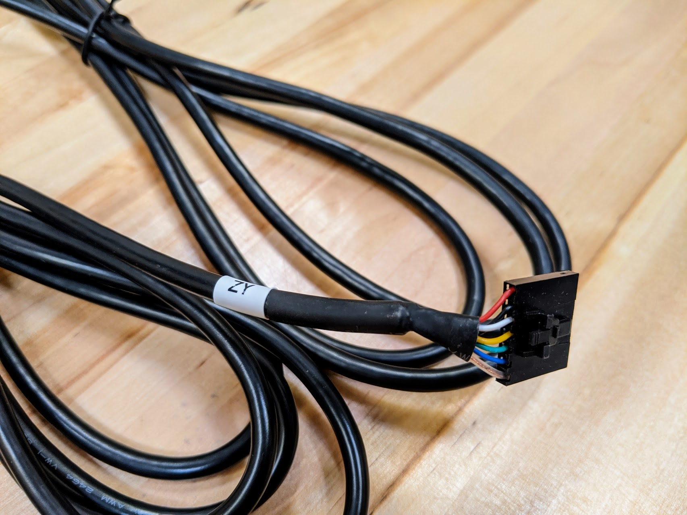
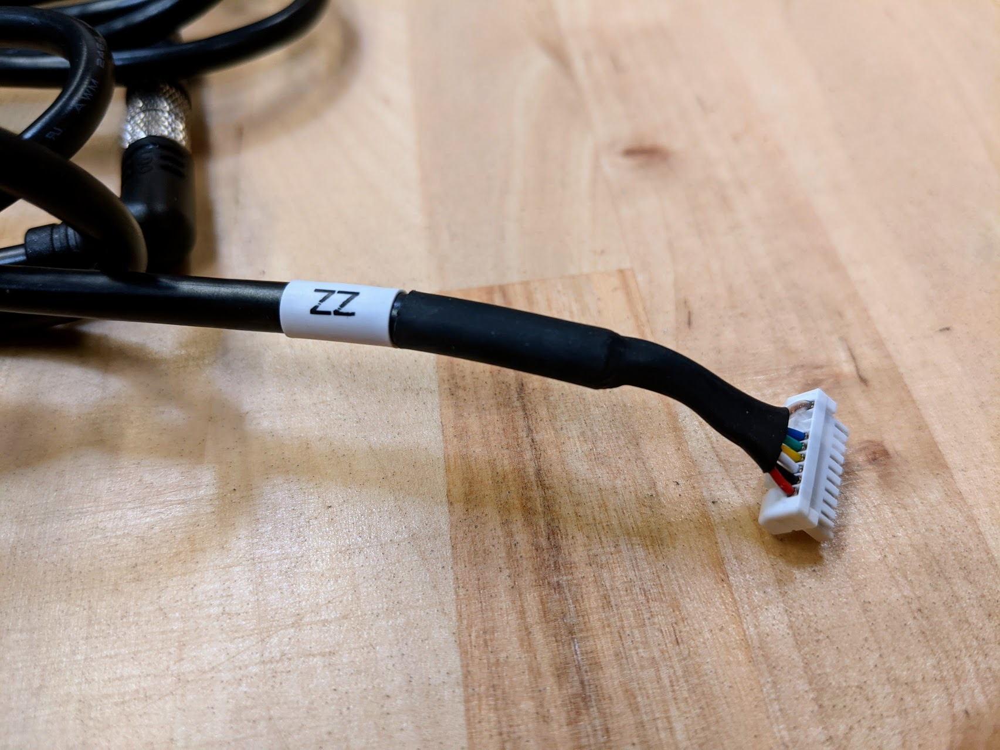

* toc
{:toc}

# NEMA 17 Stepper Motor with Rotary Encoder

These powerful 200 resolution stepper motors allow FarmBot to move precisely in the X, Y, and Z directions. Download the [motor spec sheet](https://drive.google.com/file/d/1Ehqu20q84Lyycn1fOj6dvWKbrMLvoNv4/view?usp=sharing) and [encoder spec sheet](https://drive.google.com/file/d/15dSqr_hQTXAQGIvw-YeDLIOC6dB0Y26n/view?usp=sharing).



|                              |                              |
|------------------------------|------------------------------|
|**Motor Resolution**          |200 steps/revolution (1.8 deg/step)
|**Winding Type**              |Bipolar
|**Voltage**                   |12V
|**Current Draw**              |1.68A max
|**Shaft Diameter**            |5mm diameter
|**Mount Hole Pattern**        |4x M3 holes, standard NEMA 17 pattern
|**Motor Connector**           |6-pin connector (only 4 pins used)
|**Encoder Connector**         |8-pin connector
|**Encoder Resolution**        |360 lines/revolution
|**Encoder Output**            |Differential
|**Price**                     |$60.00
|**Quantity**                  |4

**Internal specs**{:.internal}

|                              |                              |
|------------------------------|------------------------------|
|**Internal Part Name**        |`NEMA 17 Stepper Motor w/ Rotary Encoder`
|**Vendor**                    |Motor: LDO Encoder: Honest Sensor
|**$/pc**                      |$29.40
|**Notes**                     |Logo engraving must NOT be stretched. Please send photo of first samples to verify.
{:.internal}

**Component tests**{:.internal}

|Test         |Description  |Target       |Tolerance    |
|-------------|-------------|-------------|-------------|
|Motor length |Measure the length of the motor body (no encoder or shaft) using digital calipers.|47.3mm|+/- 0.5mm
|Motor housing fit|Mount a motor to the cross-slide plate with a horizontal motor housing.  Mount a motor to the z-axis motor mount and cover with the vertical motor housing.|Motor should fit inside housing|N/A
|Shaft        |Mount a GT2 pulley onto the motor shaft according to the FarmBot system design.|Pulley should mount as expected|N/A
|Shaft length |Measure the length of the motor shaft using digital calipers.|22mm|+/- 0.5mm
|Mounting holes|Mount a motor to a cross-slide plate according to the FarmBot system design.|Screws should thread into motor as expected|N/A
|Motor operation|Connect the motor to a Farmduino and issue a movement command.|Motor should operate as expected|N/A
|Encoder      |Connect the motor and encoder to a Farmduino, issue a movement command, and inspect the encoder position in the web app.|Encoder position values should update as expected|N/A
|Engraving    |Inspect the FarmBot logo engraving.|Must not be stretched|N/A
{:.internal}

# Motor Cables

These 4-wire cables connect each NEMA 17 stepper motor to the Farmduino. They are labelled on the Farmduino end `X1`, `X2`, `Y`, and `ZY`. The Z-axis cable is split into a Y-axis section labelled `ZY` and a Z-axis section labelled `ZZ` that connect with a 90-degree screw-together waterproof connection at the cross-slide.



|                              |                              |
|------------------------------|------------------------------|
|**Lengths**                   |**Genesis** 0.7m (X1) 2.6m (X2) 2.7m (Y) 2.6m (ZY) 1.8m (ZZ)  **Genesis XL** 0.7m (X1) 3.8m (X2) 4.2m (Y) 4.1m (ZY) 1.8m (ZZ)
|**Cores**                     |4
|**Gauge**                     |18
|**Motor Connector**           |6 pin connector (only 4 pins used)
|**Intermediate connector** (Z cable only)|4-pin waterproof screw together 90 degree connectors. (female connector on the Y-Axis sections, male connector on the Z-Axis section)
|**Farmduino Connector**       |2.54mm pitch 4-pin connector with locking tab ([Molex Part 50579404](https://www.molex.com/molex/products/part-detail/crimp_housings/0050579404))
|**Outer Color**               |Black
|**Inner Colors**              |Black, Red, Yellow, White
|**Labels**                    |`X1`, `X2`, `Y`, `ZY`, and `ZZ`
|**Price**                     |**Genesis** 0.7m - $15.00 2.6m - $18.00 2.7m - $20.00 2.6m+1.8m - $30.00  **Genesis XL** 0.7m - $15.00 3.8m - $23.00 4.2m - $25.00 4.1m+1.8m - $35.00

**Internal specs**{:.internal}

|                              |                              |
|------------------------------|------------------------------|
|**Internal Part Name**        |`Genesis X1 and Genesis XL X1 Motor Cable - 0.7m` `Genesis X2 Motor Cable - 2.3m` `Genesis Y Motor Cable - 2.7m` `Genesis Z Motor Cable, Y-axis section - 2.6m` `Genesis XL X2 Motor Cable - 3.8m` `Genesis XL Y Motor Cable - 4.2m` `Genesis XL Z Motor cable, Y-axis section - 4.1m` `Z Motor Cable, Z-axis section - 1.8m`
|**Vendor**                    |
|**$/pc**                      |**Genesis** 0.7m (X1) - $1.50 2.3m (X2) - $1.90 2.7m (Y) - $2.10 2.6m (ZY) - $3.60 1.8m (ZZ) - $2.80  **Genesis XL** 0.7m (X1) - $1.50 3.8m (X2) - $2.60 4.2m (Y) - $2.80 4.1m (ZY) - $4.30 1.8m (ZZ) - $2.80
|**Notes**                     |What are the part numbers for the connectors?
{:.internal}

**Component tests**{:.internal}

|Test         |Description  |Target       |Tolerance    |
|-------------|-------------|-------------|-------------|
|Length       |Measure the length using a measuring tape.|See BOM spec|+/- 20mm
|Diameter     |Measure the cable's diameter using digital calipers.|5mm|+/- 1mm
|Connectors   |Use a motor cable to connect a motor to the Farmduino. Issue some movement commands.|The motor should operate as expected|N/A
|Label        |Inspect the shrinkwrap labels.|`X1`, `X2`, `Y`, `ZY`, and `ZZ`|N/A
|Cable        |Inspect the cable's spec.|24AWG-4C stranded copper cable|N/A
|Color        |Inspect the color of the cable.|Black|N/A
{:.internal}

# Encoder Cables

These cables connect the four rotary encoders to the Farmduino. They are labelled on the Farmduino end `X1`, `X2`, `Y`, and `ZY`. The Z-axis cable is split into a Y-axis section labelled `ZY` and a Z-axis section labelled `ZZ` that connect with a 90-degree screw-together waterproof connection at the cross-slide.

|                              |                              |
|------------------------------|------------------------------|
|**Lengths**                   |**Genesis** 0.7m (X1) 2.3m (X2) 2.7m (Y) 2.6m (ZY) 1.8m (ZZ)  **Genesis XL** 0.7m (X1) 3.8m (X2) 4.2m (Y) 4.1m (ZY) 1.8m (ZZ)
|**Cores**                     |7
|**Gauge**                     |20
|**Encoder Connector**         |8 pin connector
|**Intermediate connector** (Z cable only)|7-pin waterproof screw together 90 degree connectors. (female connector on the Y-Axis sections, male connector on the Z-Axis section)
|**Farmduino Connector**       |2.54mm pitch 7-pin connector with locking tab ([Molex Part 50579407](https://www.molex.com/molex/products/part-detail/crimp_housings/0050579407))
|**Outer Color**               |Black
|**Labels**                    |`X1`, `X2`, `Y`, `ZY`, and `ZZ`
|**Price**                     |**Genesis** 0.7m - $20.00 2.3m - $23.00 2.7m - $25.00 2.6m+1.8m - $35.00  **Genesis XL** 0.7m - $20.00 3.8m - $28.00 4.2m - $30.00 4.1m+1.8m - $40.00

**Internal specs**{:.internal}

|                              |                              |
|------------------------------|------------------------------|
|**Internal Part Name**        |`Genesis X1 and Genesis XL X1 Encoder Cable - 0.7m` `Genesis X2 Encoder cable - 2.3m` `Genesis Y Encoder cable - 2.7m` `Genesis Z Encoder cable, Y-axis section - 2.6m` `Genesis XL X2 Encoder cable - 3.8m` `Genesis XL Y Encoder cable - 4.2m` `Genesis XL Z Encoder cable, Y-axis section - 4.1m` `Genesis and Genesis XL Z Encoder cable, Z-axis section - 1.8m`
|**Vendor**                    |
|**$/pc**                      |**Genesis** 0.7m (X1) - $1.70 2.3m (X2) - $2.30 2.7m (Y) - $2.70 2.6m (ZY) - $5.50 1.8m (ZZ) - $5.20  **Genesis XL** 0.7m (X1) - $1.70 3.8m (X2) - $3.20 4.2m (Y) - $3.70 4.1m (ZY) - $6.20 1.8m (ZZ) - $5.20
|**Notes**                     |What are the part numbers for the connectors?
{:.internal}



**Component tests**{:.internal}

|Test         |Description  |Target       |Tolerance    |
|-------------|-------------|-------------|-------------|
|Length       |Measure the length using a measuring tape.|See BOM spec|+/- 20mm
|Diameter     |Measure the cable's diameter using digital calipers.|5mm|+/- 1mm
|Connectors   |Use a motor and encoder cable to connect to the Farmduino. Issue some movement commands.|The encoder should report motor position as expected|N/A
|Label        |Inspect the shrinkwrap labels.|`X1`, `X2`, `Y`, `ZY`, and `ZZ`|N/A
|Cable        |Inspect the cable's spec.|28AWG-3P shielded stranded copper cable|N/A
|Color        |Inspect the color of the cable.|Black|N/A
{:.internal}