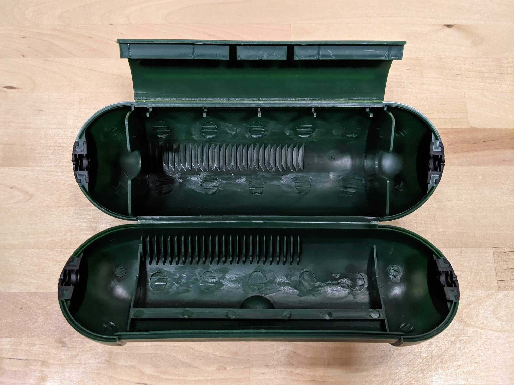

* toc
{:toc}

# Power Supply

This universal input IP67 waterproof power supply provides FarmBot with all the electricity it needs.



|                              |                              |
|------------------------------|------------------------------|
|**Output Power**              |150 watts (24 volts DC, 6.25 amps)
|**Output Cable**              |0.2m long black cable with waterproof 3-pin screw-together connector
|**Input Power**               |110 volts AC with a max current draw of 1.36 amps (150 watts)  or  220 volt AC with a max current draw of 0.68 amps (150 watts)
|**Input Cable**               |0.3m long black cable with standard US 3-prong plug
|**Waterproof Rating**         |IP67
|**Brand**                     |Weho
|**Price**                     |$60.00
|**Quantity**                  |1

**Internal specs**{:.internal}

|                              |                              |
|------------------------------|------------------------------|
|**Internal Part Name**        |`IP67 24V 6.25A Power Supply`
|**Vendor**                    |Weho
|**$/pc**                      |$30.00
|**Component Tests**           |
|**Notes**                     |
{:.internal}

**Component tests**{:.internal}

|Test         |Description  |Target       |Tolerance    |
|-------------|-------------|-------------|-------------|
|Brand        |Inspect the name plate for the brand name.|`WEHO`|N/A
|Model        |Inspect the name plate for the model number.|`LPVF-150-24`|N/A
|Input        |Inspect the name plate for the input specs.|AC 100-265V 50/60Hz|N/A
|Input cable length|Measure the lenght of the input cable using a tape measure.|30cm|+/- 3cm
|Input plug   |Inspect the input plug.|Standard US 3-prong plug (NEMA 5-15 plug)|N/A
|Cord protector fit|Connect the input to an extension cord and insert into the power cord protector.|Cord protector should be able to fully close|N/A
|Output       |Inspect the name plate for the output specs.|DC 24V DC 6.25A 150W|N/A
|Output cable length|Measure the lenght of the input cable using a tape measure.|20cm|+/- 3cm
|Output connector|Connect the output cable's screw-together connector to a power supply cable.|Should connect|N/A
|Waterproof   |Inspect the name plate for waterproof rating.|IP67|N/A
|Function     |Connect the power supply to complete FarmBot and power up the device.|FarmBot should be able to operate the motors and peripherals as expected.|N/A
{:.internal}

# Power Supply Cable

This modular 3-wire cable connects the power supply to the Farmduino. It features a waterproof 3-pin connector to attach to the power supply, and a black molex connector to attach to the Farmduino.



|                              |                              |
|------------------------------|------------------------------|
|**Number of Cores**           |3
|**Outer Color**               |Black
|**Connector 1**               |Waterproof 3-pin screw-together connector
|**Connector 2**               |Black 3-pin connector ([Molex Part 2004561213](https://www.molex.com/molex/products/part-detail/crimp_housings/2004561213))
|**Length**                    |Genesis: 3m Genesis XL: 4.5m
|**Quantity**                  |1
|**Price**                     |3m: $20.00 4.5m: $30.00

**Internal specs**{:.internal}

|                              |                              |
|------------------------------|------------------------------|
|**Internal Part Name**        |`Power Supply Cable - 3m Rev B` `Power Supply Cable - 4.5m Rev B`
|**Vendor**                    |
|**$/pc**                      |3m: $3.60 4.5m: $5.60
|**Component Tests**           |
|**Notes**                     |
{:.internal}

**Component tests**{:.internal}

|Test         |Description  |Target       |Tolerance    |
|-------------|-------------|-------------|-------------|
|Length       |Measure the cable's length using a tape measure.|See BOM spec|+/- 3cm
|Diameter     |Measure the cable's diameter using digital calipers.|6mm|+/- 1mm
|Cable        |Inspect cable spec.|18AWG-3C stranded copper cable|N/A
|Connector 1  |Connect the cable's screw-together connector to the power supply.|Should connect|N/A
|Connector 2  |Inspect the connector type.|Should be a 3-pin plug ([Molex 2004561213](https://www.molex.com/molex/products/part-detail/crimp_housings/2004561213)|N/A
|Cable carrier fit|Insert the cable and a water tube through the X-axis cable carrier (including through the end pieces).|Should fit|N/A
|Electronics box fit|Insert the cable and connector 2 through the slot in the bottom of the electronics box and then insert the supergland.|Should fit|N/A
|Farmduino fit|Connect the cable to the Farmduino's `24V POWER IN` connector.|Should connect and power the board|N/A
|Color        |Inspect the part's colors.|Black cable Black Molex connector|N/A
{:.internal}

# Power Cord Protector





|                              |                              |
|------------------------------|------------------------------|
|**Color**                     |Green
|**Rainproof?**                |Yes
|**Submersible?**              |No
|**Price**                     |$7.00
|**Quantity**                  |1

**Internal specs**{:.internal}

|                              |                              |
|------------------------------|------------------------------|
|**Internal Part Name**        |`Rainproof Power Cord Box`
|**Vendor**                    |
|**$/pc**                      |$1.50
|**Notes**                     |Will use Chinese samples received Aug 2020. Do NOT include plastic piece for hanging product on store shelves.
{:.internal}

**Component tests**{:.internal}

|Test         |Description  |Target       |Tolerance    |
|-------------|-------------|-------------|-------------|
|Plug fit     |Connect a power supply to an extension cord, place the connection inside the power cord protector, and close the power cord protector fully.|The plugs should fit inside as expected|N/A
|Color        |Inspect the color of the part.|Green|N/A
{:.internal}