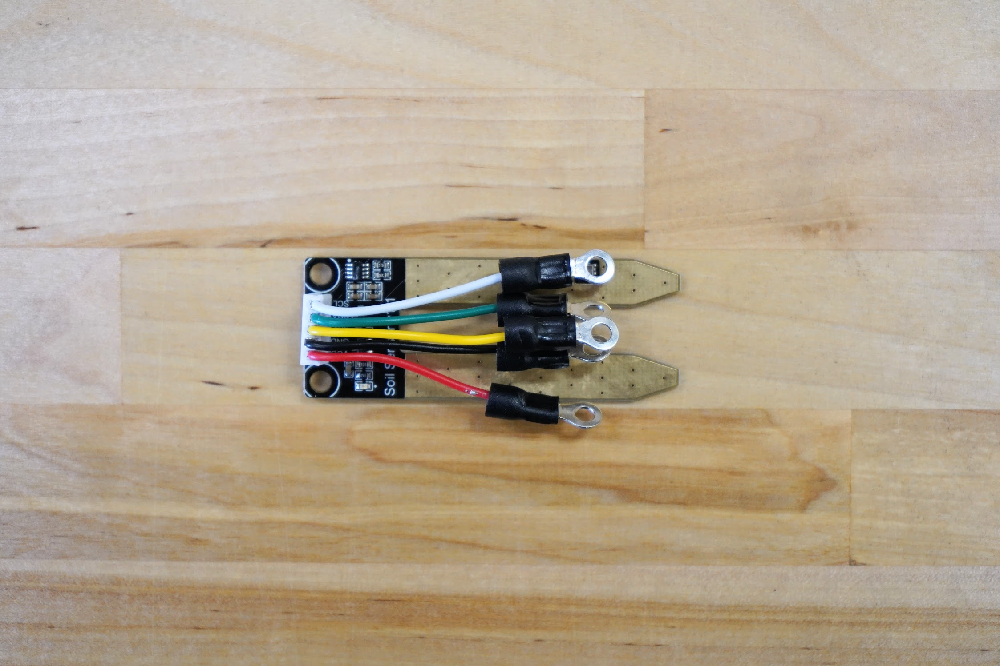
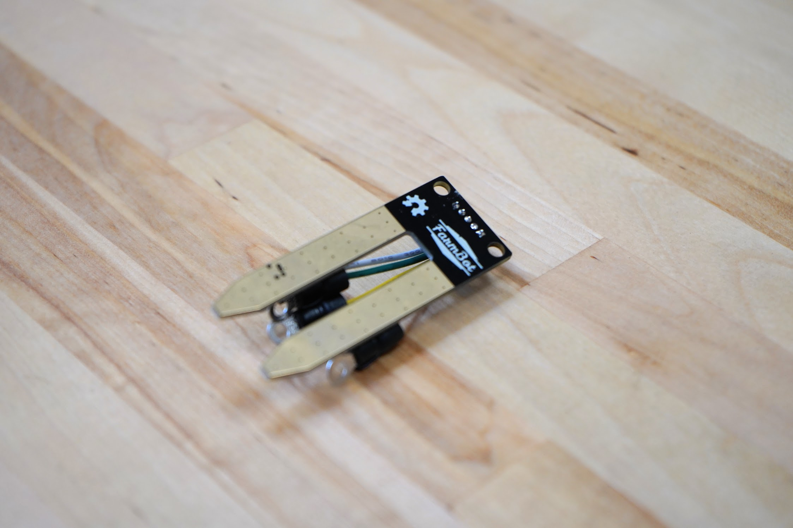

* toc
{:toc}

# Soil Sensor PCB

The Soil Moisture Sensor is a simple breakout for measuring the moisture in soil and similar materials. The soil moisture sensor is pretty straight forward to use. The two large exposed pads function as probes for the sensor, together acting as a variable resistor. The more water that is in the soil means the better the conductivity between the pads will be and will result in a lower resistance, and a higher SIG out.



|                              |                              |
|------------------------------|------------------------------|
|**Sensor Type**               |Capacitive (moisture) IC (temperature)
|**Output Type**               |Analog `SIG` for moisture `I2C` for temperature
|**PCB Color**                 |Black
|**Wire Colors**               |`VCC` - Red `GND` - Black `SIG` - Yellow `SDA` - Green `SCL` - White
|**Wire Lengths**              |50mm
|**Ring Terminals**            |Insulated M3
|**Price**                     |$6.00
|**Quantity**                  |1

**Internal specs**{:.internal}

|                              |                              |
|------------------------------|------------------------------|
|**Internal Part Name**        |`Soil Moisture and Temperature Sensor PCB Rev A`
|**Vendor**                    |LDO
|**$/pc**                      |$3.50
|**Notes**                     |What is the part number for the connector?
{:.internal}

**Component tests**{:.internal}

|Test         |Description  |Target       |Tolerance    |
|-------------|-------------|-------------|-------------|
|Function     |Connect the PCB to a test fixture and take readings in dry and wet conditions.|Functions as expected|N/A
|Wiring       |Inspect the wire colors.|`VCC` - Red `GND` - Black `SIG` - Yellow `SDA` - Green `SCL` - White|N/A
|Wiring length|Measure the length of the wires using digital calipers.|50mm|+/- 5mm
|Terminals    |Attach a terminal to the soil sensor plastic part using an M3 screw.|Terminal should attach as expected|N/A
|Color        |Inspect the color of the PCB.|Matte black|N/A
{:.internal}