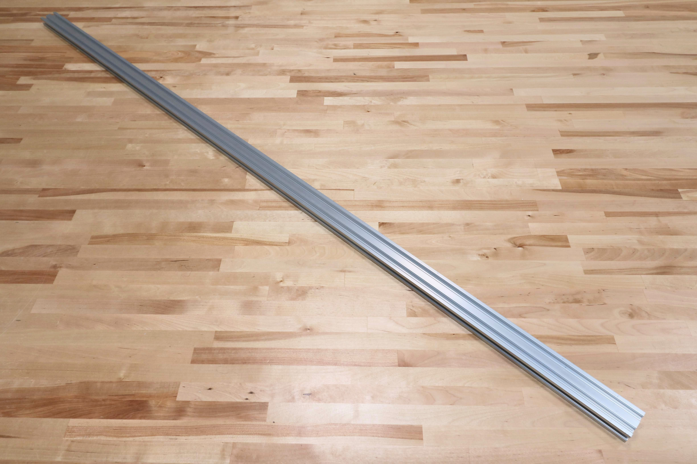
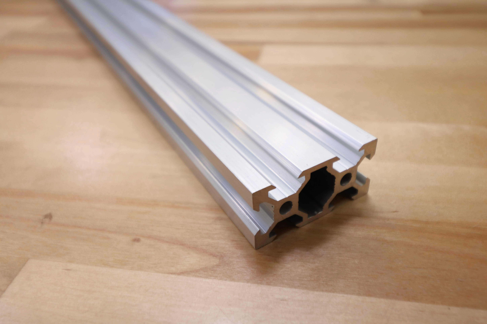
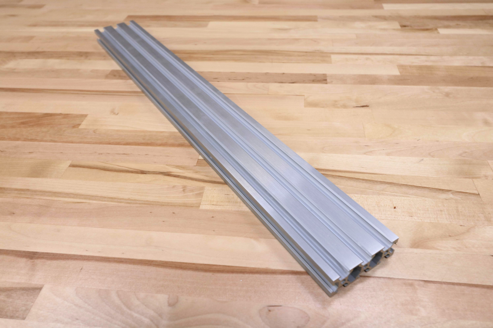
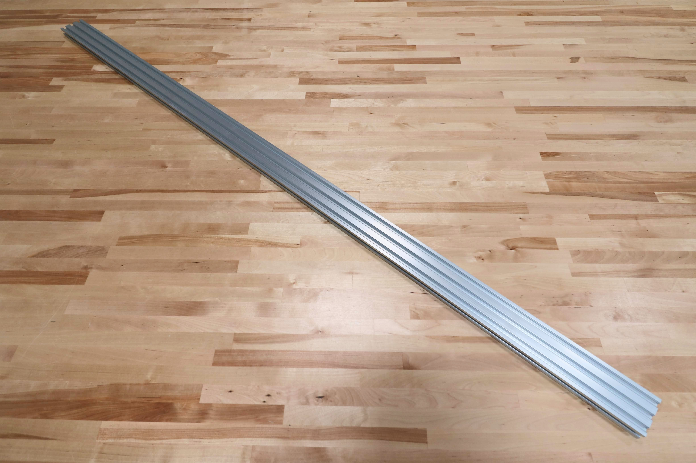
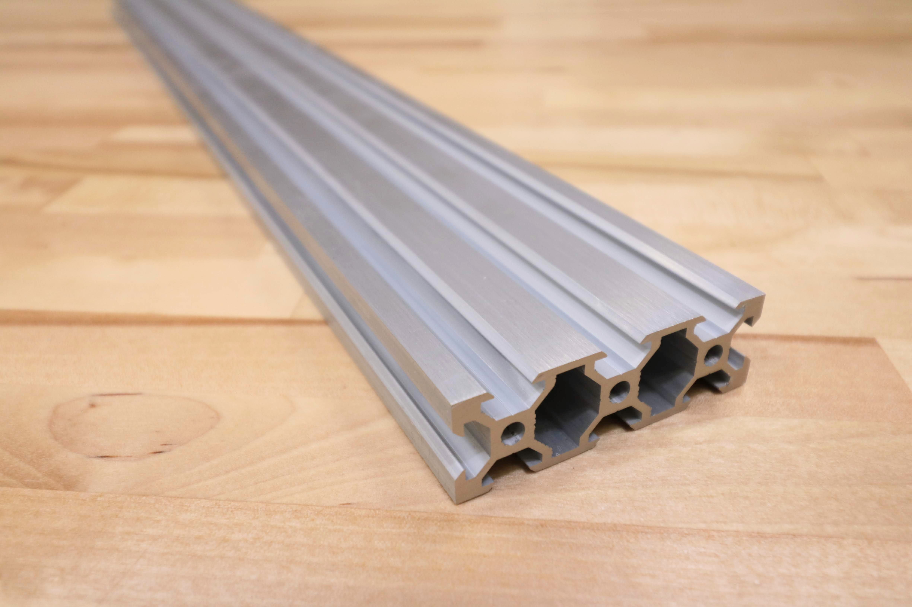
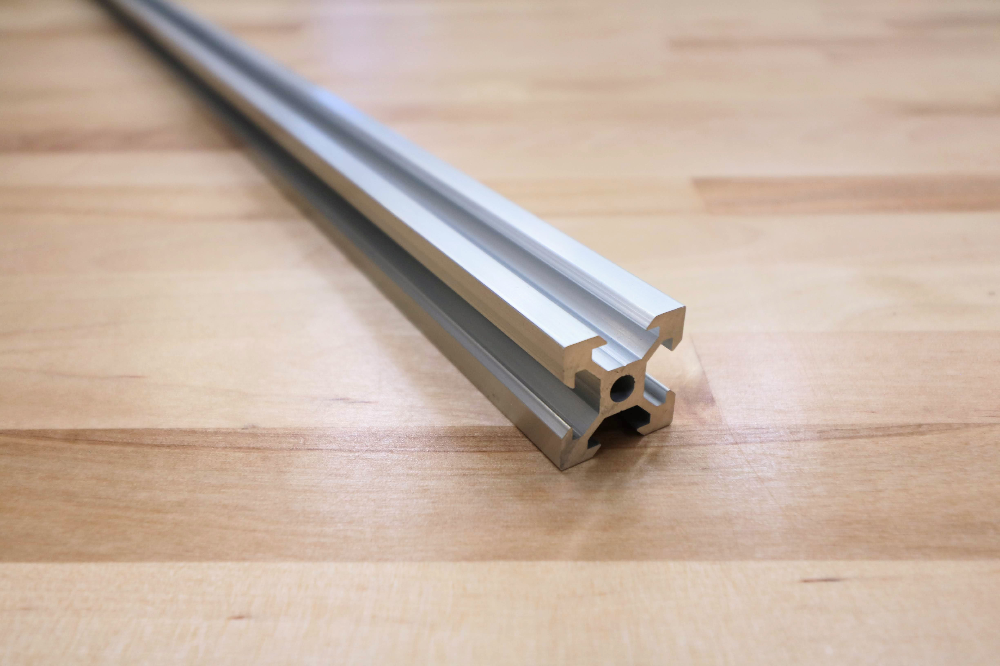
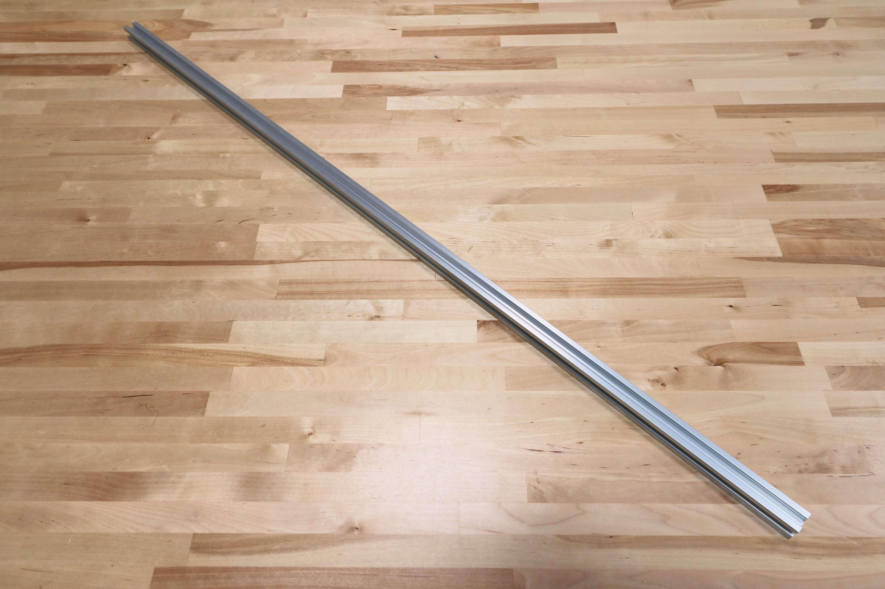

* toc
{:toc}

|Component|$/Unit|Genesis Qty|Genesis Subtotal|XL Qty|XL Subtotal|MAX Qty|MAX Subtotal|
|---------|------|-----------|----------------|------|-----------|-------|--------|
|[Track Extrusion](#track-extrusion)|$30.00|4|$120.00|8|$240.00|24|$720.00
|[Gantry Column](#gantry-column)|$15.00|2|$30.00|2|$30.00|2|$30.00
|[Gantry Main Beam](#gantry-main-beam)|$35.00|1|$35.00|2|$70.00|2|$70.00
|[Z-Axis Extrusion](#z-axis-extrusion)|$20.00|1|$20.00|1|$20.00|1|$20.00
|**TOTALS**||**8**|**$205.00**|**13**|**$360.00**|**29**|**$840.00**

<iframe class="embedly-embed" src="//cdn.embedly.com/widgets/media.html?src=https%3A%2F%2Fwww.youtube.com%2Fembed%2FLWvoSmqNwyA%3Ffeature%3Doembed&url=http%3A%2F%2Fwww.youtube.com%2Fwatch%3Fv%3DLWvoSmqNwyA&image=https%3A%2F%2Fi.ytimg.com%2Fvi%2FLWvoSmqNwyA%2Fhqdefault.jpg&key=f2aa6fc3595946d0afc3d76cbbd25dc3&type=text%2Fhtml&schema=youtube" width="854" height="480" scrolling="no" frameborder="0" allow="autoplay; fullscreen" allowfullscreen="true"></iframe>

# Track Extrusion

Track extrusions are the primary structural component of the tracks sub-assembly. They can be combined end-to-end in order to create longer tracks. The gantry v-wheels roll along the track extrusions, allowing FarmBot to move in the x-direction.



|                              |                              |
|------------------------------|------------------------------|
|**Length**                    |1500mm
|**Profile**                   |20mm x 40mm V-Slot
|**Material**                  |6063-T5 Aluminum
|**Surface Treatment**         |Sand blasted and clear anodized
|**Price**                     |$30.00
|**Quantity**                  |Genesis - 4 Genesis XL - 8
|**Recommended Supplier**      |[The FarmBot Shop](http://shop.farm.bot)

**Internal specs**{:.internal}

|                              |                              |
|------------------------------|------------------------------|
|**Internal Part Name**        |`20 x 40 x 1500mm V-Slot Silver (Track)`
|**Vendor**                    |LDO
|**$/pc**                      |$6.20
|**Component Tests**           |[Extrusion tests](#component-tests)
{:.internal}

# Gantry Column

The gantry columns are made from aluminum extrusions. They can be scaled to be taller or shorter to satisfy your needs. The two large spaces inside the columns are used to conceal and protect the GT2 timing belts that run along the tracks and up to the gantry pulleys.



|                              |                              |
|------------------------------|------------------------------|
|**Length**                    |500mm
|**Profile**                   |20mm x 60mm V-Slot
|**Material**                  |6063-T5 Aluminum
|**Surface Treatment**         |Sand blasted and clear anodized
|**Price**                     |$15.00
|**Quantity**                  |2
|**Recommended Supplier**      |[The FarmBot Shop](http://shop.farm.bot)

**Internal specs**{:.internal}

|                              |                              |
|------------------------------|------------------------------|
|**Internal Part Name**        |`20 x 60 x 500mm V-Slot Silver (Gantry column)`
|**Vendor**                    |LDO
|**$/pc**                      |$3.10
|**Component Tests**           |[Extrusion tests](#component-tests)
{:.internal}

# Gantry Main Beam

This aluminum extrusion serves as the gantry's primary structural element. The cross-slide's v-wheels move across this extrusion, allowing FarmBot to move in the y-direction. It is possible to make this extrusion longer or shorter to suit your needs.



|                              |                              |
|------------------------------|------------------------------|
|**Length**                    |1500mm
|**Profile**                   |20mm x 60mm V-Slot
|**Material**                  |6063-T5 Aluminum
|**Surface Treatment**         |Sand blasted and clear anodized
|**Price**                     |$35.00
|**Quantity**                  |Genesis - 1 Genesis XL - 2
|**Recommended Supplier**      |[The FarmBot Shop](http://shop.farm.bot)

**Internal specs**{:.internal}

|                              |                              |
|------------------------------|------------------------------|
|**Internal Part Name**        |`20 x 60 x 1500mm V-Slot Silver (Gantry main beam)`
|**Vendor**                    |LDO
|**$/pc**                      |$9.30
|**Component Tests**           |[Extrusion tests](#component-tests)
{:.internal}

# Z-Axis Extrusion

This aluminum extrusion allows FarmBot to accurately position the UTM and tools in the z-direction. It slides through the vertically aligned wheels on the front of the cross-slide.



|                              |                              |
|------------------------------|------------------------------|
|**Length**                    |1000mm
|**Profile**                   |20mm x 20mm V-Slot
|**Material**                  |6063-T5 Aluminum
|**Surface Treatment**         |Sand blasted and clear anodized
|**Price**                     |$20.00
|**Quantity**                  |1
|**Recommended Supplier**      |[The FarmBot Shop](http://shop.farm.bot)

**Internal specs**{:.internal}

|                              |                              |
|------------------------------|------------------------------|
|**Internal Part Name**        |`20 x 20 x 1000mm V-Slot Silver (Z-axis)`
|**Vendor**                    |LDO
|**$/pc**                      |$2.50
|**Component Tests**           |[Extrusion tests](#component-tests)
{:.internal}

# Component tests

## Size and shape

|Test         |Description  |Target       |Tolerance    |
|-------------|-------------|-------------|-------------|
|Length       |Measure the length of each extrusion with a measuring tape.|See spec in BOM listing|+/- 2mm
|Profile      |Measure the outer width and outer height of each extrusion profile using calipers.|See spec in BOM listing|+/- 0.25mm
|Straightness |Place the extrusion on a reference table with a flatness tolerance of 0.5mm per 1m or better.|0mm deviation|+ 3mm
|Square ends  |Measure the angle of the cut ends relative to the four major faces of the extrusion using a digital angle finder.|90 deg|+/- 0.5 deg
|Deburred     |Inspect cut ends and all edges to ensure there are no burrs|0 burrs|+ 1 minor + 0 major

## Material and appearance

|Test         |Description  |Target       |Tolerance    |
|-------------|-------------|-------------|-------------|
|Material     |Ensure the material is aluminum and will not rust by holding a magnet to the extrusion.|Aluminum (no magnetic attraction)|N/A
|Sandblasting |Inspect for thorough sandblasting coverage.|100%|- 1%
|Annodization |Inspect for thorough annodization coverage.|100%|- 1%

## Function

|Test           |Description  |Target       |Tolerance    |
|---------------|-------------|-------------|-------------|
|Drop-In Tee Nut|Assemble a drop-in tee nut, M5 screw, and horizontal cable carrier support. Fasten the parts straight to an extrusion face and slot (without sliding the tee nut in from the end of the extrusion).|The parts should fasten securely to the extrusion.|N/A
|Nut Bar        |Assemble a nut bar, M5 screw, and horizontal cable carrier support. Slide the parts into the slot from the end of the extrusion and tighten.|The parts should fasten securely to the extrusion.|N/A
|V-Wheel        |Slide an assembled gantry wheel plate and an assembled cross-slide onto an extrusion and adjust the eccentric spacers.|The subassemblies should glide smoothly along the full length of the extrusion.|N/A