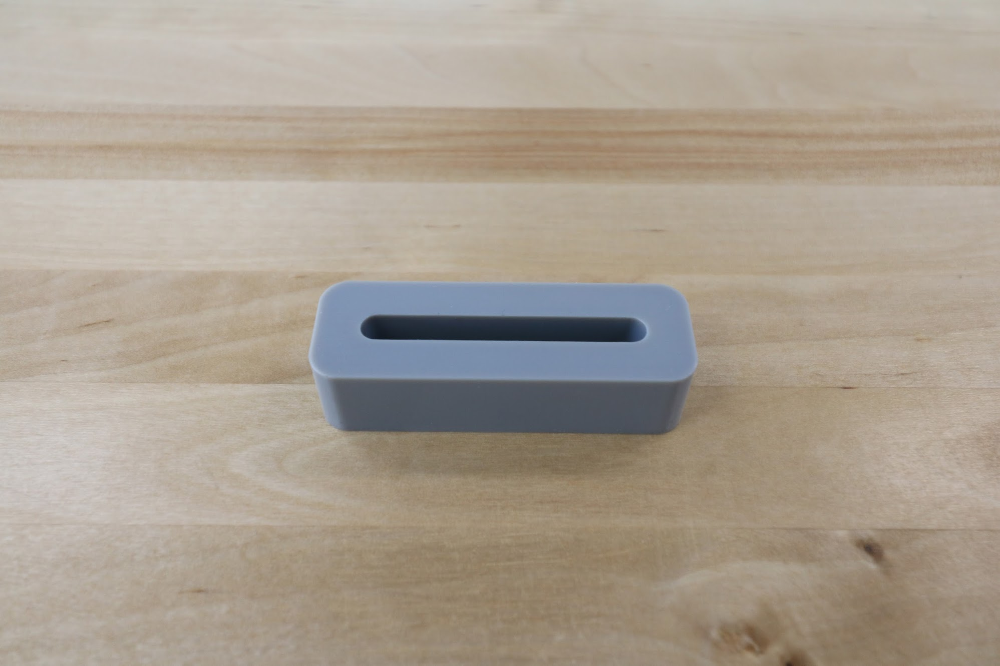
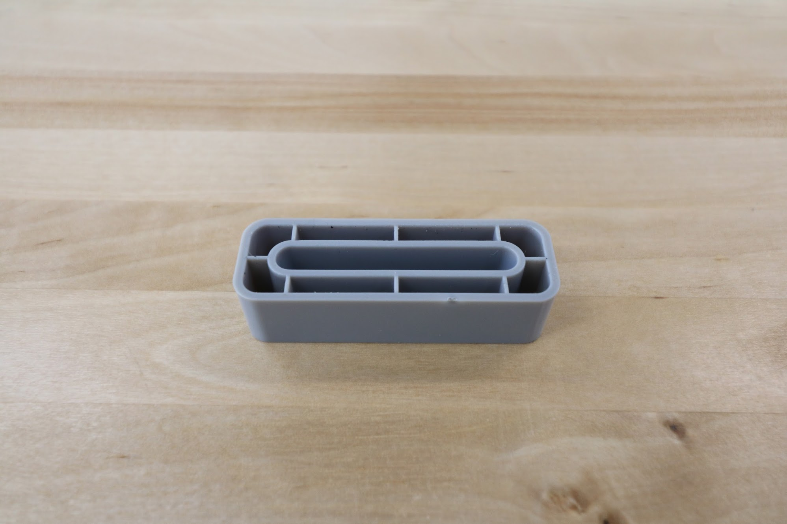

* toc
{:toc}

# 40mm Horizontal Cable Carrier Support

These parts are used to mount and support the x-axis cable carrier. The gusset also functions as an area for cables, tubes, and LED light strips to be routed through.



|                              |                              |
|------------------------------|------------------------------|
|**Material**                  |Gray UV stabilized ABS
|**Price**                     |$3.00
|**Quantity**                  |Genesis - 12 Genesis XL - 24
|**Recommended Supplier**      |[The FarmBot Shop](http://shop.farm.bot)

**Internal specs**{:.internal}

|                              |                              |
|------------------------------|------------------------------|
|**Internal Part Name**        |`40mm Horizontal CC Support Rev B`
|**Vendor**                    |LDO
|**$/pc**                      |$0.82
|**Component Tests**           |[Plastic Part Tests](../plastic-parts.md#component-tests)
{:.internal}

# 60mm Horizontal Cable Carrier Support

These parts are used to mount and support the y-axis cable carrier. The gusset also functions as an area for cables, tubes, and LED light strips to be routed through.



|                              |                              |
|------------------------------|------------------------------|
|**Material**                  |Gray UV stabilized ABS
|**Price**                     |$3.00
|**Quantity**                  |Genesis - 6 Genesis XL and MAX - 12
|**Recommended Supplier**      |[The FarmBot Shop](http://shop.farm.bot)

**Internal specs**{:.internal}

|                              |                              |
|------------------------------|------------------------------|
|**Internal Part Name**        |`60mm Horizontal CC Support Rev A`
|**Vendor**                    |LDO
|**$/pc**                      |$0.92
|**Component Tests**           |[Plastic Part Tests](../plastic-parts.md#component-tests)
{:.internal}

# 60mm Vertical Cable Carrier Support

These parts are used to guide and support the z-axis cable carrier. The gusset also functions as an area for the z-axis motor's cables to be routed through.



|                              |                              |
|------------------------------|------------------------------|
|**Material**                  |Gray UV stabilized ABS
|**Price**                     |$3.00
|**Quantity**                  |4
|**Recommended Supplier**      |[The FarmBot Shop](http://shop.farm.bot)

**Internal specs**{:.internal}

|                              |                              |
|------------------------------|------------------------------|
|**Internal Part Name**        |`60mm Vertical CC Support Rev A`
|**Vendor**                    |LDO
|**$/pc**                      |$.95
|**Component Tests**           |[Plastic Part Tests](../plastic-parts.md#component-tests)
{:.internal}

# 60mm Cable Carrier Spacer Block

This component offsets the z-axis cable carrier from the cross-slide plate.



|                              |                              |
|------------------------------|------------------------------|
|**Material**                  |Gray UV stabilized ABS
|**Price**                     |$3.00
|**Quantity**                  |1
|**Recommended Supplier**      |[The FarmBot Shop](http://shop.farm.bot)

**Internal specs**{:.internal}

|                              |                              |
|------------------------------|------------------------------|
|**Internal Part Name**        |`60mm CC Spacer Block Rev A`
|**Vendor**                    |LDO
|**$/pc**                      |$1.20
|**Component Tests**           |[Plastic Part Tests](../plastic-parts.md#component-tests)
{:.internal}
