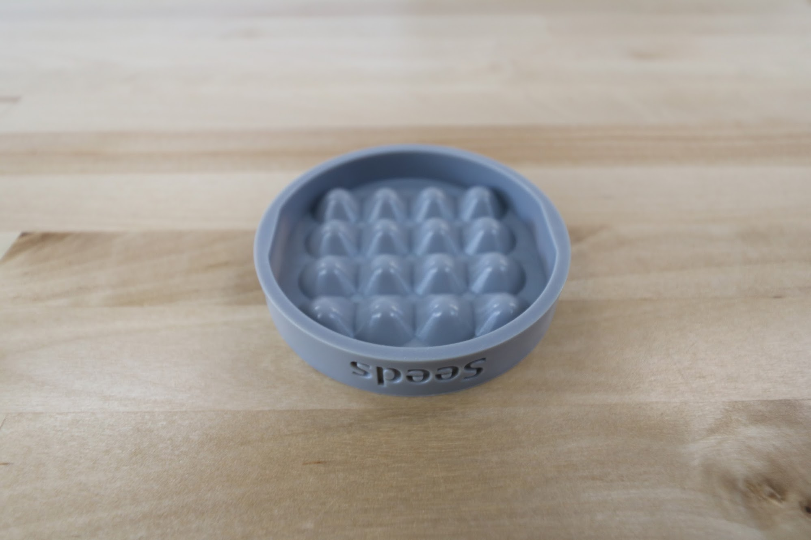

* toc
{:toc}

# Seed Bin

This plastic bin allows you to load many seeds of the same type into your FarmBot.



|                              |                              |
|------------------------------|------------------------------|
|**Material**                  |Gray UV stabilized ABS
|**Price**                     |$7.00
|**Quantity**                  |1
|**Recommended Supplier**      |[The FarmBot Shop](http://shop.farm.bot)

**Internal specs**{:.internal}

|                              |                              |
|------------------------------|------------------------------|
|**Internal Part Name**        |`Seed Bin Rev A`
|**Vendor**                    |LDO
|**$/pc**                      |$1.25
|**Component Tests**           |[Plastic Part Tests](../plastic-parts.md#component-tests)
{:.internal}

# Seed Tray

The seed trays feature 16 small bins allowing you to load 16 precise quantities/types of seeds into your FarmBot.



|                              |                              |
|------------------------------|------------------------------|
|**Material**                  |Gray UV stabilized ABS
|**Price**                     |$7.00
|**Quantity**                  |2
|**Recommended Supplier**      |[The FarmBot Shop](http://shop.farm.bot)

**Internal specs**{:.internal}

|                              |                              |
|------------------------------|------------------------------|
|**Internal Part Name**        |`Seed Tray Rev A`
|**Vendor**                    |LDO
|**$/pc**                      |$1.35
|**Component Tests**           |[Plastic Part Tests](../plastic-parts.md#component-tests)
{:.internal}

# Seed Trough

These troughs fit into the seed trough holder, allowing FarmBot to bring seeds with it while traveling along the x-axis.

|                              |                              |
|------------------------------|------------------------------|
|**Material**                  |Gray UV stabilized ABS
|**Price**                     |$3.00
|**Quantity**                  |2
|**Recommended Supplier**      |[The FarmBot Shop](http://shop.farm.bot)

**Internal specs**{:.internal}

|                              |                              |
|------------------------------|------------------------------|
|**Internal Part Name**        |`Seed Trough Rev A`
|**Vendor**                    |LDO
|**$/pc**                      |$1.00
|**Component Tests**           |[Plastic Part Tests](../plastic-parts.md#component-tests)
{:.internal}

# Seed Trough Holder

This gantry-mounted seed trough holder allows FarmBot to bring seeds with it while traveling along the x-axis, shortening the time needed for seed injection.

|                              |                              |
|------------------------------|------------------------------|
|**Material**                  |Gray UV stabilized ABS
|**Price**                     |$8.00
|**Quantity**                  |1
|**Recommended Supplier**      |[The FarmBot Shop](http://shop.farm.bot)

**Internal specs**{:.internal}

|                              |                              |
|------------------------------|------------------------------|
|**Internal Part Name**        |`Seed Trough Holder Rev B`
|**Vendor**                    |LDO
|**$/pc**                      |$1.60
|**Component Tests**           |[Plastic Part Tests](../plastic-parts.md#component-tests)
{:.internal}
