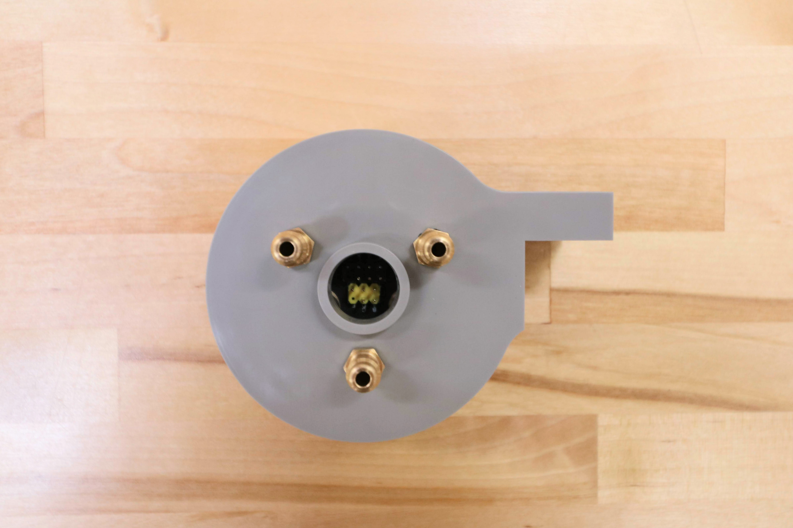

* toc
{:toc}

The UTM allows FarmBot to automatically switch tools for the task at hand. It features 12 electrical connections, three liquid/gas lines, and magnetic coupling.



|                              |                              |
|------------------------------|------------------------------|
|**Material**                  |Gray UV stabilized ABS
|**Price**                     |$30.00
|**Quantity**                  |1
|**Recommended Supplier**      |[The FarmBot Shop](http://shop.farm.bot)

**Internal specs**{:.internal}

|                              |                              |
|------------------------------|------------------------------|
|**Internal Part Name**        |`UTM Rev B`
|**Vendor**                    |LDO
|**$/pc**                      |$2.10
|**Component Tests**           |[Plastic Part Tests](../plastic-parts.md#component-tests)
{:.internal}
