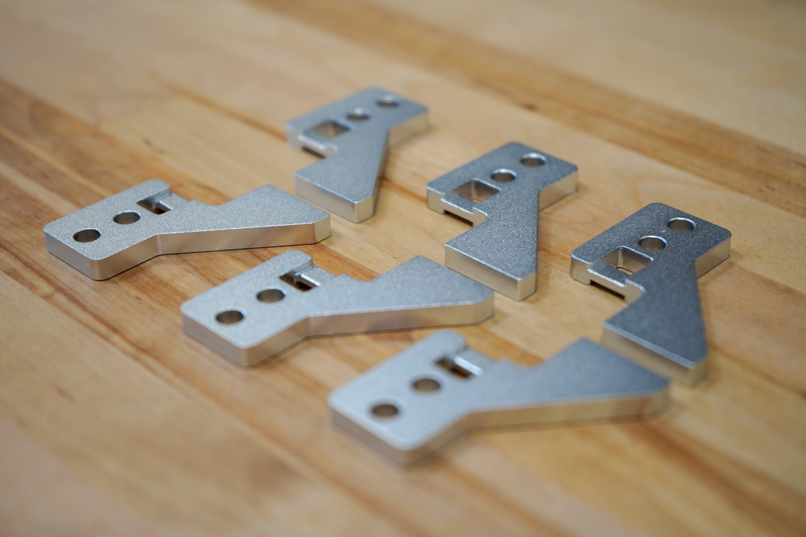

* toc
{:toc}



|                              |                              |
|------------------------------|------------------------------|
|**Thickness**                 |5mm
|**Material**                  |6061 Aluminum
|**Surface Treatments**        |Tumble polished Sand blasted Clear anodized
|**Price**                     |$3.00
|**Quantity**                  |6
|**Recommended Supplier**      |[The FarmBot Shop](http://shop.farm.bot)

**Internal specs**{:.internal}

|                              |                              |
|------------------------------|------------------------------|
|**Internal Part Name**        |`Belt Clip Rev A`
|**Vendor**                    |LDO
|**$/pc**                      |$1.65
|**Component Tests**           |[Plate and Bracket Tests](../plates-and-brackets.md#component-tests)
{:.internal}