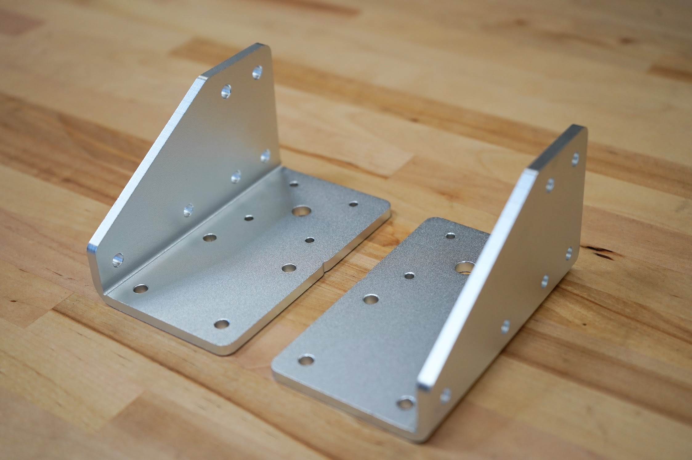
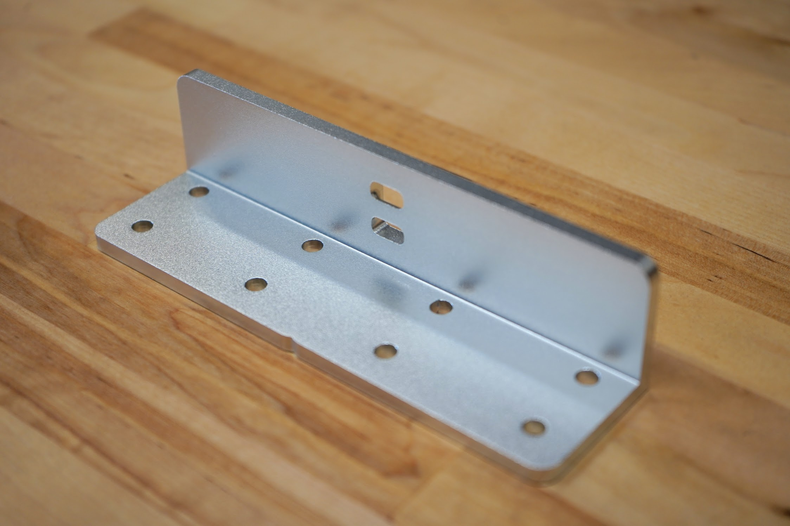

* toc
{:toc}

# Gantry Wheel Plate

|                              |                              |
|------------------------------|------------------------------|
|**Thickness**                 |5mm
|**Material**                  |6061 Aluminum
|**Surface Treatments**        |Tumble polished Sand blasted Clear anodized
|**Price**                     |$25.00
|**Quantity**                  |2
|**Recommended Supplier**      |[The FarmBot Shop](http://shop.farm.bot)

**Internal specs**{:.internal}

|                              |                              |
|------------------------------|------------------------------|
|**Internal Part Name**        |`Genesis Gantry Wheel Plate Rev B`
|**Vendor**                    |LDO
|**$/pc**                      |$3.95
|**Component Tests**           |[Plate and Bracket Tests](../plates-and-brackets.md#component-tests)
{:.internal}

# Gantry Corner Bracket



|                              |                              |
|------------------------------|------------------------------|
|**Thickness**                 |5mm
|**Material**                  |5052 Aluminum
|**Surface Treatments**        |Tumble polished Sand blasted Clear anodized
|**Price**                     |$30.00
|**Quantity**                  |2 (1 left-hand and 1 right-hand version) :raised_hands:
|**Recommended Supplier**      |[The FarmBot Shop](http://shop.farm.bot)

**Internal specs**{:.internal}

|                              |                              |
|------------------------------|------------------------------|
|**Internal Part Name**        |`Left Gantry Corner Bracket Rev A` `Right Gantry Corner Bracket Rev A`
|**Vendor**                    |LDO
|**$/pc**                      |$4.20
|**Component Tests**           |[Plate and Bracket Tests](../plates-and-brackets.md#component-tests)
{:.internal}

# Gantry Joining Bracket



|                              |                              |
|------------------------------|------------------------------|
|**Thickness**                 |5mm
|**Material**                  |6061 Aluminum
|**Surface Treatments**        |Tumble polished Sand blasted Clear anodized
|**Price**                     |$35.00
|**Quantity**                  |1 (Genesis XL only)
|**Recommended Supplier**      |[The FarmBot Shop](http://shop.farm.bot)

**Internal specs**{:.internal}

|                              |                              |
|------------------------------|------------------------------|
|**Internal Part Name**        |`Gantry Joining Bracket Rev B`
|**Vendor**                    |LDO
|**$/pc**                      |$4.95
|**Component Tests**           |[Plate and Bracket Tests](../plates-and-brackets.md#component-tests)
{:.internal}