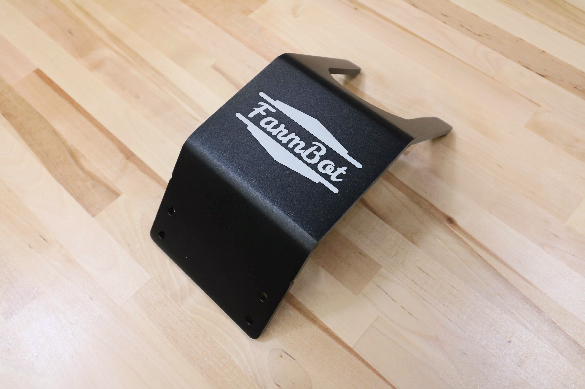

* toc
{:toc}

<iframe width="854" height="480" src="https://www.youtube.com/embed/vjvIB5wXmRo" frameborder="0" allow="accelerometer; autoplay; clipboard-write; encrypted-media; gyroscope; picture-in-picture" allowfullscreen></iframe>

# 1-Slot Toolbay

|                              |                              |
|------------------------------|------------------------------|
|**Thickness**                 |5mm
|**Material**                  |5052 Aluminum
|**Surface Treatments**        |Tumble polished Sand blasted Black anodized Laser engraved logo
|**Price**                     |$25.00
|**Quantity**                  |Genesis: 0  Genesis XL: 3
|**Recommended Supplier**      |[The FarmBot Shop](http://shop.farm.bot)

**Internal specs**{:.internal}

|                              |                              |
|------------------------------|------------------------------|
|**Internal Part Name**        |`1-Slot Toolbay Rev A`
|**Vendor**                    |LDO
|**$/pc**                      |$5.60
|**Component Tests**           |[Plate and Bracket Tests](../plates-and-brackets.md#component-tests)
{:.internal}

# 3-Slot Toolbay



|                              |                              |
|------------------------------|------------------------------|
|**Thickness**                 |5mm
|**Material**                  |5052 Aluminum
|**Surface Treatments**        |Tumble polished Sand blasted Black anodized Laser engraved logo
|**Price**                     |$40.00
|**Quantity**                  |2
|**Recommended Supplier**      |[The FarmBot Shop](http://shop.farm.bot)

**Internal specs**{:.internal}

|                              |                              |
|------------------------------|------------------------------|
|**Internal Part Name**        |`3-Slot Toolbay Rev B`
|**Vendor**                    |LDO
|**$/pc**                      |$12.60
|**Component Tests**           |[Plate and Bracket Tests](../plates-and-brackets.md#component-tests)
{:.internal}

# Seed Trough Holder Mount

This component allows for the seed trough holder to be mounted offset from the gantry column so that the seeder may reach the troughs.



|                              |                              |
|------------------------------|------------------------------|
|**Thickness**                 |5mm
|**Material**                  |6061 Aluminum
|**Surface Treatments**        |Tumble polished Sand blasted Clear anodized
|**Price**                     |$5.00
|**Quantity**                  |1
|**Recommended Supplier**      |[The FarmBot Shop](http://shop.farm.bot)

**Internal specs**{:.internal}

|                              |                              |
|------------------------------|------------------------------|
|**Internal Part Name**        |`Seed Trough Holder Mount Plate Rev A`
|**Vendor**                    |LDO
|**$/pc**                      |$2.50
|**Component Tests**           |[Plate and Bracket Tests](../plates-and-brackets.md#component-tests)
{:.internal}