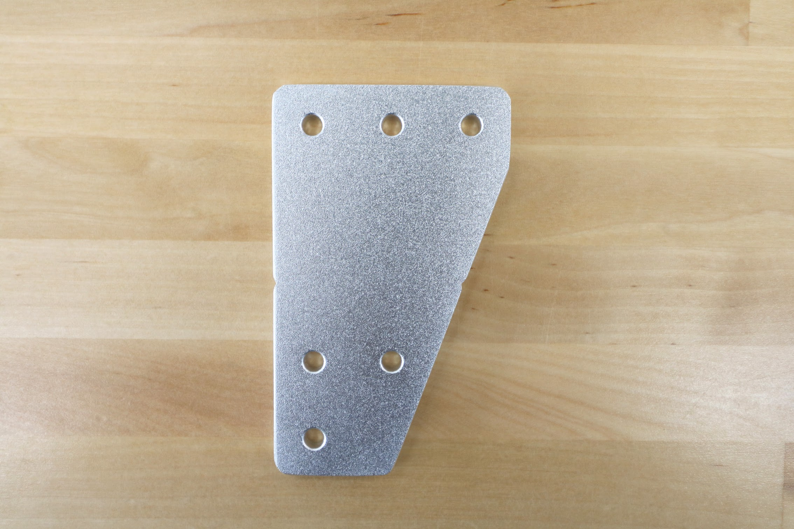

* toc
{:toc}

# Track End Plate



|                              |                              |
|------------------------------|------------------------------|
|**Thickness**                 |5mm
|**Material**                  |6061 Aluminum
|**Surface Treatments**        |Tumble polished Sand blasted Clear anodized
|**Price**                     |$12.00
|**Quantity**                  |4
|**Recommended Supplier**      |[The FarmBot Shop](http://shop.farm.bot)

**Internal specs**{:.internal}

|                              |                              |
|------------------------------|------------------------------|
|**Internal Part Name**        |`Track End Plate Rev B`
|**Vendor**                    |LDO
|**$/pc**                      |$1.83
|**Component Tests**           |[Plate and Bracket Tests](../plates-and-brackets.md#component-tests)
{:.internal}

# Track Joining Plate

|                              |                              |
|------------------------------|------------------------------|
|**Thickness**                 |5mm
|**Material**                  |6061 Aluminum
|**Surface Treatments**        |Tumble polished Sand blasted Clear anodized
|**Price**                     |$15.00
|**Quantity**                  |Genesis - 2 Genesis XL - 6
|**Recommended Supplier**      |[The FarmBot Shop](http://shop.farm.bot)

**Internal specs**{:.internal}

|                              |                              |
|------------------------------|------------------------------|
|**Internal Part Name**        |`Track Joining Plate Rev A`
|**Vendor**                    |LDO
|**$/pc**                      |$2.80
|**Component Tests**           |[Plate and Bracket Tests](../plates-and-brackets.md#component-tests)
{:.internal}