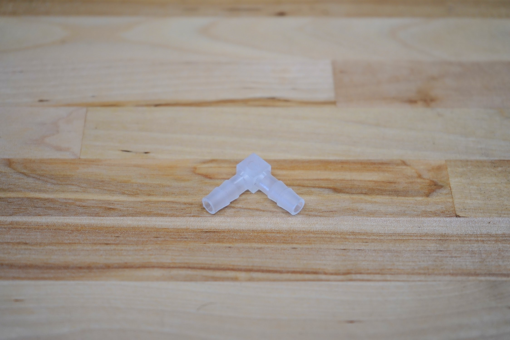
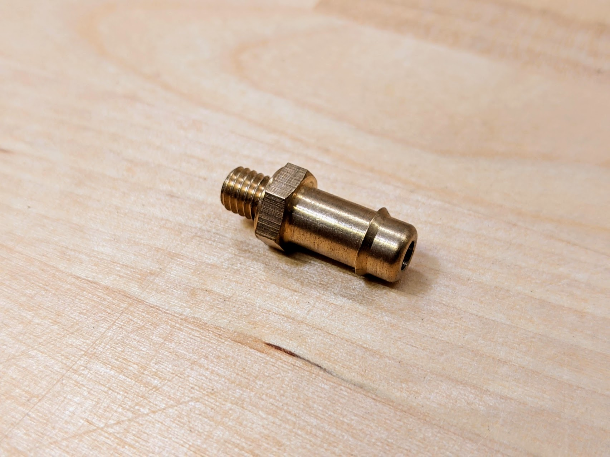
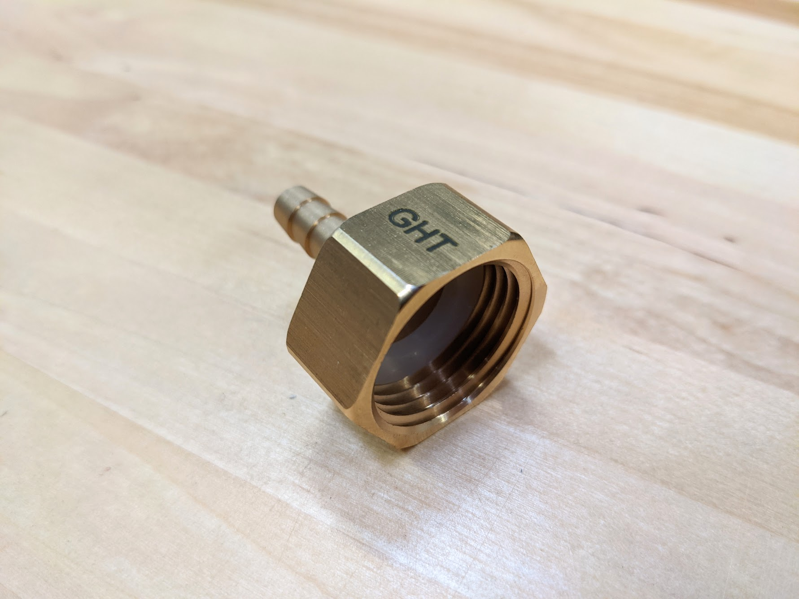
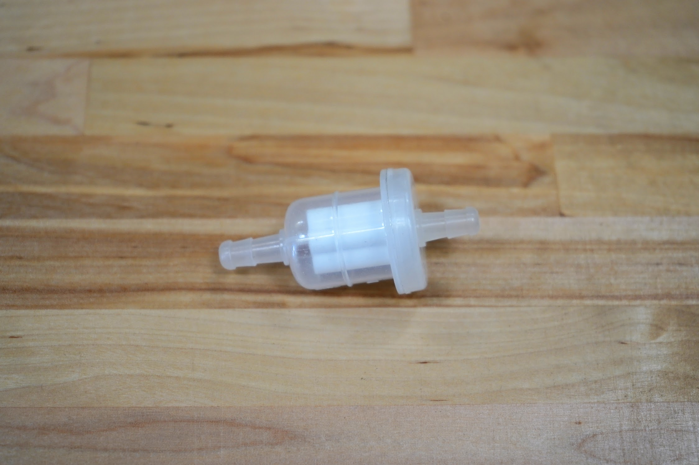
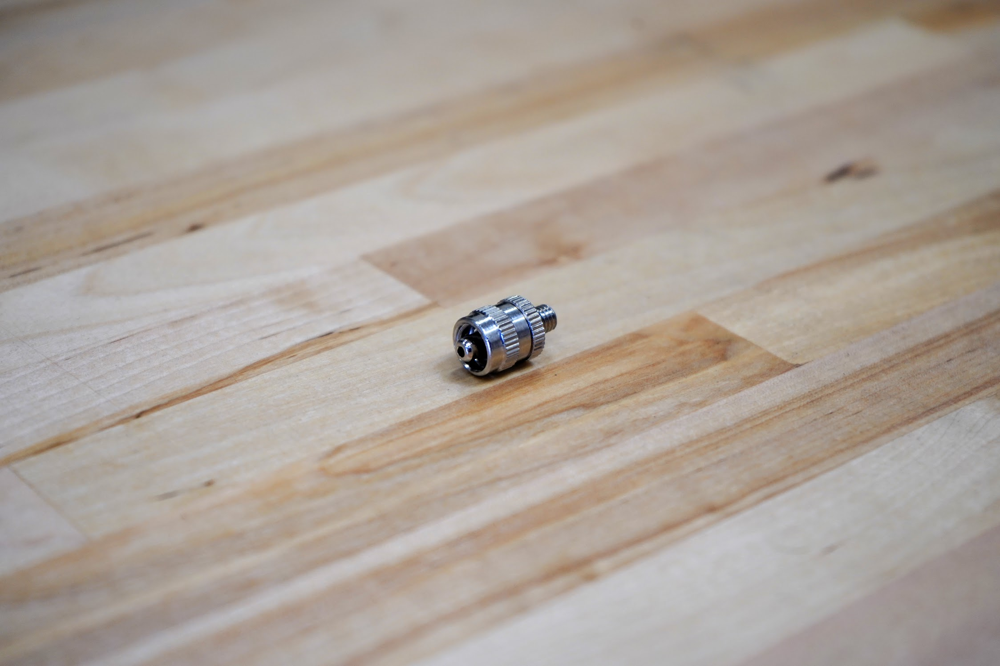
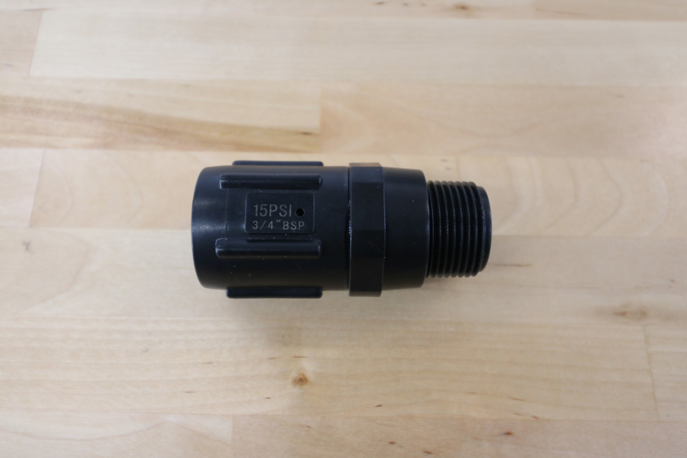

* toc
{:toc}

|Component|$/Unit|Genesis Qty|Genesis Subtotal|XL Qty|XL Subtotal|MAX Qty|MAX Subtotal|
|---------|------|-----------|----------------|------|-----------|-------|------------|
|[90-Degree Barb](#90-degree-barb)|$2.00|1|$2.00|1|$2.00|1|$2.00
|[Barbs](#barbs)|$6.00|3|$18.00|3|$18.00|3|$18.00
|[Garden Hose to Barb Adapter](#garden-hose-to-barb-adapter)|$7.00|1|$7.00|1|$7.00|1|$7.00
|[Inline Air Filter](#inline-air-filter)|$10.00|1|$10.00|1|$10.00|1|$10.00
|[Luer Lock Adapter](#luer-lock-adapter)|$5.00|1|$5.00|1|$5.00|1|$5.00
|[Luer Lock Needles](#luer-lock-needles)|$3.00|9|$27.00|9|$27.00|9|$27.00
|[NPT to Barb Adapter](#npt-to-barb-adapter)|$5.00|3|$15.00|3|$15.00|3|$15.00
|[O-rings](#o-rings)|$0.50|3|$1.50|3|$1.50|3|$1.50
|[Pressure Regulator](#pressure-regulator)|$8.00|1|$8.00|1|$8.00|1|$8.00
|[Rubber Gasket](#rubber-gasket)|$1.00|4|$4.00|4|$4.00|4|$4.00
|[Teflon Tape](#teflon-tape)|$5.00|1|$5.00|1|$5.00|1|$5.00
|[Vacuum Tube](#vacuum-tube)|$1.00|2|$2.00|2|$2.00|2|$2.00
|[Water Tube](#water-tube)|$5.00 to $35.00|3|$23.00|3|$32.00|3|$52.00
|**TOTALS**||**26**|**$111.50**|**26**|**$120.50**|**26**|**$140.50**

# 90-Degree Barb

This barb is used to connect the y-axis water tube to the z-axis water tube.

|                              |                              |
|------------------------------|------------------------------|
|**Price**                     |$2.00
|**Quantity**                  |1

**Internal specs**{:.internal}

|                              |                              |
|------------------------------|------------------------------|
|**Internal Part Name**        |`90 Degree Barb for 6mm ID tubing`
|**Vendor**                    |LDO
|**$/pc**                      |$0.10
{:.internal}

**Component tests**{:.internal}

|Test         |Description  |Target       |Tolerance    |
|-------------|-------------|-------------|-------------|
|Barb size    |Connect a 6mm ID tube to both ends.|Tube should fit snugly onto the barbs and not fall off.|N/A
|Water flow   |Connect the barb inline to a water line and turn on the water.|The water should flow sufficiently without issue.|N/A
{:.internal}

# Barbs

These brass barbs screw into the UTM's three liquid/gas ports and accept the three liquid/gas lines coming from the z-axis cable carrier.



|                              |                              |
|------------------------------|------------------------------|
|**For Tube ID**               |6mm
|**Threads**                   |M5
|**Hex Size**                  |8mm
|**Gasket?**                   |Yes
|**Material**                  |Brass
|**Price**                     |$6.00
|**Quantity**                  |3

**Internal specs**{:.internal}

|                              |                              |
|------------------------------|------------------------------|
|**Internal Part Name**        |`Barbs for 6mm ID tubing w/ M5 Threads, 8mm hex, o-ring`
|**Vendor**                    |LDO
|**$/pc**                      |$1.00
{:.internal}

**Component tests**{:.internal}

|Test         |Description  |Target       |Tolerance    |
|-------------|-------------|-------------|-------------|
|Threads      |Connect to an M5 brass insert on top of the UTM.|Parts should connect as expected|N/A
|Hex size     |Use an 8mm wrench to tighten the barb on top of the UTM.|The hex size should work with an 8mm wrench|N/A
|Barb         |Connect a 6mm ID tube.|The tube should connect securely and have mildly resist being disconnected by hand.|N/A
{:.internal}

# Garden Hose to Barb Adapter

This adapter connects standard US garden hoses to 6mm ID tubing.



|                              |                              |
|------------------------------|------------------------------|
|**Material**                  |Brass
|**For Tube ID**               |6mm
|**Threads**                   |3/4" Female GHT (Garden Hose Thread) 3/4" Male NPT (National Pipe Thread)
|**Engraving**                 |`GHT`
|**Rubber Gasket?**            |Included
|**Price**                     |$7.00
|**Quantity**                  |1

**Internal specs**{:.internal}

|                              |                              |
|------------------------------|------------------------------|
|**Internal Part Name**        |`Garden Hose to Barb Adapter (3/4" female GHT to Barb for 6mm ID tubing)`
|**Vendor**                    |LDO
|**$/pc**                      |$3.50
|**Notes**                     |Includes "GHT" laser engraving and pre-inserted rubber gasket.
{:.internal}

**Component tests**{:.internal}

|Test         |Description  |Target       |Tolerance    |
|-------------|-------------|-------------|-------------|
|Threads      |Connect the adapter to a garden hose.|Parts should connect as expected|N/A
|Barb         |Connect a tube to the barbed end.|The tube should connect securely and resist being disconnected by hand.|N/A
|Engraving    |Inspect the part for an engraved label.|Should say `GHT`|N/A
{:.internal}

# Inline Air Filter

This filter is used to prevent soil and other debris from entering the vacuum pump.

|                              |                              |
|------------------------------|------------------------------|
|**Price**                     |$10.00
|**Quantity**                  |1

**Internal specs**{:.internal}

|                              |                              |
|------------------------------|------------------------------|
|**Internal Part Name**        |`Inline Air Filter (Barbs for 6mm ID tubing)`
|**Vendor**                    |LDO
|**$/pc**                      |$0.75
{:.internal}

**Component tests**{:.internal}

|Test         |Description  |Target       |Tolerance    |
|-------------|-------------|-------------|-------------|
|Barb size    |Connect a 6mm ID tube to both ends of the air filter.|Tube should fit snugly onto the barbs and not fall off.|N/A
|Airflow      |Connect the filter inline to a vacuum pump and UTM. Turn on the pump and mount a seed injector tool to the UTM.|The vacuum should provide enough suction even with the inline filter installed to pick up seeds.|N/A
{:.internal}

# Luer Lock Adapter

This adapter screws into the tool head and allows various luer lock needles to be quickly attached for seed injection.

|                              |                              |
|------------------------------|------------------------------|
|**Material**                  |Stainless steel
|**Threads**                   |M5
|**Interface**                 |1/4 turn luer lock
|**Price**                     |$5.00
|**Quantity**                  |1

**Internal specs**{:.internal}

|                              |                              |
|------------------------------|------------------------------|
|**Internal Part Name**        |`M5 to Luer Lock Adapter (Stainless Steel)`
|**Vendor**                    |LDO
|**$/pc**                      |$0.50
{:.internal}

**Component tests**{:.internal}

|Test         |Description  |Target       |Tolerance    |
|-------------|-------------|-------------|-------------|
|Threads      |Thread the adapter into a seeder tool with an M5 brass insert.|Adapter should connect as expected|N/A
|Luer lock    |Connect a needle to a luer lock adapter.|Should connect securely with a 1/4 turn|N/A
|Material     |Ensure the needle is stainless steel and will not rust by holding a magnet to the part.|Stainless steel (no magnetic attraction)|Weak attraction to stainless steel is permissible.
{:.internal}

# Luer Lock Needles

These needles are used for seed injection.

|                              |                              |
|------------------------------|------------------------------|
|**Material**                  |Stainless steel and plastic
|**Gauges**                    |16, 19, and 22
|**Length**                    |40mm
|**Covers**                   |Included
|**Interface**                 |1/4 turn luer lock
|**Price**                     |$3.00
|**Quantity**                  |3 of each gauge

**Internal specs**{:.internal}

|                              |                              |
|------------------------------|------------------------------|
|**Internal Part Name**        |`Luer Lock Needle w/ cover (16 Gauge)` `Luer Lock Needle w/ cover (19 Gauge)` `Luer Lock Needle w/ cover (22 Gauge)`
|**Vendor**                    |LDO
|**$/pc**                      |$0.08
{:.internal}

**Component tests**{:.internal}

|Test         |Description  |Target       |Tolerance    |
|-------------|-------------|-------------|-------------|
|Outer diameter|Measure the outer diameter using digital calipers.|1.65mm (16 guage) 1.07mm (19 guage) 0.71mm (22 guage)|+/- .05mm
|Length       |Measure the length using digital calipers.|40mm|+/- 1mm
|Material     |Ensure the needle is stainless steel and will not rust by holding a magnet to the part.|Stainless steel (no magnetic attraction)|Weak attraction to stainless steel is permissible.
|Color        |Inspect the color of each needle's plastic luer lock connector.|The color should be different depending on the needle size.|N/A
|Luer lock    |Connect a needle to a luer lock adapter.|Should connect securely with a 1/4 turn|N/A
|Covers       |Ensure the needles have covers.|Included cover|N/A
{:.internal}

# NPT to Barb Adapter

These adapters are used on the inlet of the solenoid valve and the outlet of the pressure reducer.



|                              |                              |
|------------------------------|------------------------------|
|**Material**                  |Brass
|**For Tube ID**               |6mm
|**Threads**                   |3/4" female NPT (National Pipe Thread)
|**Engraving**                 |`NPT`
|**Rubber Gasket?**            |Included
|**Price**                     |$5.00
|**Quantity**                  |2

**Internal specs**{:.internal}

|                              |                              |
|------------------------------|------------------------------|
|**Internal Part Name**        |`NPT to Barb Adapter (3/4" female NPT to Barb for 6mm ID tubing)`
|**Vendor**                    |LDO
|**$/pc**                      |$3.50
|**Notes**                     |Includes "NPT" laser engraving and pre-inserted rubber gasket.
{:.internal}

**Component tests**{:.internal}

|Test         |Description  |Target       |Tolerance    |
|-------------|-------------|-------------|-------------|
|Threads      |Connect the adapter to a solenoid valve.|Parts should connect as expected|N/A
|Barb         |Connect a 6mm ID tube to the barbed end.|The tube should connect securely and resist being disconnected by hand.|N/A
|Engraving    |Inspect the part for an engraved label.|Should say `NPT`|N/A
{:.internal}

# O-rings

These O-rings fit onto the UTM's liquid/gas ports and create a solid seal when tools are mounted.

|                              |                              |
|------------------------------|------------------------------|
|**Material**                  |Viton
|**Durometer**                 |A70 (Medium)
|**Outer Diameter**            |10.5mm
|**Inner Diameter**            |7.65mm
|**Thickness**                 |1.78mm
|**Temperature Range**         |-30° to 212° F
|**Color**                     |Black
|**Price**                     |$0.50
|**Quantity**                  |3

**Internal specs**{:.internal}

|                              |                              |
|------------------------------|------------------------------|
|**Internal Part Name**        |`X profile O-rings`
|**Vendor**                    |LDO
|**$/pc**                      |$0.33
{:.internal}

**Component tests**{:.internal}

|Test         |Description  |Target       |Tolerance    |
|-------------|-------------|-------------|-------------|
|Profile      |Inspect the o-ring's profile.|X-profile|N/A
|Inner diameter|Measure the inner diameter with digital calipers.|7.5mm|+/-0.2mm
|Thickness    |Measure the thickness with digital calipers.|1.5mm|+/-0.1mm
|Color        |Inspect the part's color|Black|N/A
|UTM fit      |Slide an o-ring onto a UTM liquid/gas port and then vigorously shake the UTM up and down.|The o-ring should stay in place.|N/A
{:.internal}

# Pressure Regulator

This pressure regulator reduces the pressure from a municipal water supply down to 15 PSI (103 kpa, 1.03 bar) so that FarmBot can more easily control the amount of water it disperses.



|                              |                              |
|------------------------------|------------------------------|
|**Material**                  |UV resistant plastic
|**Inlet**                     |3/4 in. female pipe thread
|**Outlet**                    |3/4 in. male pipe thread
|**Color**                     |Black
|**Outer Diameter**            |1.25 inches (31.75mm)
|**Outlet Pressure**           |15 PSI (103 kpa, 1.02 bar)
|**Max Input Pressure**        |100 PSI (688 kpa, 6.88 bar)
|**Rubber Gasket?**            |Included
|**Price**                     |$8.00
|**Quantity**                  |1

**Internal specs**{:.internal}

|                              |                              |
|------------------------------|------------------------------|
|**Internal Part Name**        |`15 psi Pressure Reducer (3/4" female NPT to 3/4" male NPT)`
|**Vendor**                    |LDO
|**$/pc**                      |$1.00
|**Notes**                     |Includes pre-inserted rubber gasket.
{:.internal}

**Component tests**{:.internal}

|Test         |Description  |Target       |Tolerance    |
|-------------|-------------|-------------|-------------|
|Threads      |Connect a solenoid valve and NPT to barb adapter onto the pressure regulator.|Mating parts should connect as expected|N/A
|Rating       |Inspect the part's printed pressure rating|15 PSI|N/A
|Color        |Inspect the part's color|Black|N/A
{:.internal}

# Rubber Gasket

These gaskets are used with the NPT to barb adapter, garden hose to barb adapter, and pressure reducer to seal the water system's threaded connections.

|                              |                              |
|------------------------------|------------------------------|
|**Material**                  |Rubber
|**Size**                      |For 3/4" NPT or GHT connections
|**Price**                     |$1.00
|**Quantity**                  |4

**Internal specs**{:.internal}

|                              |                              |
|------------------------------|------------------------------|
|**Internal Part Name**        |`3/4" Rubber Gasket`
|**Vendor**                    |LDO
|**$/pc**                      |Inlcuded in price of adapters
|**Notes**                     |Pre-inserted into `Garden Hose to Barb Adapter`, `NPT to Barb Adapter`, and `Pressure Regulator`
{:.internal}

**Component tests**{:.internal}

|Test         |Description  |Target       |Tolerance    |
|-------------|-------------|-------------|-------------|
|Size         |Insert a rubber gasket into an NPT to barb adapter and then screw the adapter onto a solenoid valve.|Gasket should insert into the adapter and seal the assembly as expected.|N/A
{:.internal}

# Teflon Tape

This plumber's tape is used to seal the pipe thread connections in FarmBot's watering system.

|                              |                              |
|------------------------------|------------------------------|
|**Material**                  |PTFE
|**Length**                    |10m
|**Width**                     |1.5cm
|**Color**                     |White
|**Price**                     |$5.00
|**Quantity**                  |1

**Internal specs**{:.internal}

|                              |                              |
|------------------------------|------------------------------|
|**Internal Part Name**        |`Teflon Tape (1.5cm wide, 10m long)`
|**Vendor**                    |LDO
|**$/pc**                      |$0.20
{:.internal}

**Component tests**{:.internal}

|Test         |Description  |Target       |Tolerance    |
|-------------|-------------|-------------|-------------|
|Width        |Measure the width with digital calipers|15mm|+/- 1mm
|Length       |Unravel a spool and measure the length with a tape measure.|9m|+/- 0.5m
|Color        |Inspect the color.|White|N/A
|Packing      |Inspect the packing.|Plastic bag|N/A
{:.internal}

# Vacuum Tube

These ultra flexible silicone tubes carry vacuum suction from the vacuum pump to the UTM.

|                              |                              |
|------------------------------|------------------------------|
|**Length**                    |0.15m
|**Material**                  |Semi-clear silicone
|**Flexibility**               |Very flexible
|**Compatible Tube Fittings**  |Barbs
|**Inner Diameter**            |6mm
|**Outer Diameter**            |10mm
|**Price**                     |$1.00
|**Quantity**                  |2

**Internal specs**{:.internal}

|                              |                              |
|------------------------------|------------------------------|
|**Internal Part Name**        |`6 x 10mm Tube - 0.15m (Vacuum)`
|**Vendor**                    |LDO
|**$/pc**                      |$0.30
{:.internal}

**Component tests**{:.internal}

|Test         |Description  |Target       |Tolerance    |
|-------------|-------------|-------------|-------------|
|ID           |Measure the inner diameter with digital calipers.|6mm|+/- 0.1mm
|OD           |Measure the outer diameter with digital calipers.|10mm|+/- 0.25mm
|Length       |Measure the length with a tape measure.|See BOM spec.|+/- 10mm
|Flexibility  |Inspect for flexibility.|Tubing should be very flexible|N/A
|Kink resistance|Bend the tube into a 10cm diameter circle.|The tube should not kink|N/A
|Barb compatibility|Connect to a barbed adapter.|The tube should connect securely and resist being disconnected by hand.|N/A
{:.internal}

# Water Tube

These ultra flexible silicone tubes carry water to the UTM.



|                              |                              |
|------------------------------|------------------------------|
|**Lengths**                   |**Genesis** 3m, 2.1m, and 0.95m  **Genesis XL** 4.5m, 3.6m, and 0.95m
|**Material**                  |Semi-clear silicone
|**Flexibility**               |Very flexible
|**Compatible Tube Fittings**  |Barbs
|**Inner Diameter**            |6mm
|**Outer Diameter**            |10mm
|**Price**                     |$5.00 - 0.95m $8.00 - 2.1m $10.00 - 3m $12.00 - 3.6m $15.00 - 4.5m $35.00 - 10.5m
|**Quantity**                  |One of each length

**Internal specs**{:.internal}

|                              |                              |
|------------------------------|------------------------------|
|**Internal Part Names**        |**Genesis** `6 x 10mm Tube - 0.95m (Water, Z-axis, all bots)` `6 x 10mm Tube - 2.1m (Water, Y-axis, Genesis)` `6 x 10mm Tube - 3.0m (Water, X-Axis, Genesis)`  **Genesis XL** `6 x 10mm Tube - 0.95m (Water, Z-axis, all bots)` `6 x 10mm Tube - 3.6m (Water, Y-Axis Genesis XL)` `6 x 10mm Tube - 4.5m (Water, X-Axis, Genesis XL)`
|**Vendor**                    |LDO
|**$/pc**                      |$0.80 - 0.95m $1.80 - 2.1m $2.70 - 3.0m $3.00 - 3.6m $3.80 - 4.5m
{:.internal}

**Component tests**{:.internal}

|Test         |Description  |Target       |Tolerance    |
|-------------|-------------|-------------|-------------|
|ID           |Measure the inner diameter with digital calipers.|6mm|+/- 0.1mm
|OD           |Measure the outer diameter with digital calipers.|10mm|+/- 0.25mm
|Length       |Measure the length with a tape measure.|See BOM spec.|+/- 10mm
|Flexibility  |Inspect for flexibility.|Tubing should be very flexible|N/A
|Kink resistance|Bend the tube into a 10cm diameter circle.|The tube should not kink|N/A
|Barb compatibility|Connect to a barbed adapter.|The tube should connect securely and resist being disconnected by hand.|N/A
{:.internal}
