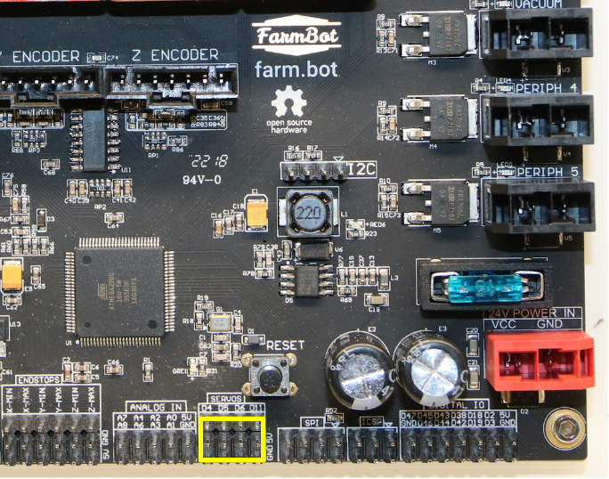

* toc
{:toc}

Interested in making your own servo powered tool or peripheral? You can easily control PWM servo motors via the __CONTROL SERVO__ sequence command.

For additional information, see the [sequence command documentation](https://software.farm.bot/docs/sequence-commands).

Up to four servo motors can be connected to the `SERVOS` pins on the Farmduino.
To control a servo directly from the pins, connect a set of servo pins (`GND`, `5V`, and one of the four available control pins `D4`, `D5`, `D6`, or `D11`) to a servo.
To control a servo through the UTM, connect a set of servo pins (`GND`, `5V`, and one of the four available control pins `D4`, `D5`, `D6`, or `D11`) to [available UTM pins](../../assembly/tools/utm.md#pin-mapping) using [jumper wires](../../bom/electronics-and-wiring/jumper-wire.md). Then, connect the servo to the corresponding pins at the UTM with the same labels you chose at the Farmduino.

Make sure to let us know what you make in [the forum](https://forum.farmbot.org)!
