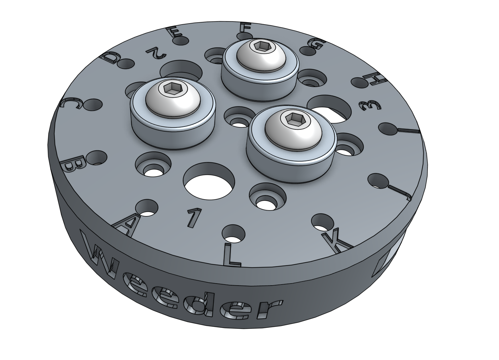
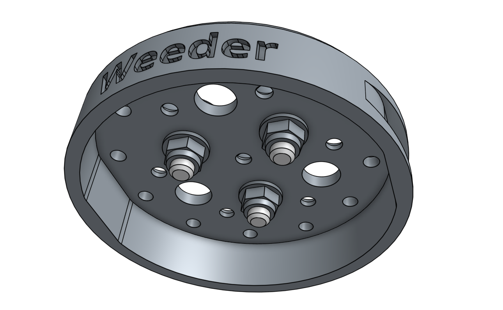
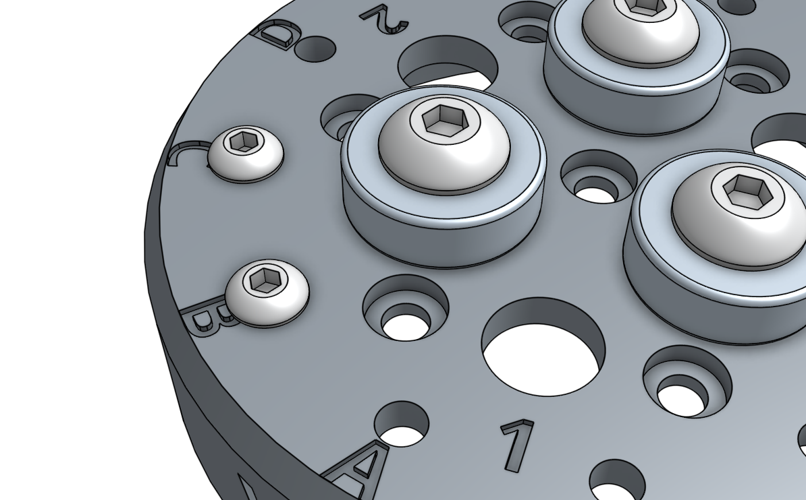
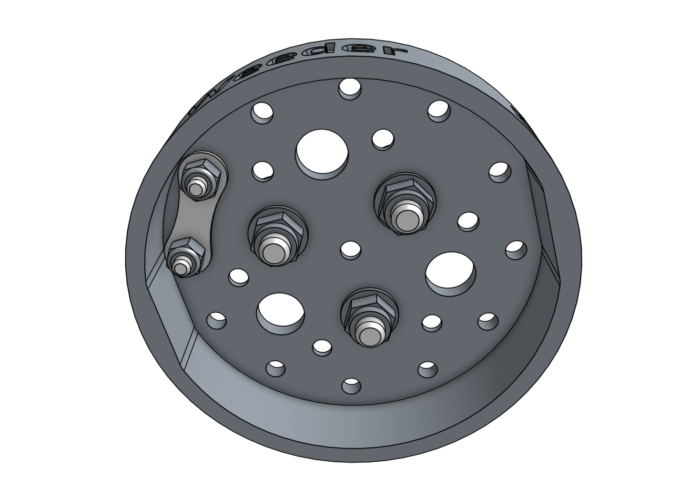

# Step 1: Install the magnets





Secure the three **ring magnets** to the top of the **tool** using three [[M5 x 16mm screws]] and [[M5 flange locknuts]]. Use the 3mm hex driver and 8mm wrench to tighten the components. *Note: the watering nozzle will require [[M5 x 30mm screws]]*.





# Step 2: Install the tool verification jumper link

Insert two [[M3 x 12mm screws]] into the holes labelled **B** and **C** on the top of the **tool**.

Secure the [[jumper link]] to the bottom of the screws with two [[M3 locknuts]].

