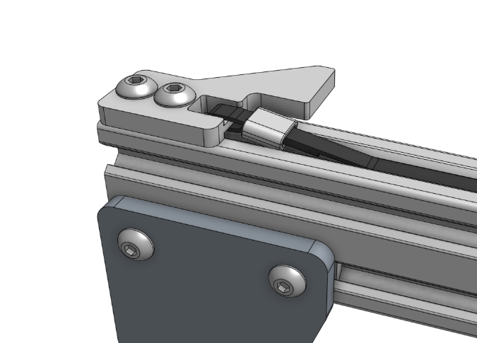

* toc
{:toc}

# Step 1: Slide on a belt sleeve
Slide a [[belt sleeve]] onto the **belt**.

# Step 2: Route the belt through the clip
Route the **belt** down through the slot in the [[belt clip]] and then wrap the belt back under itself. The teeth from the short end of the belt should engage with the teeth on the long end.

# Step 3: Secure the belt with the sleeve
Slide the [[belt sleeve]] over both ends of the belt. This may take a small bit of force and some wiggling.

# Step 4: Mount the clip
Mount the clip to the end of an **extrusion** with a **20mm nut bar** and **M5 x 10mm screws**.

