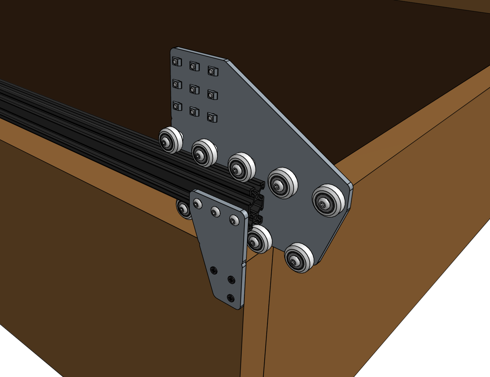
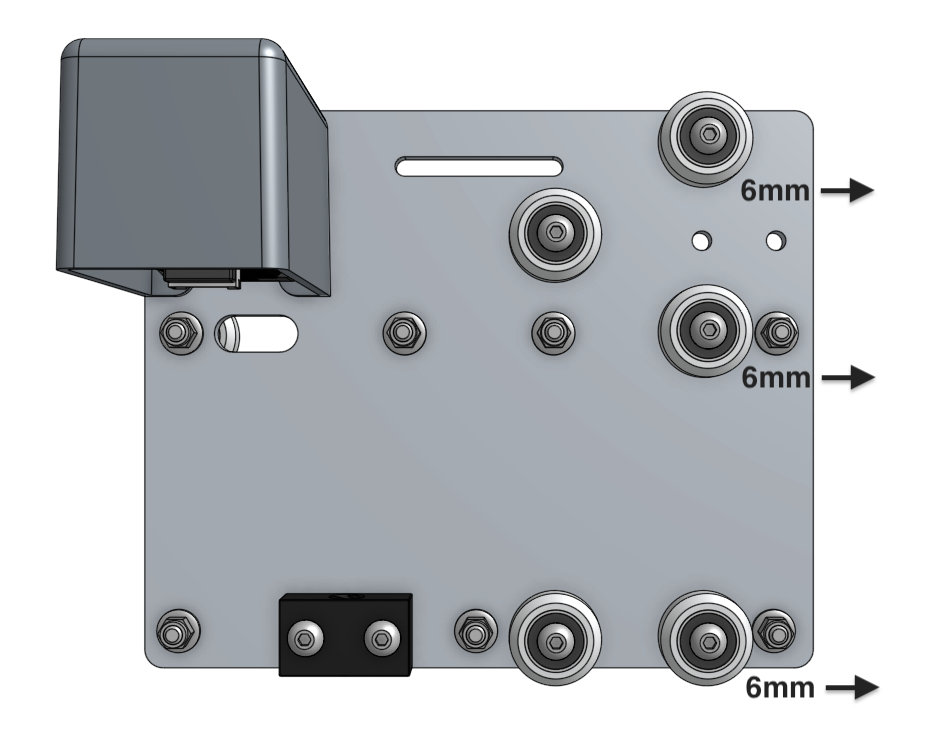

Eccentric spacers are used for making fine adjustments to the spacing between the v-wheels on either side of an aluminum extrusion. Adjusting this spacing is key to achieving smooth and wobble-free movement of the gantry across the tracks, the cross-slide across the gantry main beam, and the z-axis up and down the cross-slide.

If the spacing between v-wheels is too little, then the extrusions will not fit between the v-wheels at all or be tough to move. If the spacing is too great, then the connection will be wobbly and loose. Let's adjust the eccentric spacers throughout FarmBot to be just right.

# Fit test

First, see if the extrusion will easily slide in between the v-wheels. It will very likely either be too loose and wobble, or too tight and not fit at all. Take note of which v-wheels need adjustment.



# Adjusting the eccentric spacers

1. Separate the extrusion and the wheel/plate assembly
2. Using an **8mm wrench**, turn the **eccentric spacer** that needs adjusting about 1/32 of a turn. Depending on the direction you turn the spacer, and the current orientation of the spacer, the spacing will either increase or decrease. Your goal is to adjust the spacer in the direction you need. Make the spacing smaller if the connection was loose. Make the spacing larger if the extrusion did not fit between the v-wheels or if there was a lot of friction. The notch in the side of the eccentric spacer indicates the shortest distance, so moving the notch towards the other wheels will decrease the spacing.
3. Once you have adjusted the spacer 1/32 of a turn, do another fit test.
4. Continue the steps above for all eccentric spacers until your connections are smooth and wobble free.

## Gantry wheel plates

These eccentric spacers on the gantry wheel plates affect the fit of the gantry wheel plates on the tracks. To set the spacers to the loosest setting, position the `6mm` engraving on the spacers facing away from the track extrusions (down).



## Cross-slide

These eccentric spacers on the cross-slide affect the fit of the cross-slide on the gantry main beam. To set the spacers to the loosest setting, position the `6mm` engraving on the spacers facing away from the gantry main beam.



## Z-axis

These eccentric spacers on the cross-slide affect the fit of the z-axis in the cross-slide. To set the spacers to the loosest setting, position the `6mm` engraving on the spacers facing away from the z-axis extrusion.



{%
include callout.html
type="info"
title="Need just a little more space?"
content="If the fit of the wheels on the extrusion is still too tight after adjusting all of the eccentric spacers to their loosest setting (`6mm` engraving facing away from the extrusion), you can increase the distance between the two sets of wheels slightly more by adjusting the wheels with standard spacers as well.

Loosen the screws attaching the wheels with standard spacers (non-eccentric) until the wheel assemblies can be moved around in the holes in the plate. Gently nudge the wheel assemblies in the holes so that they are farthest from the extrusion and re-tighten the screws."
%}

{%
include callout.html
type="success"
title="The perfect fit"
content="The perfect fit is subjective and you'll need to play around to get it just right. Here is our best tip: Adjust your wheel spacing so that it is as large as possible without inducing wobbling or rattling. This will ensure you are not over tightening your wheels and risking damage.

You would rather have a wobbly wheel that you can tighten later than damaged components now.

Don't expect anything to roll like a ball down a hill. A well fitted extrusion/v-wheel connection will have a small amount of friction. Again, just play around with the spacing and use your best judgement."
%}

