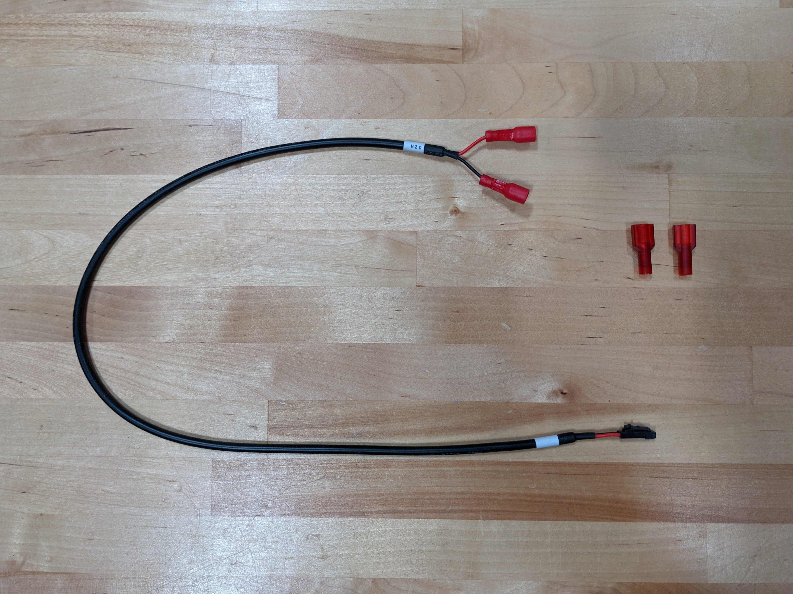

The replacement quick connect terminals are located in a small plastic bag.

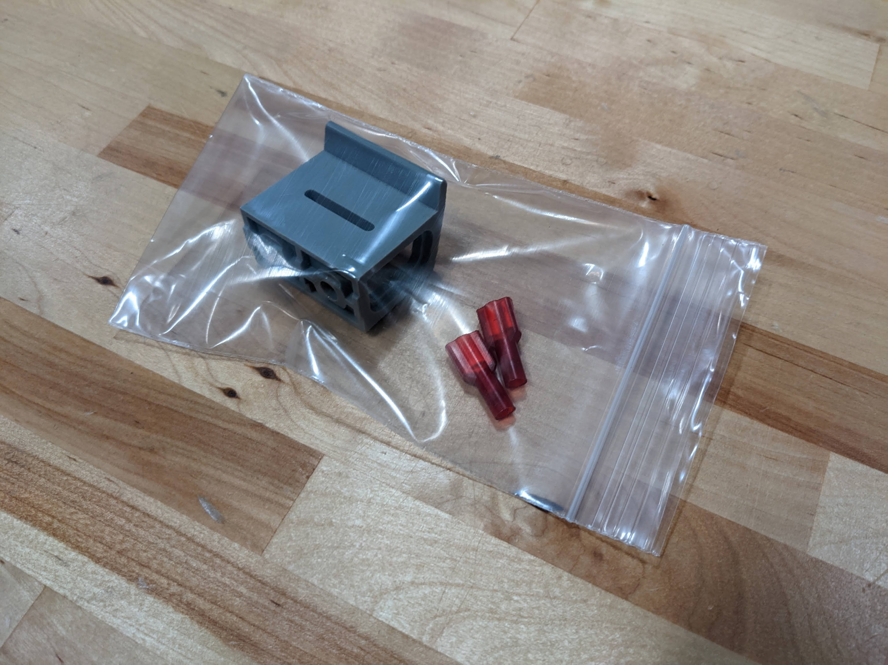

# Step 1: Cut off the incorrect terminals

Use scissors to cut off the two incorrect terminals. Cut off as little wire as possible.

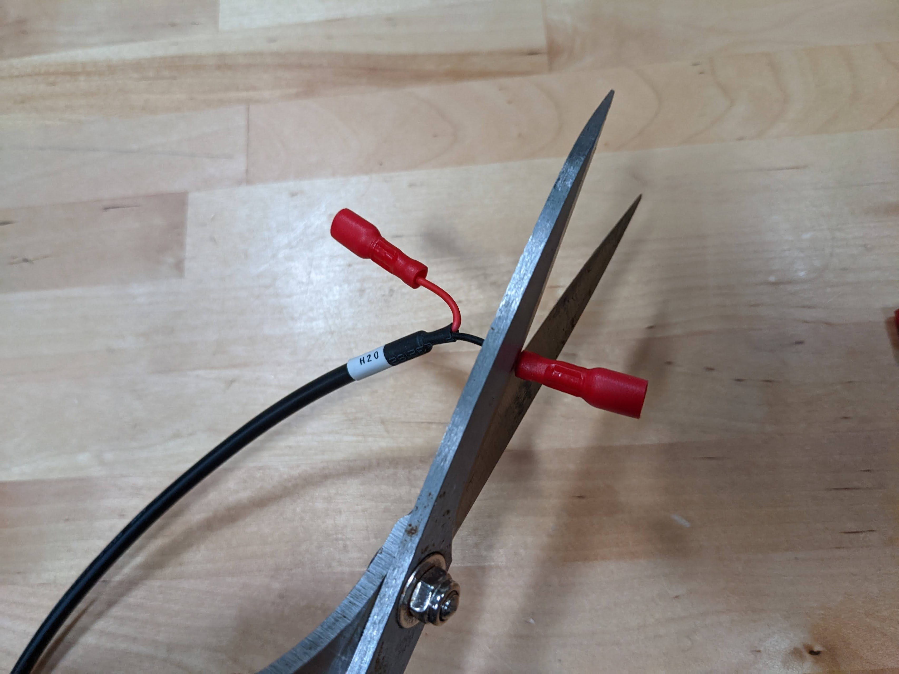

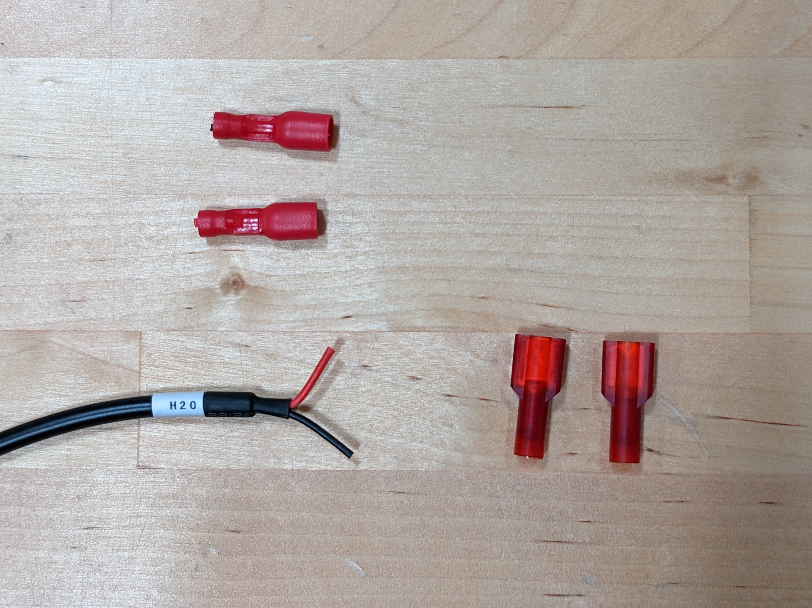

# Step 2: Remove the heatshrink

Using your fingernails, carefully remove the **black heatshrink** from the cable. Also, slide the white heatshrink labelled `H20` away from the end of the cable by about 50mm.

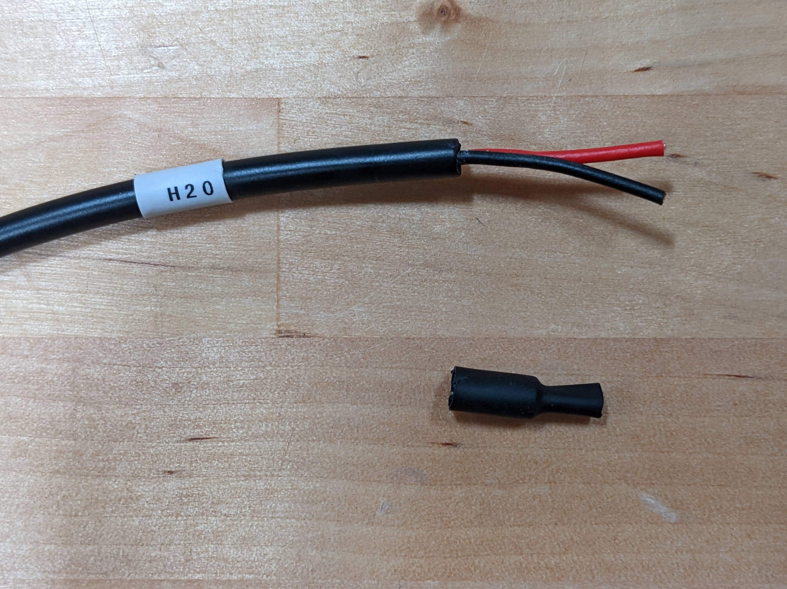

# Step 3: Carefully cut off the outer cable insulation

Using scissors or wire strippers, *carefully* remove 25mm (1 inch) of the **black outer cable insulation** from the cable without cutting through or damaging the red or black inner wire insulation.



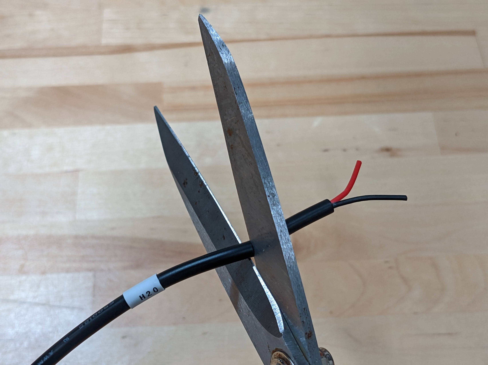

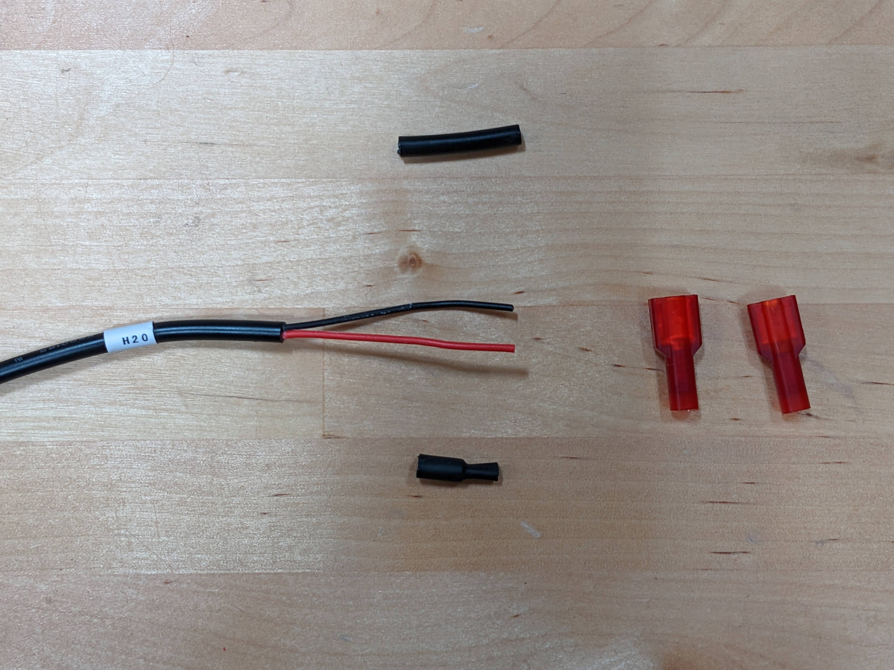

# Step 4: Replace the heatshrink

Slide the black heatshrink (removed in step 2) back onto the end of the cable. Also, slide the white heatshrink labelled `H20` back towards the end.

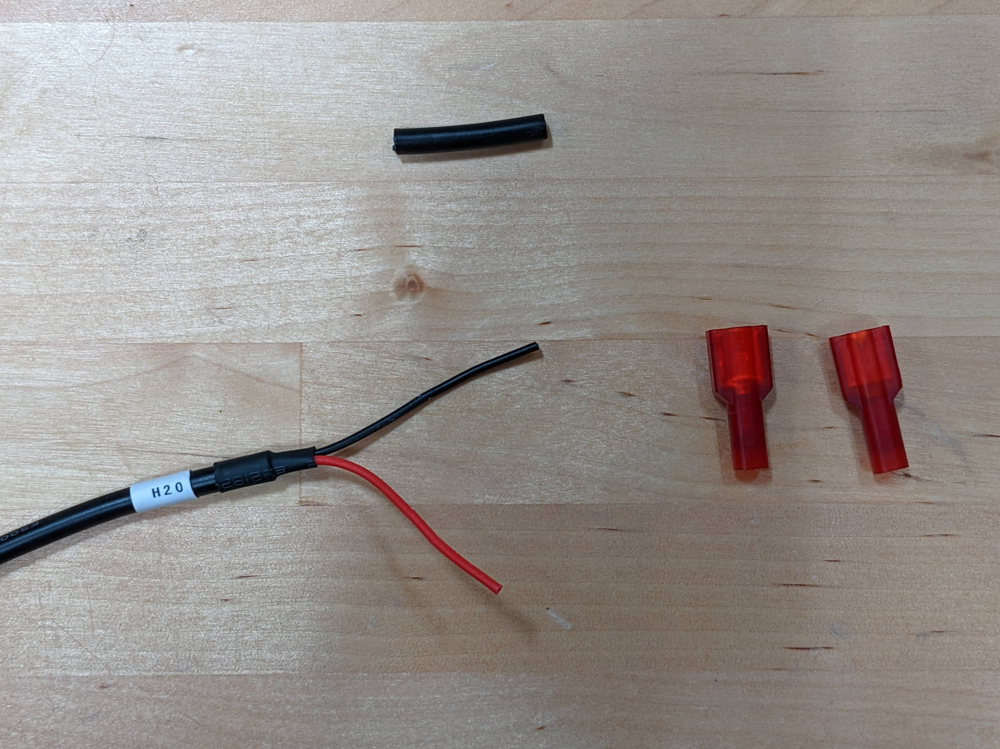

# Step 5: Carefully cut off the inner wire insulation

Using scissors or wire strippers, *carefully* remove about 5mm (1/4 inch) of the **red and black inner wire insulation**. Take your time!

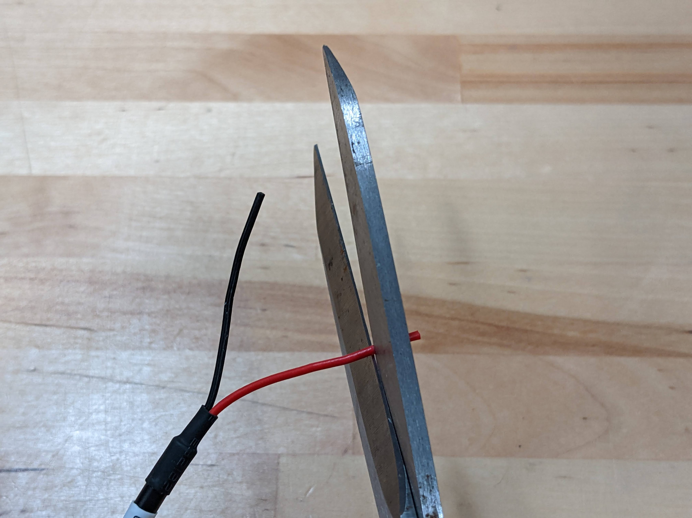

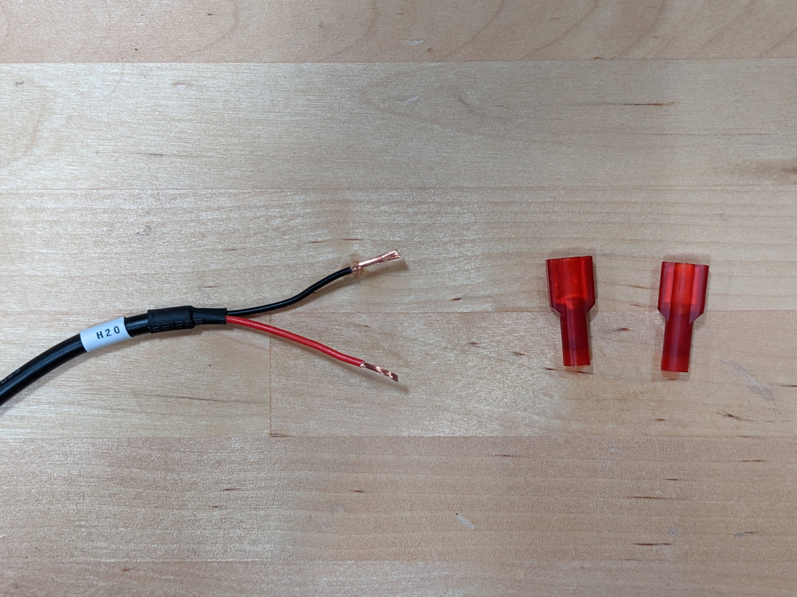

# Step 6: Crimp on the new terminals

Insert one of the wires all the way into the round half of one of the new **quick connect terminals**. Then use needle nose pliers to crimp the round portion of the terminal. You will need to use significant force to perform the crimping action. Once crimped, the wire should be securely attached to the terminal.

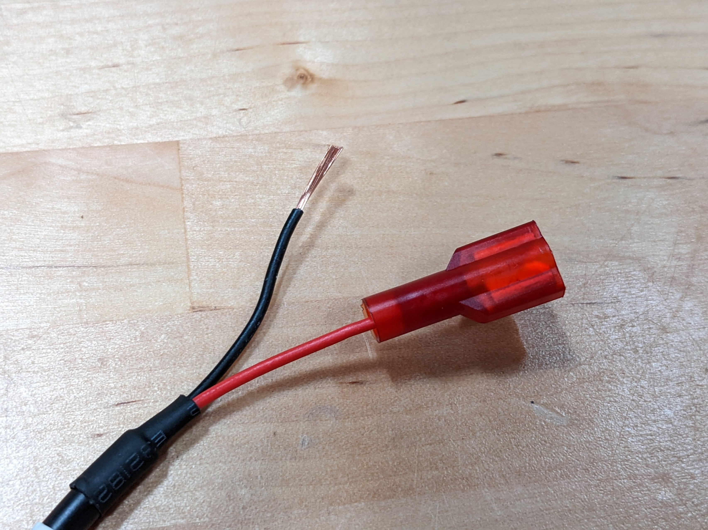

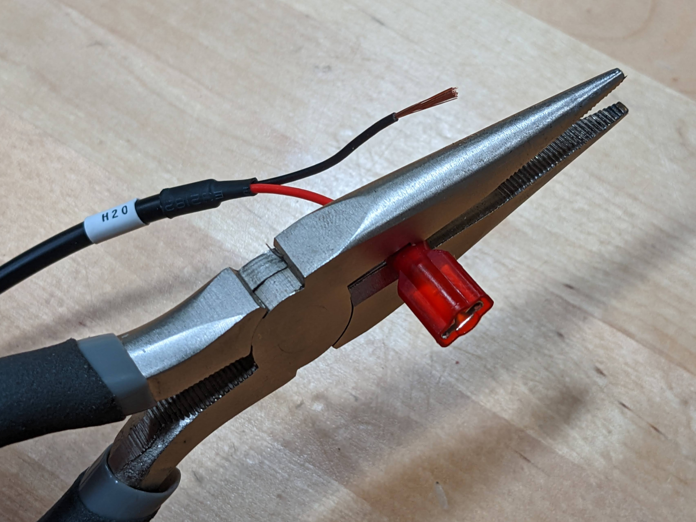

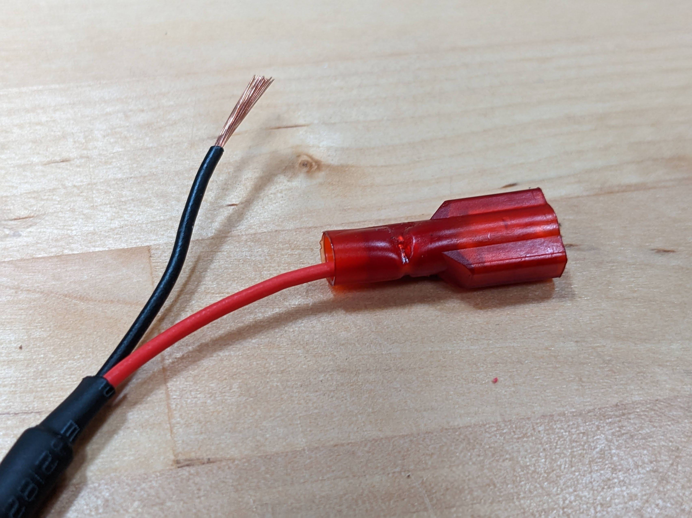

Repeat for the second wire and terminal. You're now finished!

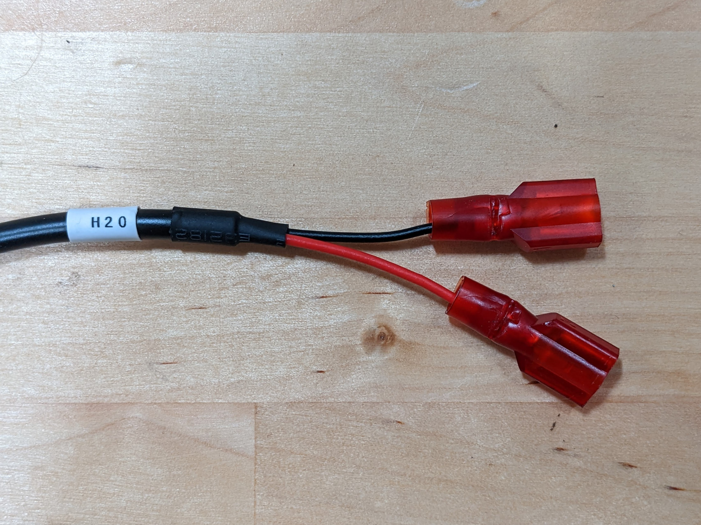

# Messed up?

If you messed up any of this procedure, please get in touch with us at [contact@farm.bot](mailto:contact@farm.bot) with your original order number and we will send you a free replacement cable.