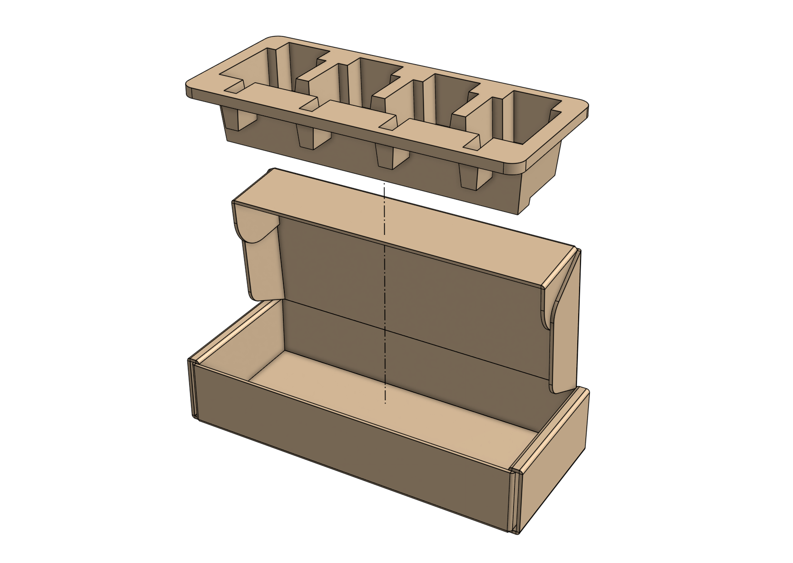
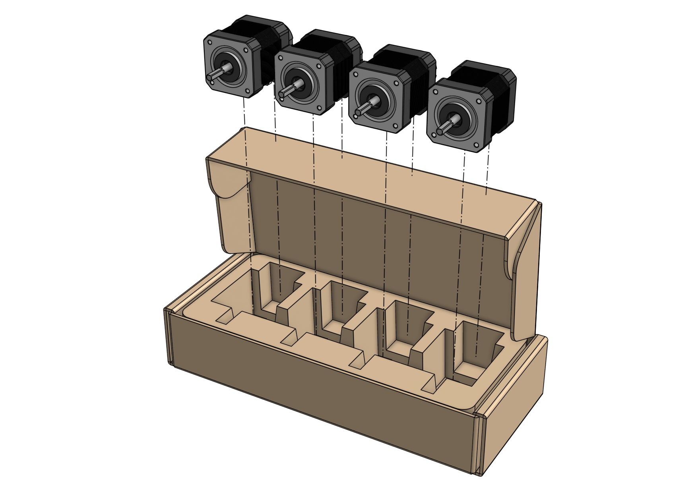
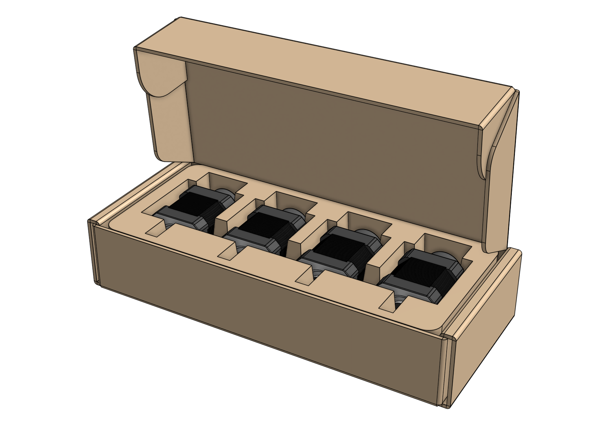
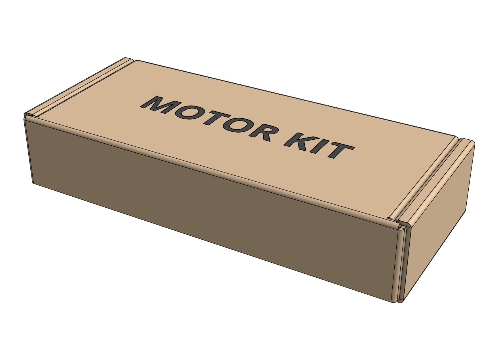

# Packing list

|Item|Qty|
|----|---|
|Motor Box|1|
|Motor Box Insert|1|
|[[Motor]]|4

# Step 1: Insert the insert

Insert the **motor box insert** into the **motor box**.

# Step 2: Pack the motors

Pack the four [[motors]] into the box. The FarmBot logos should be facing down, into the box. Then close the lid.



# Box specifications

|                                |                              |
|--------------------------------|------------------------------|
|**Box style**                   |Top flap (standard FarmBot box design)
|**Inner dimensions (L x W x H)**|
|**Outer dimensions (L x W x H)**|
|**Material**                    |Cardboard
|**Color**                       |Brown
|**Printing**                    |None
|**Fill**                        |Recycled paper pulp insert
