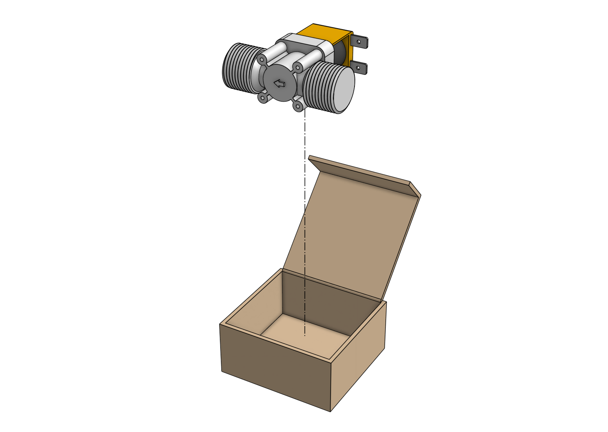
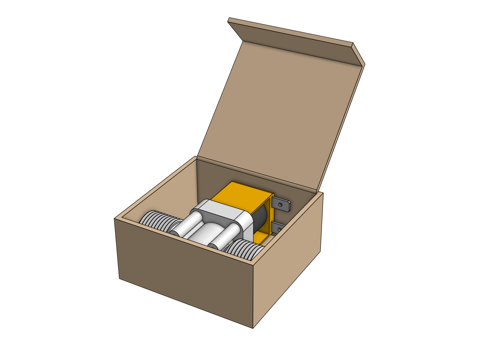
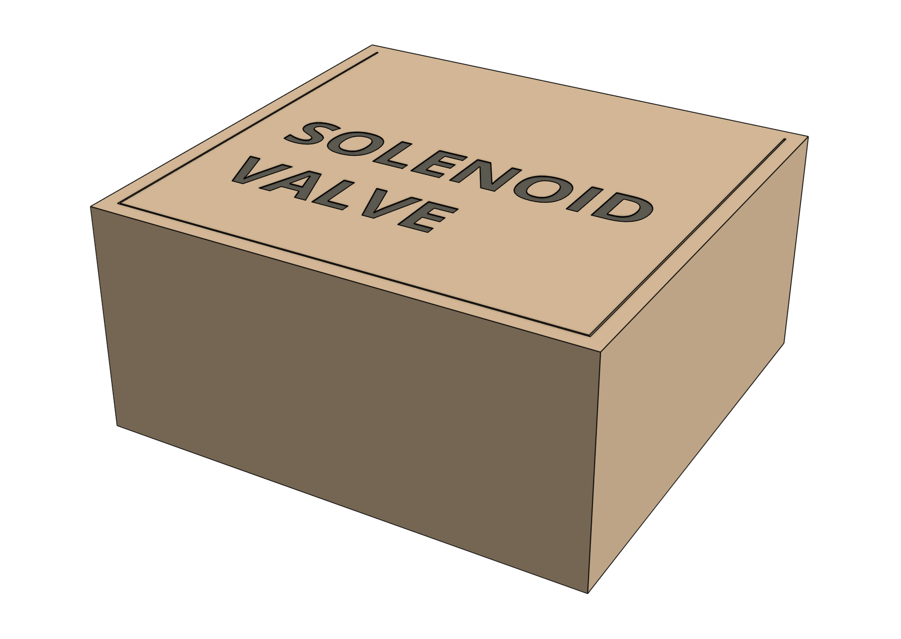

# Packing list

|Item|Sub-packing|Qty|
|----|-----------|---|
|Solenoid Valve Box|-|1
|Solenoid Valve|none|1

# Step 1: Pack the solenoid valve

Pack the [[solenoid valve]] into the box.



# Box specifications

|                                |                              |
|--------------------------------|------------------------------|
|**Box style**                   |Top flap (standard FarmBot box design)
|**Inner dimensions (L x W x H)**|
|**Outer dimensions (L x W x H)**|
|**Material**                    |Cardboard
|**Color**                       |Brown
|**Printing**                    |None
|**Fill**                        |None

