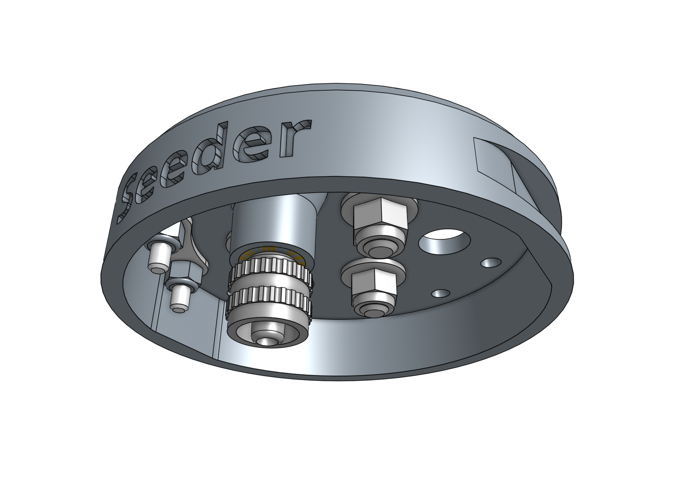

* toc
{:toc}

# Component list

|Component                     |Qty  |
|------------------------------|-----|
|Seed Injector                 |1
|M5 to Luer Lock Adapter       |1
|Magnets                       |3
|M5 x 16mm Screws              |3
|M5 Flange Locknuts            |3
|M3 x 12mm Screws              |2
|M3 Locknuts                   |2
|Jumper Link                   |1
|Bag of: - 2x Luer Lock Needle w/ cover (16 Gauge) - 2x Luer Lock Needle w/ cover (19 Gauge) - 2x Luer Lock Needle w/ cover (22 Gauge)|1

# Step 1: Install the basic tool hardware

Install the **magnets** and tool verification **jumper link** using the instructions in the [basic tool hardware reference guide](../../../extras/reference/basic-tool-hardware.md).

# Step 2: Add the luer lock adapter

Screw the **luer lock adapter** into the brass insert on the bottom of the **seeder**.

# Step 3: Pack

Place the **bag of luer lock needles** into the box and then the **pre-assembled seed injector** on top of the bag. Close the box.
