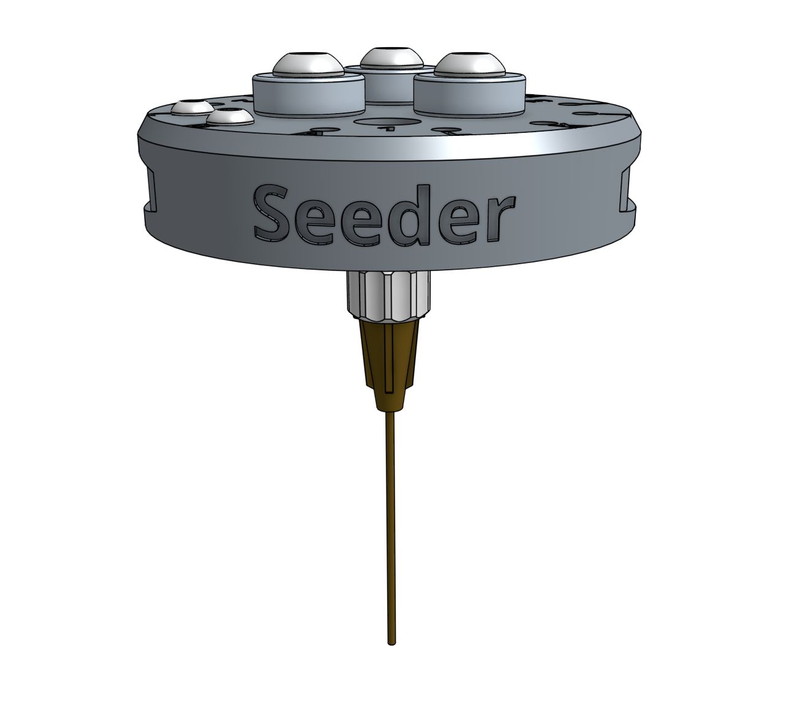
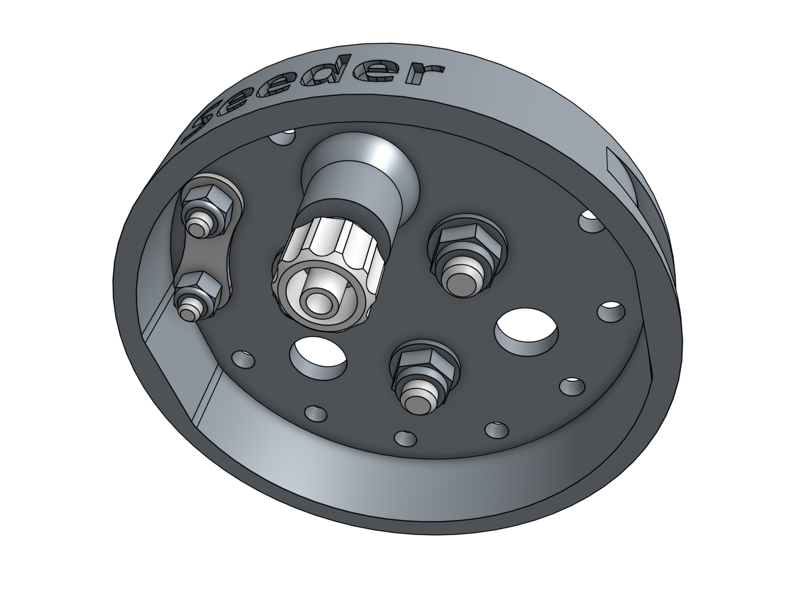

* toc
{:toc}

# Component list

|Component                     |Qty  |
|------------------------------|-----|
|Seeder                        |1
|M5 to Luer Lock Adapter       |1
|Magnets                       |3
|M5 x 16mm Screws              |3
|M5 Flange Locknuts            |3
|M3 x 12mm Screws              |2
|M3 Locknuts                   |2
|Jumper Link                   |1
|Seeder Accessory Bag: - 2x Luer Lock Needle w/ cover (16 Gauge) - 2x Luer Lock Needle w/ cover (19 Gauge) - 2x Luer Lock Needle w/ cover (22 Gauge)|1
|Seeder Box                    |1
|Seeder Box Insert             |1

# Step 1: Install the basic tool hardware

Install the **magnets** and tool verification **jumper link** using the instructions in the [basic tool hardware reference guide](../../../extras/reference/basic-tool-hardware.md).

# Step 2: Add the luer lock adapter

Screw the [[luer lock adapter]] into the brass insert on the bottom of the **seeder**.

# Step 3: Pack

Place the **seeder box insert** into the **seeder box**. Then insert the **seeder accessory bag** into the box followed by the **pre-assembled seeder tool**. Close the box.

# Box specifications

|                                |                              |
|--------------------------------|------------------------------|
|**Box style**                   |Top flap (standard FarmBot box design)
|**Inner dimensions (L x W x H)**|
|**Outer dimensions (L x W x H)**|
|**Material**                    |Cardboard
|**Color**                       |Brown
|**Printing**                    |**[SEEDER.pdf](http://docs.farm.bot)** <i class="fa fa-file-pdf-o">
|**Fill**                        |Cardboard insert
